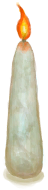

# 鸟巢  
> 可以用作火绒，只需要点燃它。  
  
<table class="table table-bordered table2808" data-toggle="table"  data-show-header="false"><thead style="display:none"><tr ><th  style="width:50%;"  >title</th><th  style="width:50%;"  ></th></tr></thead><tr ><td  style="width:50%;"  >**重量：**25  **标签：**	[“树叶”](tag_Leaves.md), [“火绒”](tag_Tinder.md)</td><td  style="width:50%;"  >

<a href="Nest.md" style="color:black">鸟巢</a>

</td></tr></tbody></table>  
  
## 获取来源  

继续

[一个灰山鹑巢！(事件)](Event_PartridgeNest.md)

继续

[你做到了！(事件)](Event_SeagullNest.md)

  
  
## 可拖入  

<table style="margin-bottom:0px;"><tr><td style="width:40%;text-align:left; background-color:#FEFEFE"><b>拖入：</b>[

[手钻](HandDrill.md)](HandDrill.md)</td><td style="width:40%;font-size:1em;font-weight:bold;background-color:#FEFEFE">钻木取火 (30分) [“手部动作(组)”](HandAction.md)</td></tr><tr style="background-color:#FFFFFF"><td style=""><b>使用物：</b>可用次数  <b>-1</b></td><td style=""><b>自身：</b>→ [

[火种](TinderLit.md)](TinderLit.md)</td></tr><tr><td colspan="2"><b>状态变化：</b>[

[情绪](Morale.md)](Morale.md)<b>+1</b>, [

[手掌损伤](HandDamage.md)](HandDamage.md)<b>+40</b></td></tr></table>
  

<table style="margin-bottom:0px;"><tr><td style="width:40%;text-align:left; background-color:#FEFEFE"><b>拖入：</b>[

[弓钻](BowDrill.md)](BowDrill.md)</td><td style="width:40%;font-size:1em;font-weight:bold;background-color:#FEFEFE">钻木取火 (15分) [“手部动作(组)”](HandAction.md)</td></tr><tr style="background-color:#FFFFFF"><td style=""><b>使用物：</b>可用次数  <b>-1</b></td><td style=""><b>自身：</b>→ [

[火种](TinderLit.md)](TinderLit.md)</td></tr><tr><td colspan="2"><b>状态变化：</b>[

[情绪](Morale.md)](Morale.md)<b>+1</b>, [

[手掌损伤](HandDamage.md)](HandDamage.md)<b>+10</b></td></tr></table>
  

<table style="margin-bottom:0px;"><tr><td style="width:40%;text-align:left; background-color:#FEFEFE"><b>拖入：</b>[

[火把(开)](TorchOn.md)](TorchOn.md) | [

[蜡烛(开)](CandleOn.md)](CandleOn.md) | [

[茉莉蜡烛(开)](CandleJasmineOn.md)](CandleJasmineOn.md) | [

[香茅蜡烛(开)](CandleCitronellaOn.md)](CandleCitronellaOn.md) | [

[燃烧的信号弹(开)](FlareHandOn.md)](FlareHandOn.md)</td><td style="width:40%;font-size:1em;font-weight:bold;background-color:#FEFEFE">点燃火绒  </td></tr><tr style="background-color:#FFFFFF"><td style=""><b>使用物：</b></td><td style=""><b>自身：</b>→ [

[火种](TinderLit.md)](TinderLit.md)</td></tr><tr><td colspan="2"><b>状态变化：</b>[

[情绪](Morale.md)](Morale.md)<b>+1</b></td></tr></table>
  

<table style="margin-bottom:0px;"><tr><td style="width:40%;text-align:left; background-color:#FEFEFE"><b>拖入：</b>[

[信号镜](SignalingMirror.md)](SignalingMirror.md) | [

[眼镜](Glasses.md)](Glasses.md)</td><td style="width:40%;font-size:1em;font-weight:bold;background-color:#FEFEFE">点燃火绒 (45分) </td></tr><tr style="background-color:#FFFFFF"><td style=""><b>使用物：</b>可用次数  <b>-1</b></td><td style=""><b>自身：</b>→ [

[火种](TinderLit.md)](TinderLit.md)</td></tr><tr><td colspan="2"><b>状态变化：</b>[

[情绪](Morale.md)](Morale.md)<b>+1</b></td></tr><tr><td colspan="2"><b>需求：</b>[

[降水值](RainValue.md)](RainValue.md): <b>0-0</b>, [

[阳光强度](SunStrength.md)](SunStrength.md): <b>1-6</b></td></tr></table>
  
  
## 可拖至  

[叶床](LeafBed.md)

[堆肥箱](CompostBin.md)

[蒸馏器(关)](AlembicOff.md)

[蒸馏器(开)](AlembicOn.md)

[营火](Campfire.md)

[营火(熄灭)](CampfireExtinguished.md)

[粘土火盆](ClayFirePit.md)

[粘土火盆(熄灭)](ClayFirePitExtinguished.md)

[火堆](Fire.md)

[火堆(熄灭)](FireExtinguished.md)

[熔炉](Forge.md)

[熔炉(熄灭)](ForgeExtinguished.md)

[瓦斯炉(开)](GasCookerOn.md)

[窑炉](Kiln.md)

[高级窑炉](KilnAdvanced.md)

[高级窑炉(熄灭)](KilnAdvancedExtinguished.md)

[窑炉(熄灭)](KilnExtinguished.md)

[火炉](Stove.md)

[火炉(熄灭)](StoveExtinguished.md)

[羊食槽](GoatFeeder.md)

[羊食槽(空)](GoatFeederEmpty.md)

[火炭](Embers.md)

[母山羊](GoatEnclosureFemale.md)

[小羊](GoatEnclosureKid.md)

[哺乳期山羊](GoatEnclosureLactating.md)

[公山羊](GoatEnclosureMale.md)

[母山羊](GoatTiedFemale.md)

[哺乳期山羊](GoatTiedFemaleLactating.md)

[小羊](GoatTiedKid.md)

[公山羊](GoatTiedMale.md)

[熏蜂器(关)](BeeSmokerOff.md)

[手钻](FirePlow.md)

  
  

