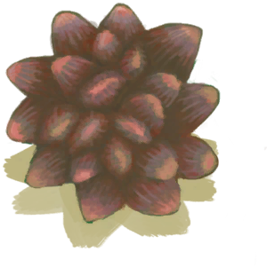
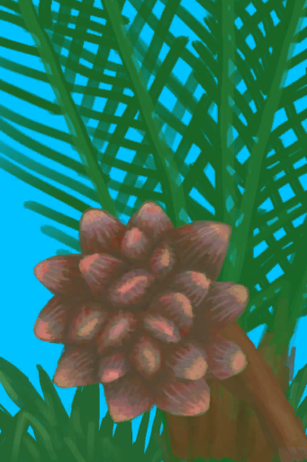

# 水椰子  
> 我需要切割工具或者斧子来弄开它。  
  
<table class="table table-bordered" data-toggle="table"  data-show-header="false"><thead style="display:none"><tr ><th  style="width:50%;text-align:left;vertical-align:top;"  >title</th><th  style="width:50%;text-align:left;vertical-align:top;"  ></th></tr></thead><tr ><td  style="width:50%;text-align:left;vertical-align:top;"  >**重量：**500  **可用次数：**4</td><td  style="width:50%;text-align:left;vertical-align:top;"  >

<a href="NipaFruit.md" style="color:black">水椰子</a>

一大串可食用的水椰树种。  它们需要在<b>切割工具</b>（或猕猴朋友）的帮助下去除外壳才能食用。  和椰子类似，吃多了会导致腹泻。</td></tr></tbody></table>  
  
## 获取来源  
<table class="table table-bordered" data-toggle="table"  ><thead style=""><tr ><th  style="text-align:left;vertical-align:top;"  >来源</th><th  style="text-align:left;vertical-align:top;"  >操作</th></tr></thead><tr ><td  style="text-align:left;vertical-align:top;"  >[

[水椰](NipaPalm.md)](NipaPalm.md)</td><td  style="text-align:left;vertical-align:top;"  >割水椰子 ** 拖入：**[“切割工具”](tag_Cutter.md) , [“斧”](tag_Axe.md)</td></tr></tbody></table>  
  
## 可拖入  
<table class="table table-bordered" data-toggle="table"  ><thead style=""><tr ><th  style="text-align:left;vertical-align:top;"  >使用</th><th  style="text-align:left;vertical-align:top;"  >动作</th><th  style="text-align:left;vertical-align:top;"  >耗时</th><th  style="text-align:left;vertical-align:top;"  >条件</th><th  style="text-align:left;vertical-align:top;"  >变化</th><th  style="text-align:left;vertical-align:top;"  >玩家状态</th></tr></thead><tr ><td  style="text-align:left;vertical-align:top;"  >[“斧”](tag_Axe.md)</td><td  style="text-align:left;vertical-align:top;"  >取得种子 [“手部动作(组)”](HandAction.md)</td><td  style="text-align:left;vertical-align:top;"  >15分</td><td  style="text-align:left;vertical-align:top;"  >[

[光亮](Light.md)](Light.md): 10-100</td><td  style="text-align:left;vertical-align:top;"  >** 自身: ** 使用次数  -1(-25%)  ** 使用物: ** 可用次数  -1  ** 获得: ** ** [Nipa Seeds]  **   [

[水椰籽](NipaSeeds.md)](NipaSeeds.md)(+1) 基础权重：1</td><td  style="text-align:left;vertical-align:top;"  >[

[手掌损伤](HandDamage.md)](HandDamage.md)+40 [

[耐力](Stamina.md)](Stamina.md)-4</td></tr><tr ><td  style="text-align:left;vertical-align:top;"  >[“切割工具”](tag_Cutter.md)</td><td  style="text-align:left;vertical-align:top;"  >取得种子 [“手部动作(组)”](HandAction.md)</td><td  style="text-align:left;vertical-align:top;"  >30分</td><td  style="text-align:left;vertical-align:top;"  >[

[光亮](Light.md)](Light.md): 10-100</td><td  style="text-align:left;vertical-align:top;"  >** 自身: ** 使用次数  -1(-25%)  ** 使用物: ** 可用次数  -1  ** 获得: ** ** [Nipa Seeds]  **   [

[水椰籽](NipaSeeds.md)](NipaSeeds.md)(+1) 基础权重：1</td><td  style="text-align:left;vertical-align:top;"  >[

[手掌损伤](HandDamage.md)](HandDamage.md)+75 [

[耐力](Stamina.md)](Stamina.md)-6</td></tr></tbody></table>  
  
## 可拖至  

[猕猴朋友](MacaqueFriend.md)

  
  
## 属性   
<table class="table table-bordered" data-toggle="table"  ><thead style=""><tr ><th  style="text-align:left;vertical-align:top;"  >属性</th><th  style="text-align:left;vertical-align:top;"  >值</th><th  style="text-align:left;vertical-align:top;"  data-sortable="true"  >耗时</th><th  style="text-align:left;vertical-align:top;"  >变化</th></tr></thead><tr ><td  style="text-align:left;vertical-align:top;"  >使用次数</td><td  style="text-align:left;vertical-align:top;"  >初始：4 最大：4</td><td  style="text-align:left;vertical-align:top;"  >-</td><td  style="text-align:left;vertical-align:top;"  >** 到达0时： **  ** 自身 ** →消失</td></tr></tbody></table>  
  

