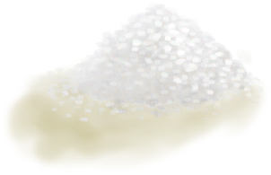

# 硝石晶体  
> 可以磨成硝酸钾。  
  
<table class="table table-bordered" data-toggle="table"  data-show-header="false"><thead style="display:none"><tr ><th  style="width:50%;text-align:left;vertical-align:top;"  >title</th><th  style="width:50%;text-align:left;vertical-align:top;"  ></th></tr></thead><tr ><td  style="width:50%;text-align:left;vertical-align:top;"  >**环境：**[蝙蝠洞(环境)](Env_CaveBats.md)  **重量：**50</td><td  style="width:50%;text-align:left;vertical-align:top;"  >

<a href="NiterCrystals.md" style="color:black">硝石晶体</a>

研磨<b>硝床</b>产生的<b>硝石晶体</b>可得。  这种化学物质不止是高效的肥料，也能与<b>硫酸</b>混合后在<b>蒸馏器</b>上制得<b>浓硝酸</b>，是制作<b>炸药</b>的必备材料！</td></tr></tbody></table>  
  
## 获取来源  

转化

[硝石矿床](NiterBed.md)

  
  
## 可拖入  

<table style="margin-bottom:0px;"><tr><td style="width:40%;text-align:left; background-color:#FEFEFE"><b>拖入：</b>[“锤”](tag_Hammer.md)</td><td style="width:40%;font-size:1em;font-weight:bold;background-color:#FEFEFE">研磨 (1小时) [“手部动作(组)”](HandAction.md), [“制造动作(组)”](CraftAction.md)</td></tr><tr style="background-color:#FFFFFF"><td style=""><b>使用物：</b></td><td style=""><b>自身：</b>→消失</td></tr><tr><td colspan="2">[

[硝酸钾](Saltpeter.md)](Saltpeter.md)(<b>+3</b>)</td></tr></table>
  
  

