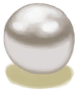

# 牡蛎  
> 里面可能有好东西呢。  
  
<table class="table table-bordered" data-toggle="table"  data-show-header="false"><thead style="display:none"><tr ><th  style="width:50%;text-align:left;vertical-align:top;"  >title</th><th  style="width:50%;text-align:left;vertical-align:top;"  ></th></tr></thead><tr ><td  style="width:50%;text-align:left;vertical-align:top;"  >** 不可删除 **  **重量：**25  **标签：**	[“锤”](tag_Hammer.md)</td><td  style="width:50%;text-align:left;vertical-align:top;"  >

<a href="Oyster.md" style="color:black">牡蛎</a>

牡蛎是双壳纲软体动物，可以在<b>鸟岩岛和海湾</b>找到。  牡蛎需要石头或其他工具才能打开，且里面有很小几率包含有宝贵的<b>珍珠</b>。</td></tr></tbody></table>  
  
## 获取来源  

探索

[鸟岩岛](BirdRock.md)

潜水

[海(海湾)](Sea_Bay.md)

  
  
## 可拖入  

<table style="margin-bottom:0px;"><tr><td style="width:40%;text-align:left; background-color:#FEFEFE"><b>拖入：</b>[“锤”](tag_Hammer.md) | [“切割工具”](tag_Cutter.md)</td><td style="width:40%;font-size:1em;font-weight:bold;background-color:#FEFEFE">打开 (15分) [“手部动作(组)”](HandAction.md), [“制造动作(组)”](CraftAction.md)</td></tr><tr><td colspan="2"><b>需求：</b>[

[光亮](Light.md)](Light.md): <b>10-100</b></td></tr><tr style="background-color:#FFFFFF"><td style=""><b>使用物：</b></td><td style=""><b>自身：</b>→消失</td></tr><tr><td colspan="2"><b>状态变化：</b>[

[手掌损伤](HandDamage.md)](HandDamage.md)<b>+5</b></td></tr><tr><td colspan="2">

<table style="margin-bottom:3px;"><tr><td rowspan=2 style="text-align:center" width="80px">
基础权重

85
</td><td style="font-size:0.6em;line-height:0.6em;font-weight:bold">No Pearl</td></tr><tr><td>[

[牡蛎肉](OysterMeat.md)](OysterMeat.md)(<b>+1</b>)</td></tr></table>

<table style="margin-bottom:3px;"><tr><td rowspan=2 style="text-align:center" width="80px">
基础权重

15
</td><td style="font-size:0.6em;line-height:0.6em;font-weight:bold">Pearl</td></tr><tr><td>[

[牡蛎肉](OysterMeat.md)](OysterMeat.md)(<b>+1</b>), [

[珍珠](Pearl.md)](Pearl.md)(<b>+1</b>)</td></tr></table>

</td></tr></table>
  
  
## 可拖至  

[铜矿脉(洞穴上层)](CopperVein.md)

[干土堆](DirtPile.md)

[火炉(熄灭)](StoveExtinguished.md)

[泥堆](MudPile.md)

[水槽](WateringTrough.md)

[骨头碎片](BoneSplinters.md)

[骨头](Bones.md)

[木炭](Charcoal.md)

[椰子](Coconut.md)

[青椰子](CoconutHusked.md)

[带孔椰子](CoconutPerforated.md)

[腐烂的椰子](CoconutRotten.md)

[海螺](Conch.md)

[铜制装饰品](CopperDecoration_Mold.md)

[羽毛](Feathers.md)

[干辣椒](ChiliesDried.md)

[海螺肉](ConchMeat.md)

[姜](Ginger.md)

[干姜](GingerDried.md)

[茉莉花](JasmineFlowers.md)

[卡瓦根](KavaRoot.md)

[干燥的卡瓦根](KavaRootDried.md)

[柠檬草](LemongrassStalks.md)

[蛇草](SnakeGrass.md)

[蜘蛛兰叶](SpiderLilyLeaves.md)

[干燥的蜘蛛兰叶](SpiderLilyLeavesDried.md)

[晶洞](Geode.md)

[大海螺](GiantConch.md)

[煅烧后的砂浆](MortarBurnt.md)

[泥砖](MudBrick.md)

[硝石晶体](NiterCrystals.md)

[牡蛎](Oyster.md)

[煅烧后的石头](StoneBurnt.md)

[煅烧后的大石块](StoneHeavyBurnt.md)

[热带杏仁](TropicalAlmonds.md)

[海胆](Urchin.md)

[硫磺喷口(火山)](VentBrimstone.md)

[韦斯顿](Weston.md)

[狭窄通道(洞穴底层)](CrystalChamberEntranceClosed.md)

[狭窄通道(潮湿洞穴)](DarkCaveCaveEntranceClosed.md)

[狭窄通道(洞穴中层)](DarkChamberCaveEntranceClosed.md)

[狭窄通道(洞穴上层)](FloodedChamberEntranceClosed.md)

[狭窄通道(隧道)](HighChamberEntranceClosed.md)

[滤水器](WaterFilter.md)

  
  

