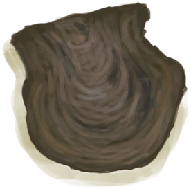

# 牡蛎  
> 里面可能有好东西呢。  
   
> 牡蛎是双壳纲软体动物，可以在<b>鸟岩岛和海湾</b>找到。  牡蛎需要石头或其他工具才能打开，且里面有很小几率包含有宝贵的<b>珍珠</b>。  
  
  牡蛎  |   图片   
 ----  |  ----:   
 ** 不可删除 **  **重量：**25  **标签：**	[“锤”](tag_Hammer.md)  |     
  
## 获取来源  
来源  |  操作  
----  |  ----  
[鸟岩岛(区域)](BirdRock.md)  |  探索  
[海(海湾)](Sea_Bay.md)  |  潜水  
## 可拖入  
使用  |  动作  |  耗时  |  条件  |  变化  |  玩家状态  
----  |  ----  |  ----  |  ----  |  ----  |  ----  
[“锤”](tag_Hammer.md)  |  打开 [手部动作](HandAction.md) [制造动作](CraftAction.md)  |  15分  |  [光亮](Light.md): 10-100  |  ** 自身: ** 消失  ** 使用物: ** 可用次数  -1  ** 获得: ** ** [No Pearl] **   [牡蛎肉](OysterMeat.md)(+1) 基础权重：85  ** [Pearl] **   [牡蛎肉](OysterMeat.md)(+1)   [珍珠](Pearl.md)(+1) 基础权重：15   |  [手掌损伤](HandDamage.md)+5  
## 可拖至  
[铜矿脉(狭窄隧道)](CopperVein.md), [干土堆](DirtPile.md), [火炉(熄灭)](StoveExtinguished.md), [泥堆](MudPile.md), [水槽](WateringTrough.md), [骨头碎片](BoneSplinters.md), [骨头](Bones.md), [木炭](Charcoal.md), [椰子](Coconut.md), [青椰子](CoconutHusked.md), [带孔椰子](CoconutPerforated.md), [腐烂的椰子](CoconutRotten.md), [海螺](Conch.md), [铜制装饰品](CopperDecoration_Mold.md), [干辣椒](ChiliesDried.md), [海螺肉](ConchMeat.md), [姜](Ginger.md), [干姜](GingerDried.md), [茉莉花](JasmineFlowers.md), [卡瓦根](KavaRoot.md), [干燥的卡瓦根](KavaRootDried.md), [柠檬草](LemongrassStalks.md), [蜘蛛兰叶](SpiderLilyLeaves.md), [干燥的蜘蛛兰叶](SpiderLilyLeavesDried.md), [晶洞](Geode.md), [大海螺](GiantConch.md), [煅烧后的砂浆](MortarBurnt.md), [泥砖](MudBrick.md), [硝石晶体](NiterCrystals.md), [牡蛎](Oyster.md), [蛇草](SnakeGrass.md), [煅烧后的石头](StoneBurnt.md), [煅烧后的大石块](StoneHeavyBurnt.md), [热带杏仁](TropicalAlmonds.md), [海胆](Urchin.md), [硫磺喷口(酸湖)](VentBrimstone.md), [韦斯顿](Weston.md), [狭窄通道(洞穴底层)](CrystalChamberEntranceClosed.md), [狭窄通道(潮湿洞穴)](DarkCaveCaveEntranceClosed.md), [狭窄通道(洞穴中层)](DarkChamberCaveEntranceClosed.md), [狭窄通道(晶石洞穴)](FloodedChamberEntranceClosed.md), [狭窄通道(隧道)](HighChamberEntranceClosed.md), [滤水器](WaterFilter.md)  
