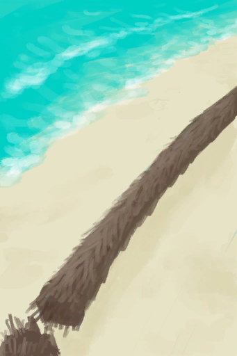
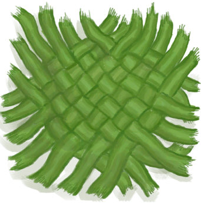
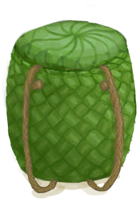
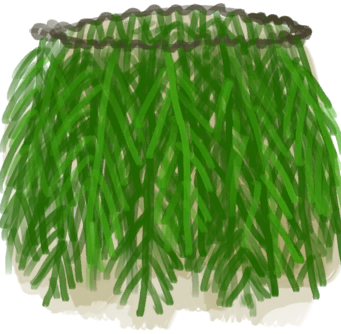

# 棕榈叶  
> 可以用来制作东西或者铺房顶  
   
> 在热带岛屿上的很多地方，如<b>沙滩和丛林里</b>都可以找到棕榈叶。 它们可以直接在地上捡到，或者在<b>椰子树和灌木丛</b>采集到。  它们可以被用于制作简单的<b>叶床</b>以保证更舒适的睡眠，同时也是建造<b>小屋和棚屋</b>屋顶的材料。  <b>棕榈叶还可以编织到一起</b>做成各种有用的物品，如<b>编织篓及背篓、帽子或者是简陋的棚屋</b>。  
  
<table class="table table-bordered"><tbody><tr ><td  style="width:80%;text-align:left;vertical-align:top;" >**重量：**100  **标签：**	[“树叶”](tag_Leaves.md)</td><td  style="width:20%;text-align:left;vertical-align:top;" >

</td></tr></tbody></tbody></table>  
  
## 获取来源  
<table class="table table-bordered"><thead><tr ><th  style="text-align:left;vertical-align:top;" >来源</th><th  style="text-align:left;vertical-align:top;" >操作</th></tr></thead><tr ><td  style="text-align:left;vertical-align:top;" >[

[窝棚](Shelter.md)](Shelter.md)</td><td  style="text-align:left;vertical-align:top;" >拆除</td></tr><tr ><td  style="text-align:left;vertical-align:top;" >[

[有遮蔽的叶床](ShelteredLeafBed.md)](ShelteredLeafBed.md)</td><td  style="text-align:left;vertical-align:top;" >拆除</td></tr><tr ><td  style="text-align:left;vertical-align:top;" >[

[扫帚](Broom.md)](Broom.md)</td><td  style="text-align:left;vertical-align:top;" >拆解</td></tr><tr ><td  style="text-align:left;vertical-align:top;" >[

[海湾](Bay.md)](Bay.md)</td><td  style="text-align:left;vertical-align:top;" >随便逛逛</td></tr><tr ><td  style="text-align:left;vertical-align:top;" >[

[沙滩](Beach.md)](Beach.md)</td><td  style="text-align:left;vertical-align:top;" >随便逛逛</td></tr><tr ><td  style="text-align:left;vertical-align:top;" >[

[丛林深处](DeepJungle.md)](DeepJungle.md)</td><td  style="text-align:left;vertical-align:top;" >探索</td></tr><tr ><td  style="text-align:left;vertical-align:top;" >[

[西部高地](HighlandsWestern.md)](HighlandsWestern.md)</td><td  style="text-align:left;vertical-align:top;" >探索</td></tr><tr ><td  style="text-align:left;vertical-align:top;" >[

[丛林](Jungle.md)](Jungle.md)</td><td  style="text-align:left;vertical-align:top;" >探索</td></tr><tr ><td  style="text-align:left;vertical-align:top;" >[

[丛林高地](JungleHighlands.md)](JungleHighlands.md)</td><td  style="text-align:left;vertical-align:top;" >探索</td></tr><tr ><td  style="text-align:left;vertical-align:top;" >[

[红树林](Mangroves.md)](Mangroves.md)</td><td  style="text-align:left;vertical-align:top;" >探索</td></tr><tr ><td  style="text-align:left;vertical-align:top;" >[

[丛林边缘](Outskirts.md)](Outskirts.md)</td><td  style="text-align:left;vertical-align:top;" >探索</td></tr><tr ><td  style="text-align:left;vertical-align:top;" >[

[湿地丛林(湿地)](Wetlands.md)](Wetlands.md)</td><td  style="text-align:left;vertical-align:top;" >探索</td></tr><tr ><td  style="text-align:left;vertical-align:top;" >[

[幼年椰子树](PalmTreeYoung.md)](PalmTreeYoung.md)</td><td  style="text-align:left;vertical-align:top;" >砍树 ** 拖入：**[“斧”](tag_Axe.md)</td></tr><tr ><td  style="text-align:left;vertical-align:top;" >[

[水椰树](NipaSapStation.md)](NipaSapStation.md)</td><td  style="text-align:left;vertical-align:top;" >转化</td></tr><tr ><td  style="text-align:left;vertical-align:top;" >[

[棕榈丛](PalmBush.md)](PalmBush.md)</td><td  style="text-align:left;vertical-align:top;" >采集</td></tr><tr ><td  style="text-align:left;vertical-align:top;" >[

[摘完的椰子树](PalmTreeCleared.md)](PalmTreeCleared.md)</td><td  style="text-align:left;vertical-align:top;" >转化</td></tr><tr ><td  style="text-align:left;vertical-align:top;" >[

[倒下的棕榈树](PalmTreeFelled.md)](PalmTreeFelled.md)</td><td  style="text-align:left;vertical-align:top;" >清除 ** 拖入：**[石斧](StoneAxe.md)</td></tr><tr ><td  style="text-align:left;vertical-align:top;" >[

[倒下的棕榈树](PalmTreeFelled.md)](PalmTreeFelled.md)</td><td  style="text-align:left;vertical-align:top;" >清除 ** 拖入：**[“斧”](tag_Axe.md)</td></tr><tr ><td  style="text-align:left;vertical-align:top;" >[

[椰子树](PalmTreeNew.md)](PalmTreeNew.md)</td><td  style="text-align:left;vertical-align:top;" >转化</td></tr><tr ><td  style="text-align:left;vertical-align:top;" >[

[椰子树(多事件旧)](PalmTreeNewMultiEventOld.md)](PalmTreeNewMultiEventOld.md)</td><td  style="text-align:left;vertical-align:top;" >转化</td></tr><tr ><td  style="text-align:left;vertical-align:top;" >[

[椰子树(旧)](PalmTreeOld.md)](PalmTreeOld.md)</td><td  style="text-align:left;vertical-align:top;" >转化</td></tr><tr ><td  style="text-align:left;vertical-align:top;" >[

[树液收集处](PalmTreeSapStation.md)](PalmTreeSapStation.md)</td><td  style="text-align:left;vertical-align:top;" >砍倒 ** 拖入：**[石斧](StoneAxe.md)</td></tr><tr ><td  style="text-align:left;vertical-align:top;" >[

[树液收集处](PalmTreeSapStation.md)](PalmTreeSapStation.md)</td><td  style="text-align:left;vertical-align:top;" >砍倒 ** 拖入：**[“斧”](tag_Axe.md)</td></tr><tr ><td  style="text-align:left;vertical-align:top;" >[

[树液补给点(空)](PalmTreeSapStationEmpty.md)](PalmTreeSapStationEmpty.md)</td><td  style="text-align:left;vertical-align:top;" >砍倒 ** 拖入：**[石斧](StoneAxe.md)</td></tr><tr ><td  style="text-align:left;vertical-align:top;" >[

[树液补给点(空)](PalmTreeSapStationEmpty.md)](PalmTreeSapStationEmpty.md)</td><td  style="text-align:left;vertical-align:top;" >砍倒 ** 拖入：**[“斧”](tag_Axe.md)</td></tr><tr ><td  style="text-align:left;vertical-align:top;" >[

[椰子树(IH)](PalmTree_IH.md)](PalmTree_IH.md)</td><td  style="text-align:left;vertical-align:top;" >砍倒 ** 拖入：**[石斧](StoneAxe.md)</td></tr><tr ><td  style="text-align:left;vertical-align:top;" >[

[椰子树(IH)](PalmTree_IH.md)](PalmTree_IH.md)</td><td  style="text-align:left;vertical-align:top;" >砍倒 ** 拖入：**[铜斧](AxeCopper.md)</td></tr><tr ><td  style="text-align:left;vertical-align:top;" >[

[椰子树(特殊)](PalmTree_Unique.md)](PalmTree_Unique.md)</td><td  style="text-align:left;vertical-align:top;" >砍倒 ** 拖入：**[石斧](StoneAxe.md)</td></tr><tr ><td  style="text-align:left;vertical-align:top;" >[

[椰子树(特殊)](PalmTree_Unique.md)](PalmTree_Unique.md)</td><td  style="text-align:left;vertical-align:top;" >砍倒 ** 拖入：**[铜斧](AxeCopper.md)</td></tr><tr ><td  style="text-align:left;vertical-align:top;" >[

[西米树](SagoPalm.md)](SagoPalm.md)</td><td  style="text-align:left;vertical-align:top;" >砍树 ** 拖入：**[石斧](StoneAxe.md)</td></tr><tr ><td  style="text-align:left;vertical-align:top;" >[

[西米树](SagoPalm.md)](SagoPalm.md)</td><td  style="text-align:left;vertical-align:top;" >砍树 ** 拖入：**[“斧”](tag_Axe.md)</td></tr><tr ><td  style="text-align:left;vertical-align:top;" >[

[小棕榈树](SmallPalm.md)](SmallPalm.md)</td><td  style="text-align:left;vertical-align:top;" >砍树 ** 拖入：**[“斧”](tag_Axe.md)</td></tr></tbody></table>  
  
## 可拖入  
<table class="table table-bordered"><thead><tr ><th  style="text-align:left;vertical-align:top;" >使用</th><th  style="text-align:left;vertical-align:top;" >动作</th><th  style="text-align:left;vertical-align:top;" >耗时</th><th  style="text-align:left;vertical-align:top;" >条件</th><th  style="text-align:left;vertical-align:top;" >变化</th><th  style="text-align:left;vertical-align:top;" >玩家状态</th></tr></thead><tr ><td  style="text-align:left;vertical-align:top;" >[

[棕榈叶](PalmFronds.md)](PalmFronds.md)</td><td  style="text-align:left;vertical-align:top;" >编织 [手部动作(组)](HandAction.md) [制造动作(组)](CraftAction.md)</td><td  style="text-align:left;vertical-align:top;" >45分</td><td  style="text-align:left;vertical-align:top;" >[

[光亮](Light.md)](Light.md): 10-100</td><td  style="text-align:left;vertical-align:top;" >** 自身: ** → [

[棕榈编织物](WeavePalm.md)](WeavePalm.md)  ** 使用物: ** →消失</td><td  style="text-align:left;vertical-align:top;" >[

[压力](Stress.md)](Stress.md)-10</td></tr></tbody></table>  
  
## 可拖至  

[叶床](LeafBed.md)

[窝棚](Shelter.md)

[有遮蔽的叶床](ShelteredLeafBed.md)

[堆肥箱](CompostBin.md)

[蒸馏器(关)](AlembicOff.md)

[蒸馏器(开)](AlembicOn.md)

[营火](Campfire.md)

[营火(熄灭)](CampfireExtinguished.md)

[粘土火盆](ClayFirePit.md)

[粘土火盆(熄灭)](ClayFirePitExtinguished.md)

[火堆](Fire.md)

[火堆(熄灭)](FireExtinguished.md)

[熔炉](Forge.md)

[熔炉(熄灭)](ForgeExtinguished.md)

[窑炉](Kiln.md)

[高级窑炉](KilnAdvanced.md)

[高级窑炉(熄灭)](KilnAdvancedExtinguished.md)

[窑炉(熄灭)](KilnExtinguished.md)

[火炉](Stove.md)

[火炉(熄灭)](StoveExtinguished.md)

[羊食槽](GoatFeeder.md)

[羊食槽(空)](GoatFeederEmpty.md)

[烟熏炉](Smoker.md)

[烟熏炉(熄灭)](SmokerExtinguished.md)

[烟熏炉(塑料布)(熄灭)](SmokerExtinguishedPlastic.md)

[烟熏炉(塑料布)(点燃)](SmokerPlastic.md)

[母山羊](GoatEnclosureFemale.md)

[小羊](GoatEnclosureKid.md)

[哺乳期山羊](GoatEnclosureLactating.md)

[公山羊](GoatEnclosureMale.md)

[母山羊](GoatTiedFemale.md)

[哺乳期山羊](GoatTiedFemaleLactating.md)

[小羊](GoatTiedKid.md)

[公山羊](GoatTiedMale.md)

[棕榈叶](PalmFronds.md)

[太阳能蒸馏器](SolarStill.md)

  
  
## 可用于蓝图  

[

[简易床(蓝图)](Bp_BedRustic.md)](Bp_BedRustic.md)

[

[空蜂箱(蓝图)](Bp_BeeSkepEmpty.md)](Bp_BeeSkepEmpty.md)

[

[扫帚(蓝图)](Bp_Broom.md)](Bp_Broom.md)

[

[畜栏(蓝图)](Bp_Enclosure.md)](Bp_Enclosure.md)

[

[山羊饲料(蓝图)](Bp_FeedGoat.md)](Bp_FeedGoat.md)

[

[叶床(蓝图)](Bp_Leafbed.md)](Bp_Leafbed.md)

[

[泥屋(蓝图)](Bp_MudHut.md)](Bp_MudHut.md)

[

[稻草人(蓝图)](Bp_Scarecrow.md)](Bp_Scarecrow.md)

[

[棚屋(蓝图)](Bp_Shed.md)](Bp_Shed.md)

[

[窝棚(蓝图)](Bp_Shelter.md)](Bp_Shelter.md)

[

[陷坑(蓝图)](Bp_TrappingPit.md)](Bp_TrappingPit.md)

[

[背篓(蓝图)](Bp_WovenBackpack.md)](Bp_WovenBackpack.md)

[

[编织篓(蓝图)](Bp_WovenBasket.md)](Bp_WovenBasket.md)

[

[棕榈编织帽(蓝图)](Bp_WovenHat.md)](Bp_WovenHat.md)

[

[草裙(蓝图)](Bp_LeafSkirt.md)](Bp_LeafSkirt.md)

  
  
  
## 属性   
<table class="table table-bordered"><thead><tr ><th  style="text-align:left;vertical-align:top;" >属性</th><th  style="text-align:left;vertical-align:top;" >值</th><th  style="text-align:left;vertical-align:top;" >耗时</th><th  style="text-align:left;vertical-align:top;" >变化</th></tr></thead><tr ><td  style="text-align:left;vertical-align:top;" >耐久</td><td  style="text-align:left;vertical-align:top;" >初始：480</td><td  style="text-align:left;vertical-align:top;" >每15分钟-1 最多需要：5天</td><td  style="text-align:left;vertical-align:top;" >** 到达0时： **  ** 自身 ** →消失</td></tr></tbody></table>  
  

