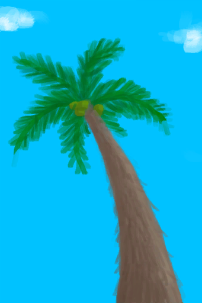
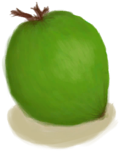

# 椰子树  
> 可以从上面获取椰子，或者砍倒它获取木材。  
  
<table class="table table-bordered" data-toggle="table"  data-show-header="false"><thead style="display:none"><tr ><th  style="width:50%;text-align:left;vertical-align:top;"  data-sortable="true"  >title</th><th  style="width:50%;text-align:left;vertical-align:top;"  ></th></tr></thead><tr ><td  style="width:50%;text-align:left;vertical-align:top;"  ></td><td  style="width:50%;text-align:left;vertical-align:top;"  >

<a href="PalmTree_IH.md" style="color:black">椰子树</a>

</td></tr></tbody></table>  
  
## 动作  

<table><tr><td rowspan="2" style="width:200px;text-align:center;font-size:1.3em;font-weight:bold">

爬树

30分

</td><td></td></tr><tr><td></td></tr><tr><td colspan="2"><b>需求：</b>[

[光亮](Light.md)](Light.md): <b>10-100</b>, [

[耐力](Stamina.md)](Stamina.md): <b>11-32</b></td></tr><tr><td colspan="2"><b>状态变化：</b>[

[耐力](Stamina.md)](Stamina.md)<b>-6</b>, [

[足部损伤](FootDamage.md)](FootDamage.md)<b>+8</b>, [

[污垢](Filth.md)](Filth.md)<b>+6</b>, [

[攀爬(技能)](Skill_Climbing.md)](Skill_Climbing.md)<b>+1</b></td></tr><tr><td colspan="2">

<table style="margin-bottom:3px;"><tr><td rowspan=2 style="text-align:center" width="80px">
基础权重

1
</td><td style="font-size:0.6em;line-height:0.6em;font-weight:bold">Fall - Abrasion</td></tr><tr><td>[

[坠落！(事件)](Event_FallAbrasion.md)](Event_FallAbrasion.md)(<b>+1</b>)</td></tr></table>

<table style="margin-bottom:3px;"><tr><td rowspan=2 style="text-align:center" width="80px">
基础权重

2
</td><td style="font-size:0.6em;line-height:0.6em;font-weight:bold">Fall - Bruises</td></tr><tr><td>[

[坠落！(事件)](Event_FallBruise.md)](Event_FallBruise.md)(<b>+1</b>)</td></tr></table>

<table style="margin-bottom:3px;"><tr><td rowspan=2 style="text-align:center" width="80px">
基础权重

8
</td><td style="font-size:0.6em;line-height:0.6em;font-weight:bold">Success</td></tr><tr><td>[

[椰子树4(事件)](Event_PalmTree4.md)](Event_PalmTree4.md)(<b>+1</b>)</td></tr><tr><td colspan=2><li>[

[攀爬(技能)](Skill_Climbing.md)](Skill_Climbing.md)为<b>0～100</b>时权重<b>+0～+20</b></li><li>[

[降水值](RainValue.md)](RainValue.md)为<b>1～5</b>时权重<b>-4～-15</b></li></td></tr></table>
<button class="btn btn-secondary btn-sm" style="" data-toggle="modal" onclick="setCollectionDataBase64('eyJ0aXRsZSI6IuamgueOh+aooeaLnzog54is5qCRICjmpLDlrZDmoJEpIiwiY29sbGVjdGlvbnMiOlt7ImRyb3AiOiI8ZGl2IHN0eWxlPVwid2lkdGg6MjVweDtkaXNwbGF5OmlubGluZS1ibG9jazt0ZXh0LWFsaWduOmNlbnRlclwiPjxpbWcgZGVjb2Rpbmc9XCJhc3luY1wiIHNyYz1cIi4uL3dpa2kvU3ByaXRlL1dlYXRoZXJQYXJ0aWFsbHlDbG91ZHlfRnVsbC5wbmdcIiBocmVmPVwiYS5tZFwiIHN0eWxlPVwibWF4LXdpZHRoOjI1cHg7bWF4LWhlaWdodDoyNXB4O1wiPjwvZGl2PuWdoOiQve+8gSjkuovku7YpIiwiYmFzZSI6MSwiY29uZGl0aW9uIjpbXX0seyJkcm9wIjoiPGRpdiBzdHlsZT1cIndpZHRoOjI1cHg7ZGlzcGxheTppbmxpbmUtYmxvY2s7dGV4dC1hbGlnbjpjZW50ZXJcIj48aW1nIGRlY29kaW5nPVwiYXN5bmNcIiBzcmM9XCIuLi93aWtpL1Nwcml0ZS9XZWF0aGVyUGFydGlhbGx5Q2xvdWR5X0Z1bGwucG5nXCIgaHJlZj1cImEubWRcIiBzdHlsZT1cIm1heC13aWR0aDoyNXB4O21heC1oZWlnaHQ6MjVweDtcIj48L2Rpdj7lnaDokL3vvIEo5LqL5Lu2KSIsImJhc2UiOjIsImNvbmRpdGlvbiI6W119LHsiZHJvcCI6IjxkaXYgc3R5bGU9XCJ3aWR0aDoyNXB4O2Rpc3BsYXk6aW5saW5lLWJsb2NrO3RleHQtYWxpZ246Y2VudGVyXCI+PGltZyBkZWNvZGluZz1cImFzeW5jXCIgc3JjPVwiLi4vd2lraS9TcHJpdGUvUGFsbVRyZWUucG5nXCIgaHJlZj1cImEubWRcIiBzdHlsZT1cIm1heC13aWR0aDoyNXB4O21heC1oZWlnaHQ6MjVweDtcIj48L2Rpdj7mpLDlrZDmoJE0KOS6i+S7tikiLCJiYXNlIjo4LCJjb25kaXRpb24iOlt7ImtleSI6IlNraWxsX0NsaW1iaW5nIiwidGl0bGUiOiLmlIDniKwo5oqA6IO9KSIsInR5cGUiOiJyYW5nZSIsIm1heCI6WzAsMTUwXSwicmFuZ2UiOlswLDEwMF0sIndlaWdodCI6WzAsMjBdLCJkZWZhdWx0VmFsdWUiOjAsIndoZW5PdXRPZlJhbmdlIjowfSx7ImtleSI6IlJhaW5WYWx1ZSIsInRpdGxlIjoi6ZmN5rC05YC8IiwidHlwZSI6InJhbmdlIiwibWF4IjpbMCw1XSwicmFuZ2UiOlsxLDVdLCJ3ZWlnaHQiOlstNCwtMTVdLCJkZWZhdWx0VmFsdWUiOjEsIndoZW5PdXRPZlJhbmdlIjowfV19XX0=')" data-target="#modelCollectionSimulator">概率模拟</button>
</td></tr></table>
  
  
  
## 可拖入  

<table style="margin-bottom:0px;"><tr><td style="width:40%;text-align:left; background-color:#FEFEFE"><b>拖入：</b>[

[石斧](StoneAxe.md)](StoneAxe.md)</td><td style="width:40%;font-size:1em;font-weight:bold;background-color:#FEFEFE">砍倒 (1小时) </td></tr><tr style="background-color:#FFFFFF"><td style=""><b>使用物：</b>可用次数  <b>-1</b></td><td style=""><b>自身：</b>→ [

[原木](Log.md)](Log.md)</td></tr><tr><td colspan="2"><b>状态变化：</b>[

[体重](Weight.md)](Weight.md)<b>-8</b>, [

[手掌损伤](HandDamage.md)](HandDamage.md)<b>+80</b></td></tr><tr><td colspan="2"><b>需求：</b>[

[光亮](Light.md)](Light.md): <b>10-100</b>, [

[耐力](Stamina.md)](Stamina.md): <b>11-32</b></td></tr><tr><td colspan="2">[

[青椰子](CoconutHusked.md)](CoconutHusked.md)(<b>+1～+2</b>), [

[棕榈叶](PalmFronds.md)](PalmFronds.md)(<b>+6</b>)</td></tr></table>
  

<table style="margin-bottom:0px;"><tr><td style="width:40%;text-align:left; background-color:#FEFEFE"><b>拖入：</b>[

[铜斧](AxeCopper.md)](AxeCopper.md)</td><td style="width:40%;font-size:1em;font-weight:bold;background-color:#FEFEFE">砍倒 (45分) </td></tr><tr style="background-color:#FFFFFF"><td style=""><b>使用物：</b>可用次数  <b>-1</b></td><td style=""><b>自身：</b>→ [

[原木](Log.md)](Log.md)</td></tr><tr><td colspan="2"><b>状态变化：</b>[

[体重](Weight.md)](Weight.md)<b>-8</b>, [

[手掌损伤](HandDamage.md)](HandDamage.md)<b>+60</b></td></tr><tr><td colspan="2"><b>需求：</b>[

[光亮](Light.md)](Light.md): <b>10-100</b>, [

[耐力](Stamina.md)](Stamina.md): <b>11-32</b></td></tr><tr><td colspan="2">[

[青椰子](CoconutHusked.md)](CoconutHusked.md)(<b>+1～+2</b>), [

[棕榈叶](PalmFronds.md)](PalmFronds.md)(<b>+6</b>)</td></tr></table>
  
  
## 状态触发  
<table class="table table-bordered" data-toggle="table"  ><thead style=""><tr ><th  style="text-align:left;vertical-align:top;"  >名称</th><th  style="text-align:left;vertical-align:top;"  >条件</th><th  style="text-align:left;vertical-align:top;"  >变化</th></tr></thead><tr ><td  style="text-align:left;vertical-align:top;"  >摘完的</td><td  style="text-align:left;vertical-align:top;"  >[阻止抽到棕榈树](PalmTreeKiller.md): <b>1-1</b></td><td  style="text-align:left;vertical-align:top;"  >→ [

[摘完的椰子树](PalmTreeCleared.md)](PalmTreeCleared.md)</td></tr></tbody></table>  
  

