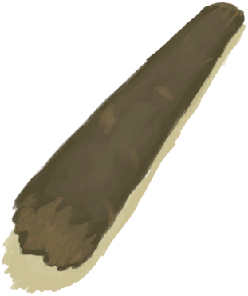

# 椰子树  
> 可以从上面获取椰子，或者砍倒它获取木材。  
  
<table class="table table-bordered" data-toggle="table" ><tbody><tr ><td  style="width:80%;text-align:left;vertical-align:top;"  ></td><td  style="width:20%;text-align:left;vertical-align:top;"  >

</td></tr></tbody></tbody></table>  
  
## 动作  
<table class="table table-bordered" data-toggle="table" ><thead><tr ><th  style="text-align:left;vertical-align:top;"  >动作</th><th  style="text-align:left;vertical-align:top;"  >耗时</th><th  style="text-align:left;vertical-align:top;"  >条件</th><th  style="text-align:left;vertical-align:top;"  >变化</th><th  style="text-align:left;vertical-align:top;"  >状态</th></tr></thead><tr ><td  style="text-align:left;vertical-align:top;"  >爬树 </td><td  style="text-align:left;vertical-align:top;"  >2TP</td><td  style="text-align:left;vertical-align:top;"  >[

[光亮](Light.md)](Light.md): 10-100 [

[耐力](Stamina.md)](Stamina.md): 11-32</td><td  style="text-align:left;vertical-align:top;"  >** 获得： ** ** [Fall - Abrasion]  **   [

[坠落！(事件)](Event_FallAbrasion.md)](Event_FallAbrasion.md)(+1) 基础权重：1 ** [Fall - Bruises]  **   [

[坠落！(事件)](Event_FallBruise.md)](Event_FallBruise.md)(+1) 基础权重：2 ** [Success]  **   [

[椰子树4(事件)](Event_PalmTree4.md)](Event_PalmTree4.md)(+1) 基础权重：8<li>[

[攀爬(技能)](Skill_Climbing.md)](Skill_Climbing.md)为0～100时权重+0～+20</li><li>[

[降水值](RainValue.md)](RainValue.md)为1～5时权重-4～-15</li></td><td  style="text-align:left;vertical-align:top;"  >[

[耐力](Stamina.md)](Stamina.md)-6 [

[足部损伤](FootDamage.md)](FootDamage.md)+8 [

[污垢](Filth.md)](Filth.md)+6 [

[攀爬(技能)](Skill_Climbing.md)](Skill_Climbing.md)+1</td></tr></tbody></table>  
  
## 可拖入  
<table class="table table-bordered" data-toggle="table" ><thead><tr ><th  style="text-align:left;vertical-align:top;"  >使用</th><th  style="text-align:left;vertical-align:top;"  >动作</th><th  style="text-align:left;vertical-align:top;"  >耗时</th><th  style="text-align:left;vertical-align:top;"  >条件</th><th  style="text-align:left;vertical-align:top;"  >变化</th><th  style="text-align:left;vertical-align:top;"  >玩家状态</th></tr></thead><tr ><td  style="text-align:left;vertical-align:top;"  >[

[石斧](StoneAxe.md)](StoneAxe.md)</td><td  style="text-align:left;vertical-align:top;"  >砍倒 </td><td  style="text-align:left;vertical-align:top;"  >4TP</td><td  style="text-align:left;vertical-align:top;"  >[

[光亮](Light.md)](Light.md): 10-100 [

[耐力](Stamina.md)](Stamina.md): 11-32</td><td  style="text-align:left;vertical-align:top;"  >** 自身: ** → [

[原木](Log.md)](Log.md)  ** 使用物: ** 可用次数  -1  ** 获得: ** ** [Coconuts and Leaves]  **   [

[青椰子](CoconutHusked.md)](CoconutHusked.md)(+1～+2)   [

[棕榈叶](PalmFronds.md)](PalmFronds.md)(+6) 基础权重：1</td><td  style="text-align:left;vertical-align:top;"  >[

[体重](Weight.md)](Weight.md)-8 [

[手掌损伤](HandDamage.md)](HandDamage.md)+80</td></tr><tr ><td  style="text-align:left;vertical-align:top;"  >[

[铜斧](AxeCopper.md)](AxeCopper.md)</td><td  style="text-align:left;vertical-align:top;"  >砍倒 </td><td  style="text-align:left;vertical-align:top;"  >3TP</td><td  style="text-align:left;vertical-align:top;"  >[

[光亮](Light.md)](Light.md): 10-100 [

[耐力](Stamina.md)](Stamina.md): 11-32</td><td  style="text-align:left;vertical-align:top;"  >** 自身: ** → [

[原木](Log.md)](Log.md)  ** 使用物: ** 可用次数  -1  ** 获得: ** ** [Coconuts and Leaves]  **   [

[青椰子](CoconutHusked.md)](CoconutHusked.md)(+1～+2)   [

[棕榈叶](PalmFronds.md)](PalmFronds.md)(+6) 基础权重：1</td><td  style="text-align:left;vertical-align:top;"  >[

[体重](Weight.md)](Weight.md)-8 [

[手掌损伤](HandDamage.md)](HandDamage.md)+60</td></tr></tbody></table>  
  
## 状态触发  
<table class="table table-bordered" data-toggle="table" ><thead><tr ><th  style="text-align:left;vertical-align:top;"  >名称</th><th  style="text-align:left;vertical-align:top;"  >条件</th><th  style="text-align:left;vertical-align:top;"  >变化</th></tr></thead><tr ><td  style="text-align:left;vertical-align:top;"  >摘完的</td><td  style="text-align:left;vertical-align:top;"  >[阻止抽到棕榈树](PalmTreeKiller.md): 1-1</td><td  style="text-align:left;vertical-align:top;"  >→ [

[摘完的椰子树](PalmTreeCleared.md)](PalmTreeCleared.md)</td></tr></tbody></table>  
  

