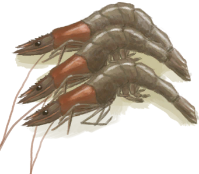

# 寄生虫  
>   
  
#### ** 基础值: ** 0   
#### ** 变化范围: ** 0 ~ 1500  
#### ** 基础变化率: ** 无   
## 阶段  
<table class="table table-bordered"><thead><tr ><th  style="text-align:left;vertical-align:top;" >范围</th><th  style="text-align:left;vertical-align:top;" >名称</th><th  style="text-align:left;vertical-align:top;" >描述</th><th  style="text-align:left;vertical-align:top;" >影响状态</th><th  style="text-align:left;vertical-align:top;" >影响动作</th></tr></thead><tr ><td  style="text-align:left;vertical-align:top;" >200 ～ 300</td><td  style="text-align:left;vertical-align:top;" ></td><td  style="text-align:left;vertical-align:top;" ></td><td  style="text-align:left;vertical-align:top;" >[

[寄生虫](Parasites.md)](Parasites.md)加成+1 [

[体重](Weight.md)](Weight.md)加成-0.5 [

[免疫系统](ImmuneSystem.md)](ImmuneSystem.md) [

[食欲](Appetite.md)](Appetite.md)+25</td><td  style="text-align:left;vertical-align:top;" ></td></tr><tr ><td  style="text-align:left;vertical-align:top;" >301 ～ 600</td><td  style="text-align:left;vertical-align:top;" ></td><td  style="text-align:left;vertical-align:top;" ></td><td  style="text-align:left;vertical-align:top;" >[

[寄生虫](Parasites.md)](Parasites.md)加成+2 [

[体重](Weight.md)](Weight.md)加成-1 [

[免疫系统](ImmuneSystem.md)](ImmuneSystem.md)-25 [

[食欲](Appetite.md)](Appetite.md)+50</td><td  style="text-align:left;vertical-align:top;" ></td></tr><tr ><td  style="text-align:left;vertical-align:top;" >601 ～ 900</td><td  style="text-align:left;vertical-align:top;" >

皮疹</td><td  style="text-align:left;vertical-align:top;" >我长了点皮疹。</td><td  style="text-align:left;vertical-align:top;" >[

[寄生虫](Parasites.md)](Parasites.md)加成+3 [

[体重](Weight.md)](Weight.md)加成-1.5 [

[免疫系统](ImmuneSystem.md)](ImmuneSystem.md)-50 [

[食欲](Appetite.md)](Appetite.md)+75</td><td  style="text-align:left;vertical-align:top;" ></td></tr><tr ><td  style="text-align:left;vertical-align:top;" >901 ～ 1500</td><td  style="text-align:left;vertical-align:top;" >

皮疹</td><td  style="text-align:left;vertical-align:top;" >我起皮疹了。</td><td  style="text-align:left;vertical-align:top;" >[

[寄生虫](Parasites.md)](Parasites.md)加成+4 [

[体重](Weight.md)](Weight.md)加成-2 [

[免疫系统](ImmuneSystem.md)](ImmuneSystem.md)-75 [

[食欲](Appetite.md)](Appetite.md)+100</td><td  style="text-align:left;vertical-align:top;" ></td></tr></tbody></table>  
  
## 相关卡牌  
[免疫系统](ImmuneSystem.md)  |  [污垢](Filth.md)  |  [奎宁](Quinine.md)  
## 可被以下操作改变  
<table class="table table-bordered"><thead><tr ><th  style="text-align:left;vertical-align:top;" >来源</th><th  style="text-align:left;vertical-align:top;" >操作</th><th  style="text-align:left;vertical-align:top;" >值</th></tr></thead><tr ><td  style="text-align:left;vertical-align:top;" >[

[猕猴肉](MacaqueMeat.md)](MacaqueMeat.md)</td><td  style="text-align:left;vertical-align:top;" >食用</td><td  style="text-align:left;vertical-align:top;" >150 ~ 300</td></tr><tr ><td  style="text-align:left;vertical-align:top;" >[

[腐烂物](RottenRemains.md)](RottenRemains.md)</td><td  style="text-align:left;vertical-align:top;" >食用</td><td  style="text-align:left;vertical-align:top;" >50 ~ 100</td></tr><tr ><td  style="text-align:left;vertical-align:top;" >[

[鸟肉](BirdMeat.md)](BirdMeat.md)</td><td  style="text-align:left;vertical-align:top;" >食用</td><td  style="text-align:left;vertical-align:top;" >0 ~ 150</td></tr><tr ><td  style="text-align:left;vertical-align:top;" >[

[野猪肉](BoarMeat.md)](BoarMeat.md)</td><td  style="text-align:left;vertical-align:top;" >食用</td><td  style="text-align:left;vertical-align:top;" >0 ~ 150</td></tr><tr ><td  style="text-align:left;vertical-align:top;" >[

[北梭鱼肉](BonefishMeat.md)](BonefishMeat.md)</td><td  style="text-align:left;vertical-align:top;" >食用</td><td  style="text-align:left;vertical-align:top;" >0 ~ 150</td></tr><tr ><td  style="text-align:left;vertical-align:top;" >[

[海螺肉](ConchMeat.md)](ConchMeat.md)</td><td  style="text-align:left;vertical-align:top;" >食用</td><td  style="text-align:left;vertical-align:top;" >0 ~ 50</td></tr><tr ><td  style="text-align:left;vertical-align:top;" >[

[松软的海螺肉](ConchMeatSoft.md)](ConchMeatSoft.md)</td><td  style="text-align:left;vertical-align:top;" >食用</td><td  style="text-align:left;vertical-align:top;" >0 ~ 50</td></tr><tr ><td  style="text-align:left;vertical-align:top;" >[

[螃蟹](Crab.md)](Crab.md)</td><td  style="text-align:left;vertical-align:top;" >食用</td><td  style="text-align:left;vertical-align:top;" >0 ~ 100</td></tr><tr ><td  style="text-align:left;vertical-align:top;" >[

[鱼杂](FishScraps.md)](FishScraps.md)</td><td  style="text-align:left;vertical-align:top;" >食用</td><td  style="text-align:left;vertical-align:top;" >0 ~ 50</td></tr><tr ><td  style="text-align:left;vertical-align:top;" >[

[鱼片](FishSlices.md)](FishSlices.md)</td><td  style="text-align:left;vertical-align:top;" >食用</td><td  style="text-align:left;vertical-align:top;" >0 ~ 25</td></tr><tr ><td  style="text-align:left;vertical-align:top;" >[

[羊肉](GoatMeat.md)](GoatMeat.md)</td><td  style="text-align:left;vertical-align:top;" >食用</td><td  style="text-align:left;vertical-align:top;" >0 ~ 150</td></tr><tr ><td  style="text-align:left;vertical-align:top;" >[

[绯鲤](Goatfish.md)](Goatfish.md)</td><td  style="text-align:left;vertical-align:top;" >食用</td><td  style="text-align:left;vertical-align:top;" >0 ~ 150</td></tr><tr ><td  style="text-align:left;vertical-align:top;" >[

[鲱鱼](Herring.md)](Herring.md)</td><td  style="text-align:left;vertical-align:top;" >食用</td><td  style="text-align:left;vertical-align:top;" >0 ~ 150</td></tr><tr ><td  style="text-align:left;vertical-align:top;" >[

[蜥蜴](Lizard.md)](Lizard.md)</td><td  style="text-align:left;vertical-align:top;" >食用</td><td  style="text-align:left;vertical-align:top;" >0 ~ 100</td></tr><tr ><td  style="text-align:left;vertical-align:top;" >[

[巨蜥肉](MonitorMeat.md)](MonitorMeat.md)</td><td  style="text-align:left;vertical-align:top;" >食用</td><td  style="text-align:left;vertical-align:top;" >0 ~ 150</td></tr><tr ><td  style="text-align:left;vertical-align:top;" >[

[剥皮的老鼠](MouseSkinned.md)](MouseSkinned.md)</td><td  style="text-align:left;vertical-align:top;" >食用</td><td  style="text-align:left;vertical-align:top;" >0 ~ 100</td></tr><tr ><td  style="text-align:left;vertical-align:top;" >[

[弹涂鱼](Mudskipper.md)](Mudskipper.md)</td><td  style="text-align:left;vertical-align:top;" >食用</td><td  style="text-align:left;vertical-align:top;" >0 ~ 100</td></tr><tr ><td  style="text-align:left;vertical-align:top;" >[

[牡蛎肉](OysterMeat.md)](OysterMeat.md)</td><td  style="text-align:left;vertical-align:top;" >食用</td><td  style="text-align:left;vertical-align:top;" >0 ~ 50</td></tr><tr ><td  style="text-align:left;vertical-align:top;" >[

[鹦哥鱼](ParrotFish.md)](ParrotFish.md)</td><td  style="text-align:left;vertical-align:top;" >食用</td><td  style="text-align:left;vertical-align:top;" >0 ~ 150</td></tr><tr ><td  style="text-align:left;vertical-align:top;" >[

[小灰山鹑尸体](PartridgeChickDead.md)](PartridgeChickDead.md)</td><td  style="text-align:left;vertical-align:top;" >食用</td><td  style="text-align:left;vertical-align:top;" >0 ~ 100</td></tr><tr ><td  style="text-align:left;vertical-align:top;" >[

[虾](Prawns.md)](Prawns.md)</td><td  style="text-align:left;vertical-align:top;" >食用</td><td  style="text-align:left;vertical-align:top;" >0 ~ 50</td></tr><tr ><td  style="text-align:left;vertical-align:top;" >[

[海怪肉](Seahoundmeat.md)](Seahoundmeat.md)</td><td  style="text-align:left;vertical-align:top;" >食用</td><td  style="text-align:left;vertical-align:top;" >0 ~ 75</td></tr><tr ><td  style="text-align:left;vertical-align:top;" >[

[鲨鱼肉](SharkMeat.md)](SharkMeat.md)</td><td  style="text-align:left;vertical-align:top;" >食用</td><td  style="text-align:left;vertical-align:top;" >0 ~ 150</td></tr><tr ><td  style="text-align:left;vertical-align:top;" >[

[剥皮的蛇](SnakeSkinned.md)](SnakeSkinned.md)</td><td  style="text-align:left;vertical-align:top;" >食用</td><td  style="text-align:left;vertical-align:top;" >0 ~ 150</td></tr><tr ><td  style="text-align:left;vertical-align:top;" >[

[马鲅鱼肉](ThreadfinMeat.md)](ThreadfinMeat.md)</td><td  style="text-align:left;vertical-align:top;" >食用</td><td  style="text-align:left;vertical-align:top;" >0 ~ 150</td></tr><tr ><td  style="text-align:left;vertical-align:top;" >[

[海胆肉](UrchinMeat.md)](UrchinMeat.md)</td><td  style="text-align:left;vertical-align:top;" >食用</td><td  style="text-align:left;vertical-align:top;" >0 ~ 75</td></tr><tr ><td  style="text-align:left;vertical-align:top;" >[

[不安全的水](LQ_WaterUnsafe.md)](LQ_WaterUnsafe.md)</td><td  style="text-align:left;vertical-align:top;" >饮用</td><td  style="text-align:left;vertical-align:top;" >0 ~ 150</td></tr></tbody></table>  
  

