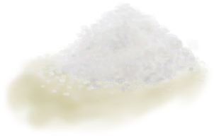

# 鹦哥鱼  
> 做熟后味道会更好。  
  
<table class="table table-bordered" data-toggle="table"  data-show-header="false"><thead style="display:none"><tr ><th  style="width:50%;text-align:left;vertical-align:top;"  >title</th><th  style="width:50%;text-align:left;vertical-align:top;"  ></th></tr></thead><tr ><td  style="width:50%;text-align:left;vertical-align:top;"  >**重量：**100  **标签：**	[“可烹饪的”](tag_Cookable.md), [“饲料”](tag_Feed.md), [“肉”](tag_Meat.md), [“生鱼”](tag_RawFish.md), [“鱼肉”](tag_Fish.md)</td><td  style="width:50%;text-align:left;vertical-align:top;"  >

<a href="ParrotFish.md" style="color:black">鹦哥鱼</a>

</td></tr></tbody></table>  
  
## 获取来源  
<table class="table table-bordered" data-toggle="table"  ><thead style=""><tr ><th  style="text-align:left;vertical-align:top;"  >来源</th><th  style="text-align:left;vertical-align:top;"  >操作</th></tr></thead><tr ><td  style="text-align:left;vertical-align:top;"  >[

[捕鱼陷阱](FishTrapDeployed.md)](FishTrapDeployed.md)</td><td  style="text-align:left;vertical-align:top;"  >捕捉猎物</td></tr><tr ><td  style="text-align:left;vertical-align:top;"  >[

[海水(覆溺洞穴)](Sea_Cave.md)](Sea_Cave.md)</td><td  style="text-align:left;vertical-align:top;"  >钓鱼 ** 拖入：**[“钓鱼线”](tag_FishingLine.md)</td></tr><tr ><td  style="text-align:left;vertical-align:top;"  >[

[海水(覆溺洞穴)](Sea_Cave.md)](Sea_Cave.md)</td><td  style="text-align:left;vertical-align:top;"  >钓鱼 ** 拖入：**[“诱饵（用于钓鱼线）”](tag_FishingLineBait.md)</td></tr><tr ><td  style="text-align:left;vertical-align:top;"  >[

[海水(覆溺洞穴)](Sea_Cave.md)](Sea_Cave.md)</td><td  style="text-align:left;vertical-align:top;"  >轰隆！ ** 拖入：**[炸弹(开)](DynamiteOn.md)</td></tr><tr ><td  style="text-align:left;vertical-align:top;"  >[

[海(环礁)](Sea_Atoll.md)](Sea_Atoll.md)</td><td  style="text-align:left;vertical-align:top;"  >叉鱼 ** 拖入：**[“一级矛”](tag_Spear.md)</td></tr><tr ><td  style="text-align:left;vertical-align:top;"  >[

[海(环礁)](Sea_Atoll.md)](Sea_Atoll.md)</td><td  style="text-align:left;vertical-align:top;"  >钓鱼 ** 拖入：**[“钓鱼线”](tag_FishingLine.md)</td></tr><tr ><td  style="text-align:left;vertical-align:top;"  >[

[海(环礁)](Sea_Atoll.md)](Sea_Atoll.md)</td><td  style="text-align:left;vertical-align:top;"  >钓鱼 ** 拖入：**[“诱饵（用于钓鱼线）”](tag_FishingLineBait.md)</td></tr><tr ><td  style="text-align:left;vertical-align:top;"  >[

[海(环礁)](Sea_Atoll.md)](Sea_Atoll.md)</td><td  style="text-align:left;vertical-align:top;"  >轰隆！ ** 拖入：**[炸弹(开)](DynamiteOn.md)</td></tr><tr ><td  style="text-align:left;vertical-align:top;"  >[

[海(海湾)](Sea_Bay.md)](Sea_Bay.md)</td><td  style="text-align:left;vertical-align:top;"  >叉鱼 ** 拖入：**[“一级矛”](tag_Spear.md)</td></tr><tr ><td  style="text-align:left;vertical-align:top;"  >[

[海(海湾)](Sea_Bay.md)](Sea_Bay.md)</td><td  style="text-align:left;vertical-align:top;"  >钓鱼 ** 拖入：**[“钓鱼线”](tag_FishingLine.md)</td></tr><tr ><td  style="text-align:left;vertical-align:top;"  >[

[海(海湾)](Sea_Bay.md)](Sea_Bay.md)</td><td  style="text-align:left;vertical-align:top;"  >钓鱼 ** 拖入：**[“诱饵（用于钓鱼线）”](tag_FishingLineBait.md)</td></tr><tr ><td  style="text-align:left;vertical-align:top;"  >[

[海(海湾)](Sea_Bay.md)](Sea_Bay.md)</td><td  style="text-align:left;vertical-align:top;"  >轰隆！ ** 拖入：**[炸弹(开)](DynamiteOn.md)</td></tr><tr ><td  style="text-align:left;vertical-align:top;"  >[

[海(沙滩)](Sea_Beach.md)](Sea_Beach.md)</td><td  style="text-align:left;vertical-align:top;"  >叉鱼 ** 拖入：**[“一级矛”](tag_Spear.md)</td></tr><tr ><td  style="text-align:left;vertical-align:top;"  >[

[海(沙滩)](Sea_Beach.md)](Sea_Beach.md)</td><td  style="text-align:left;vertical-align:top;"  >钓鱼 ** 拖入：**[“钓鱼线”](tag_FishingLine.md)</td></tr><tr ><td  style="text-align:left;vertical-align:top;"  >[

[海(沙滩)](Sea_Beach.md)](Sea_Beach.md)</td><td  style="text-align:left;vertical-align:top;"  >钓鱼 ** 拖入：**[“诱饵（用于钓鱼线）”](tag_FishingLineBait.md)</td></tr><tr ><td  style="text-align:left;vertical-align:top;"  >[

[海(沙滩)](Sea_Beach.md)](Sea_Beach.md)</td><td  style="text-align:left;vertical-align:top;"  >轰隆！ ** 拖入：**[炸弹(开)](DynamiteOn.md)</td></tr><tr ><td  style="text-align:left;vertical-align:top;"  >[

[海(沙滩)](Sea_Cove.md)](Sea_Cove.md)</td><td  style="text-align:left;vertical-align:top;"  >叉鱼 ** 拖入：**[“一级矛”](tag_Spear.md)</td></tr><tr ><td  style="text-align:left;vertical-align:top;"  >[

[海(沙滩)](Sea_Cove.md)](Sea_Cove.md)</td><td  style="text-align:left;vertical-align:top;"  >钓鱼 ** 拖入：**[“钓鱼线”](tag_FishingLine.md)</td></tr><tr ><td  style="text-align:left;vertical-align:top;"  >[

[海(沙滩)](Sea_Cove.md)](Sea_Cove.md)</td><td  style="text-align:left;vertical-align:top;"  >钓鱼 ** 拖入：**[“诱饵（用于钓鱼线）”](tag_FishingLineBait.md)</td></tr><tr ><td  style="text-align:left;vertical-align:top;"  >[

[海(沙滩)](Sea_Cove.md)](Sea_Cove.md)</td><td  style="text-align:left;vertical-align:top;"  >轰隆！ ** 拖入：**[炸弹(开)](DynamiteOn.md)</td></tr><tr ><td  style="text-align:left;vertical-align:top;"  >[

[海(荒芜沙滩)](Sea_DesolateBeach.md)](Sea_DesolateBeach.md)</td><td  style="text-align:left;vertical-align:top;"  >叉鱼 ** 拖入：**[“一级矛”](tag_Spear.md)</td></tr><tr ><td  style="text-align:left;vertical-align:top;"  >[

[海(荒芜沙滩)](Sea_DesolateBeach.md)](Sea_DesolateBeach.md)</td><td  style="text-align:left;vertical-align:top;"  >钓鱼 ** 拖入：**[“钓鱼线”](tag_FishingLine.md)</td></tr><tr ><td  style="text-align:left;vertical-align:top;"  >[

[海(荒芜沙滩)](Sea_DesolateBeach.md)](Sea_DesolateBeach.md)</td><td  style="text-align:left;vertical-align:top;"  >钓鱼 ** 拖入：**[“诱饵（用于钓鱼线）”](tag_FishingLineBait.md)</td></tr><tr ><td  style="text-align:left;vertical-align:top;"  >[

[海(荒芜沙滩)](Sea_DesolateBeach.md)](Sea_DesolateBeach.md)</td><td  style="text-align:left;vertical-align:top;"  >轰隆！ ** 拖入：**[炸弹(开)](DynamiteOn.md)</td></tr><tr ><td  style="text-align:left;vertical-align:top;"  >[

[海(红树林)](Sea_Mangroves.md)](Sea_Mangroves.md)</td><td  style="text-align:left;vertical-align:top;"  >叉鱼 ** 拖入：**[“一级矛”](tag_Spear.md)</td></tr><tr ><td  style="text-align:left;vertical-align:top;"  >[

[海(红树林)](Sea_Mangroves.md)](Sea_Mangroves.md)</td><td  style="text-align:left;vertical-align:top;"  >钓鱼 ** 拖入：**[“钓鱼线”](tag_FishingLine.md)</td></tr><tr ><td  style="text-align:left;vertical-align:top;"  >[

[海(红树林)](Sea_Mangroves.md)](Sea_Mangroves.md)</td><td  style="text-align:left;vertical-align:top;"  >钓鱼 ** 拖入：**[“诱饵（用于钓鱼线）”](tag_FishingLineBait.md)</td></tr><tr ><td  style="text-align:left;vertical-align:top;"  >[

[海(红树林)](Sea_Mangroves.md)](Sea_Mangroves.md)</td><td  style="text-align:left;vertical-align:top;"  >轰隆！ ** 拖入：**[炸弹(开)](DynamiteOn.md)</td></tr><tr ><td  style="text-align:left;vertical-align:top;"  >[

[海](Sea_Raft.md)](Sea_Raft.md)</td><td  style="text-align:left;vertical-align:top;"  >钓鱼 ** 拖入：**[“钓鱼线”](tag_FishingLine.md)</td></tr><tr ><td  style="text-align:left;vertical-align:top;"  >[

[海](Sea_Raft.md)](Sea_Raft.md)</td><td  style="text-align:left;vertical-align:top;"  >钓鱼 ** 拖入：**[“诱饵（用于钓鱼线）”](tag_FishingLineBait.md)</td></tr><tr ><td  style="text-align:left;vertical-align:top;"  >[

[海(鸟岩岛)](Sea_Rocks.md)](Sea_Rocks.md)</td><td  style="text-align:left;vertical-align:top;"  >叉鱼 ** 拖入：**[“一级矛”](tag_Spear.md)</td></tr><tr ><td  style="text-align:left;vertical-align:top;"  >[

[海(鸟岩岛)](Sea_Rocks.md)](Sea_Rocks.md)</td><td  style="text-align:left;vertical-align:top;"  >钓鱼 ** 拖入：**[“钓鱼线”](tag_FishingLine.md)</td></tr><tr ><td  style="text-align:left;vertical-align:top;"  >[

[海(鸟岩岛)](Sea_Rocks.md)](Sea_Rocks.md)</td><td  style="text-align:left;vertical-align:top;"  >钓鱼 ** 拖入：**[“诱饵（用于钓鱼线）”](tag_FishingLineBait.md)</td></tr><tr ><td  style="text-align:left;vertical-align:top;"  >[

[海(鸟岩岛)](Sea_Rocks.md)](Sea_Rocks.md)</td><td  style="text-align:left;vertical-align:top;"  >轰隆！ ** 拖入：**[炸弹(开)](DynamiteOn.md)</td></tr></tbody></table>  
  
## 动作  
<table class="table table-bordered" data-toggle="table"  ><thead style=""><tr ><th  style="text-align:left;vertical-align:top;"  >动作</th><th  style="text-align:left;vertical-align:top;"  >耗时</th><th  style="text-align:left;vertical-align:top;"  data-sortable="true"  >条件</th><th  style="text-align:left;vertical-align:top;"  >变化</th><th  style="text-align:left;vertical-align:top;"  >状态</th></tr></thead><tr ><td  style="text-align:left;vertical-align:top;"  >食用 [“食用肉类动作(组)”](CarnivorousAction.md) [“进食动作(组)”](EatingAction.md)</td><td  style="text-align:left;vertical-align:top;"  >15分</td><td  style="text-align:left;vertical-align:top;"  ></td><td  style="text-align:left;vertical-align:top;"  >** 自身：** →消失  ** 获得： ** ** [Scraps]  **   [

[鱼杂](FishScraps.md)](FishScraps.md)(+2) </td><td  style="text-align:left;vertical-align:top;"  >[

[饱食](Satiation.md)](Satiation.md)+15 [

[胃](Stomach.md)](Stomach.md)+14 [

[水分](Hydration.md)](Hydration.md)+4 [

[情绪](Morale.md)](Morale.md)-2 [

[鱼类<nobr>厌倦度</nobr>](SaturationFish.md)](SaturationFish.md)+35 [

[污垢](Filth.md)](Filth.md)+5 [

[细菌性发烧](BacteriaFever.md)](BacteriaFever.md)+0～+100 [

[寄生虫](Parasites.md)](Parasites.md)+0～+150</td></tr></tbody></table>  
  
## 可拖入  
<table class="table table-bordered" data-toggle="table"  ><thead style=""><tr ><th  style="text-align:left;vertical-align:top;"  >使用</th><th  style="text-align:left;vertical-align:top;"  >动作</th><th  style="text-align:left;vertical-align:top;"  >耗时</th><th  style="text-align:left;vertical-align:top;"  >条件</th><th  style="text-align:left;vertical-align:top;"  >变化</th><th  style="text-align:left;vertical-align:top;"  data-sortable="true"  >玩家状态</th></tr></thead><tr ><td  style="text-align:left;vertical-align:top;"  >[

[盐](Salt.md)](Salt.md)</td><td  style="text-align:left;vertical-align:top;"  >腌制 </td><td  style="text-align:left;vertical-align:top;"  >15分</td><td  style="text-align:left;vertical-align:top;"  >[

[光亮](Light.md)](Light.md): 10-100</td><td  style="text-align:left;vertical-align:top;"  >** 自身: ** → [

[腌制中的咸鱼肉](FishSaltedDrying.md)](FishSaltedDrying.md)  ** 使用物: ** →消失  ** 获得: ** ** [Scraps]  **   [

[鱼杂](FishScraps.md)](FishScraps.md)(+2) </td><td  style="text-align:left;vertical-align:top;"  ></td></tr><tr ><td  style="text-align:left;vertical-align:top;"  >[“切割工具”](tag_Cutter.md)</td><td  style="text-align:left;vertical-align:top;"  >制作诱饵 [“手部动作(组)”](HandAction.md)</td><td  style="text-align:left;vertical-align:top;"  >15分</td><td  style="text-align:left;vertical-align:top;"  >[

[光亮](Light.md)](Light.md): 10-100</td><td  style="text-align:left;vertical-align:top;"  >** 自身: ** →消失  ** 使用物: ** 可用次数  -1  ** 获得: ** ** [Slices]  **   [

[鱼片](FishSlices.md)](FishSlices.md)(+8)   [

[鱼杂](FishScraps.md)](FishScraps.md)(+2) 基础权重：1</td><td  style="text-align:left;vertical-align:top;"  ></td></tr></tbody></table>  
  
## 可拖至  

[猪食槽](BoarFeeder.md)

[猪食槽](BoarFeeder.md)

[猪食槽(空)](BoarFeederEmpty.md)

[猪食槽(空)](BoarFeederEmpty.md)

[堆肥箱](CompostBin.md)

[灰山鹑喂食器](PartridgeFeeder.md)

[灰山鹑喂食器(空)](PartridgeFeederEmpty.md)

[烟熏炉](Smoker.md)

[烟熏炉(塑料布)(点燃)](SmokerPlastic.md)

[中陷阱的猕猴](CageTrapMacaque.md)

[母猪](BoarEnclosureFemale.md)

[母猪](BoarEnclosureFemale.md)

[公猪](BoarEnclosureMale.md)

[公猪](BoarEnclosureMale.md)

[小猪](BoarEnclosurePiglet.md)

[小猪](BoarEnclosurePiglet.md)

[母猪](BoarTiedFemale.md)

[母猪](BoarTiedFemale.md)

[公猪](BoarTiedMale.md)

[公猪](BoarTiedMale.md)

[小猪](BoarTiedPiglet.md)

[小猪](BoarTiedPiglet.md)

[忠犬朋友](DogFriend.md)

[忠犬朋友](DogFriend.md)

[猕猴朋友](MacaqueFriend.md)

[受伤的猕猴](MacaqueWounded.md)

[小灰山鹑](PartridgeChick.md)

[雌灰山鹑](PartridgeFemaleEnclosure.md)

[雌灰山鹑](PartridgeFemaleLive.md)

[雄灰山鹑](PartridgeMaleEnclosure.md)

[雄灰山鹑](PartridgeMaleLive.md)

  
  
## 可用于蓝图  

[

[椰子鱼(蓝图)](Bp_CoconutFish.md)](Bp_CoconutFish.md)

[

[炸鱼薯条(蓝图)](Bp_FishNChips.md)](Bp_FishNChips.md)

[

[鱼肉煎蛋饼(蓝图)](Bp_FishOmelette.md)](Bp_FishOmelette.md)

  
  
  
## 可用于转化  
<table class="table table-bordered" data-toggle="table"  ><thead style=""><tr ><th  style="text-align:left;vertical-align:top;"  >转化为</th><th  style="text-align:left;vertical-align:top;"  >容器</th></tr></thead><tr ><td  style="text-align:left;vertical-align:top;"  >[

[鱼干](FishDried.md)](FishDried.md)</td><td  style="text-align:left;vertical-align:top;"  >[

[晾晒架](DryingRack.md)](DryingRack.md)</td></tr><tr ><td  style="text-align:left;vertical-align:top;"  >[

[烤鹦哥鱼](ParrotFishCooked.md)](ParrotFishCooked.md)</td><td  style="text-align:left;vertical-align:top;"  >[

[营火](Campfire.md)](Campfire.md)</td></tr><tr ><td  style="text-align:left;vertical-align:top;"  >[

[烤鹦哥鱼](ParrotFishCooked.md)](ParrotFishCooked.md)</td><td  style="text-align:left;vertical-align:top;"  >[

[粘土火盆](ClayFirePit.md)](ClayFirePit.md)</td></tr><tr ><td  style="text-align:left;vertical-align:top;"  >[

[烤鹦哥鱼](ParrotFishCooked.md)](ParrotFishCooked.md)</td><td  style="text-align:left;vertical-align:top;"  >[

[火堆](Fire.md)](Fire.md)</td></tr><tr ><td  style="text-align:left;vertical-align:top;"  >[

[烤鹦哥鱼](ParrotFishCooked.md)](ParrotFishCooked.md)</td><td  style="text-align:left;vertical-align:top;"  >[

[瓦斯炉(开)](GasCookerOn.md)](GasCookerOn.md)</td></tr><tr ><td  style="text-align:left;vertical-align:top;"  >[

[烤鹦哥鱼](ParrotFishCooked.md)](ParrotFishCooked.md)</td><td  style="text-align:left;vertical-align:top;"  >[

[火炉](Stove.md)](Stove.md)</td></tr><tr ><td  style="text-align:left;vertical-align:top;"  >[

[烤鹦哥鱼](ParrotFishCooked.md)](ParrotFishCooked.md)</td><td  style="text-align:left;vertical-align:top;"  >[

[烟熏炉](Smoker.md)](Smoker.md)</td></tr><tr ><td  style="text-align:left;vertical-align:top;"  >[

[烤鹦哥鱼](ParrotFishCooked.md)](ParrotFishCooked.md)</td><td  style="text-align:left;vertical-align:top;"  >[

[烟熏炉(塑料布)(点燃)](SmokerPlastic.md)](SmokerPlastic.md)</td></tr></tbody></table>  
  
## 属性   
<table class="table table-bordered" data-toggle="table"  ><thead style=""><tr ><th  style="text-align:left;vertical-align:top;"  >属性</th><th  style="text-align:left;vertical-align:top;"  >值</th><th  style="text-align:left;vertical-align:top;"  >耗时</th><th  style="text-align:left;vertical-align:top;"  >变化</th></tr></thead><tr ><td  style="text-align:left;vertical-align:top;"  >耐久</td><td  style="text-align:left;vertical-align:top;"  >初始：192</td><td  style="text-align:left;vertical-align:top;"  >每15分钟-1 最多需要：2天</td><td  style="text-align:left;vertical-align:top;"  >** 到达0时： **  ** 自身 ** → [

[腐烂物](RottenRemains.md)](RottenRemains.md)</td></tr></tbody></table>  
  

