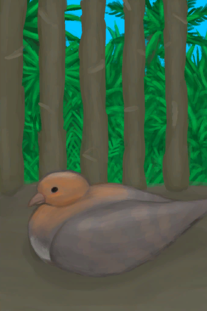

# 小灰山鹑  
> 一只灰山鹑宝宝。  
  
<table class="table table-bordered" data-toggle="table"  data-show-header="false"><thead style="display:none"><tr ><th  style="width:50%;text-align:left;vertical-align:top;"  >title</th><th  style="width:50%;text-align:left;vertical-align:top;"  ></th></tr></thead><tr ><td  style="width:50%;text-align:left;vertical-align:top;"  >** 可重命名 **  ** 不可堆叠 **  **标签：**	[“肉”](tag_Meat.md), [“灰山鹑”](tag_Partridge.md), [“饲料”](tag_Feed.md), [“弱效食料”](tag_FeedWeak.md)</td><td  style="width:50%;text-align:left;vertical-align:top;"  >

<a href="PartridgeChick.md" style="color:black">小灰山鹑</a>

这种动物可以在岛上的<b>丛林和草原</b>中找到。  可以猎杀它们以获取肉、骨头和羽毛，也可以通过<b>套索陷阱</b>活捉。 被活捉的灰山鹑可以圈养在畜栏里，之后它们会下蛋。如果雌雄灰山鹑都在场，它们也会产下受精的蛋进而孵出小灰山鹑。 </td></tr></tbody></table>  
  
## 获取来源  
<table class="table table-bordered" data-toggle="table"  ><thead style=""><tr ><th  style="text-align:left;vertical-align:top;"  >来源</th><th  style="text-align:left;vertical-align:top;"  >操作</th></tr></thead><tr ><td  style="text-align:left;vertical-align:top;"  >[

[受精蛋](EggPartridgeFertilized.md)](EggPartridgeFertilized.md)</td><td  style="text-align:left;vertical-align:top;"  >转化</td></tr></tbody></table>  
  
## 动作  
<table class="table table-bordered" data-toggle="table"  ><thead style=""><tr ><th  style="text-align:left;vertical-align:top;"  >动作</th><th  style="text-align:left;vertical-align:top;"  >耗时</th><th  style="text-align:left;vertical-align:top;"  >条件</th><th  style="text-align:left;vertical-align:top;"  >变化</th><th  style="text-align:left;vertical-align:top;"  data-sortable="true"  >状态</th></tr></thead><tr ><td  style="text-align:left;vertical-align:top;"  >宰杀 </td><td  style="text-align:left;vertical-align:top;"  >15分</td><td  style="text-align:left;vertical-align:top;"  >[

[光亮](Light.md)](Light.md): 10-100</td><td  style="text-align:left;vertical-align:top;"  >** 自身：** → [

[小灰山鹑尸体](PartridgeChickDead.md)](PartridgeChickDead.md)  ** 相关卡牌 ** [“灰山鹑”](tag_Partridge.md)能量  -250～-100</td><td  style="text-align:left;vertical-align:top;"  ></td></tr></tbody></table>  
  
## 可拖入  
<table class="table table-bordered" data-toggle="table"  ><thead style=""><tr ><th  style="text-align:left;vertical-align:top;"  >使用</th><th  style="text-align:left;vertical-align:top;"  >动作</th><th  style="text-align:left;vertical-align:top;"  data-sortable="true"  >耗时</th><th  style="text-align:left;vertical-align:top;"  data-sortable="true"  >条件</th><th  style="text-align:left;vertical-align:top;"  >变化</th><th  style="text-align:left;vertical-align:top;"  data-sortable="true"  >玩家状态</th></tr></thead><tr ><td  style="text-align:left;vertical-align:top;"  >[

[鱼片](FishSlices.md)](FishSlices.md) [

[烤鱼片](FishSlicesCooked.md)](FishSlicesCooked.md) [

[虾](Prawns.md)](Prawns.md) [

[烤虾](PrawnsCooked.md)](PrawnsCooked.md) [

[鱼杂](FishScraps.md)](FishScraps.md) [

[烤鱼杂](FishScrapsCooked.md)](FishScrapsCooked.md)</td><td  style="text-align:left;vertical-align:top;"  >喂食 </td><td  style="text-align:left;vertical-align:top;"  >-</td><td  style="text-align:left;vertical-align:top;"  ></td><td  style="text-align:left;vertical-align:top;"  >** 自身: ** 

  +288(100%) 

  +250(25%)  ** 使用物: ** →消失 可用次数  -1</td><td  style="text-align:left;vertical-align:top;"  ></td></tr><tr ><td  style="text-align:left;vertical-align:top;"  >[“饲料”](tag_Feed.md)</td><td  style="text-align:left;vertical-align:top;"  >喂食 </td><td  style="text-align:left;vertical-align:top;"  >-</td><td  style="text-align:left;vertical-align:top;"  ></td><td  style="text-align:left;vertical-align:top;"  >** 自身: ** 

  +288(100%) 

  +250(25%)  ** 使用物: ** →消失</td><td  style="text-align:left;vertical-align:top;"  ></td></tr></tbody></table>  
  
## 可拖至  

[猪食槽](BoarFeeder.md)

[猪食槽](BoarFeeder.md)

[猪食槽](BoarFeeder.md)

[猪食槽(空)](BoarFeederEmpty.md)

[猪食槽(空)](BoarFeederEmpty.md)

[猪食槽(空)](BoarFeederEmpty.md)

[堆肥箱](CompostBin.md)

[灰山鹑喂食器](PartridgeFeeder.md)

[灰山鹑喂食器(空)](PartridgeFeederEmpty.md)

[中陷阱的猕猴](CageTrapMacaque.md)

[母猪](BoarEnclosureFemale.md)

[母猪](BoarEnclosureFemale.md)

[母猪](BoarEnclosureFemale.md)

[公猪](BoarEnclosureMale.md)

[公猪](BoarEnclosureMale.md)

[公猪](BoarEnclosureMale.md)

[小猪](BoarEnclosurePiglet.md)

[小猪](BoarEnclosurePiglet.md)

[小猪](BoarEnclosurePiglet.md)

[母猪](BoarTiedFemale.md)

[母猪](BoarTiedFemale.md)

[母猪](BoarTiedFemale.md)

[公猪](BoarTiedMale.md)

[公猪](BoarTiedMale.md)

[公猪](BoarTiedMale.md)

[小猪](BoarTiedPiglet.md)

[小猪](BoarTiedPiglet.md)

[小猪](BoarTiedPiglet.md)

[忠犬朋友](DogFriend.md)

[猕猴朋友](MacaqueFriend.md)

[受伤的猕猴](MacaqueWounded.md)

[小灰山鹑](PartridgeChick.md)

[雌灰山鹑](PartridgeFemaleEnclosure.md)

[雌灰山鹑](PartridgeFemaleLive.md)

[雄灰山鹑](PartridgeMaleEnclosure.md)

[雄灰山鹑](PartridgeMaleLive.md)

  
  
## 属性   
<table class="table table-bordered" data-toggle="table"  ><thead style=""><tr ><th  style="text-align:left;vertical-align:top;"  >属性</th><th  style="text-align:left;vertical-align:top;"  >值</th><th  style="text-align:left;vertical-align:top;"  >耗时</th><th  style="text-align:left;vertical-align:top;"  >变化</th></tr></thead><tr ><td  style="text-align:left;vertical-align:top;"  >

</td><td  style="text-align:left;vertical-align:top;"  >初始：288 最大：288</td><td  style="text-align:left;vertical-align:top;"  >每15分钟-1 最多需要：3天</td><td  style="text-align:left;vertical-align:top;"  >** 到达0时： **  ** 自身 ** → [

[小灰山鹑尸体](PartridgeChickDead.md)](PartridgeChickDead.md)</td></tr><tr ><td  style="text-align:left;vertical-align:top;"  >

</td><td  style="text-align:left;vertical-align:top;"  >初始：0 最大：672</td><td  style="text-align:left;vertical-align:top;"  >每15分钟+1 最多需要：7天</td><td  style="text-align:left;vertical-align:top;"  >** 到达上限时： ** ** [Female]  **   [

[雌灰山鹑](PartridgeFemaleEnclosure.md)](PartridgeFemaleEnclosure.md)(+1) 基础权重：3 ** [Male]  **   [

[雄灰山鹑](PartridgeMaleEnclosure.md)](PartridgeMaleEnclosure.md)(+1) 基础权重：1 ** 自身 ** →消失</td></tr><tr ><td  style="text-align:left;vertical-align:top;"  >

</td><td  style="text-align:left;vertical-align:top;"  >初始：500 最大：1000</td><td  style="text-align:left;vertical-align:top;"  >每15分钟-1 最多需要：10天10小时</td><td  style="text-align:left;vertical-align:top;"  ></td></tr></tbody></table>  
  
## 被动效果  
<table class="table table-bordered" data-toggle="table"  ><thead style=""><tr ><th  style="text-align:left;vertical-align:top;"  >名称</th><th  style="text-align:left;vertical-align:top;"  >条件</th><th  style="text-align:left;vertical-align:top;"  >变化(每15分钟)</th><th  style="text-align:left;vertical-align:top;"  data-sortable="true"  >玩家状态</th></tr></thead><tr ><td  style="text-align:left;vertical-align:top;"  >Feed</td><td  style="text-align:left;vertical-align:top;"  >** 需要属性：** 

: 1～1536(0.15%～228.57%) ** 需要存在卡牌：** [灰山鹑喂食器](PartridgeFeeder.md)</td><td  style="text-align:left;vertical-align:top;"  >

 +2(0.69%) 

+2(0.2%)</td><td  style="text-align:left;vertical-align:top;"  ></td></tr><tr ><td  style="text-align:left;vertical-align:top;"  >Overcrowding</td><td  style="text-align:left;vertical-align:top;"  >** 需要属性：** 

: 1～1536(0.15%～228.57%) ** 需要存在卡牌：** [“灰山鹑”](tag_Partridge.md) [灰山鹑喂食器](PartridgeFeeder.md)</td><td  style="text-align:left;vertical-align:top;"  >

-0.1(-0.01%)</td><td  style="text-align:left;vertical-align:top;"  ></td></tr></tbody></table>  
  

