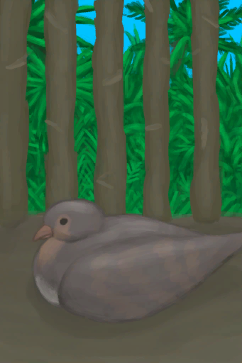

# 雌灰山鹑  
> 一只活灰山鹑。可以通过喂食维持它的生命，或者圈养在畜栏里。  
  
<table class="table table-bordered" data-toggle="table"  data-show-header="false"><thead style="display:none"><tr ><th  style="width:50%;text-align:left;vertical-align:top;"  >title</th><th  style="width:50%;text-align:left;vertical-align:top;"  ></th></tr></thead><tr ><td  style="width:50%;text-align:left;vertical-align:top;"  >** 不可堆叠 **  **重量：**150  **标签：**	[“肉”](tag_Meat.md), [“灰山鹑”](tag_Partridge.md)</td><td  style="width:50%;text-align:left;vertical-align:top;"  >

<a href="PartridgeFemaleLive.md" style="color:black">雌灰山鹑</a>

这种动物可以在岛上的<b>丛林和草原</b>中找到。  可以猎杀它们以获取肉、骨头和羽毛，也可以通过<b>套索陷阱</b>活捉。 被活捉的灰山鹑可以圈养在畜栏里，之后它们会下蛋。如果雌雄灰山鹑都在场，它们也会产下受精的蛋进而孵出小灰山鹑。 </td></tr></tbody></table>  
  
## 获取来源  

捕捉猎物

[套索陷阱](SnareTrap.md)

看看礼物

[礼物！(事件)](Event_DogFriendGift.md)

捆起来

[雌灰山鹑](PartridgeFemaleEnclosure.md)

  
  
## 动作  

<table><tr><td rowspan="2" style="width:200px;text-align:center;font-size:1.5em;font-weight:bold">

圈养在畜栏中

-

</td><td></td></tr><tr><td><b>自身：</b>→ [

[雌灰山鹑](PartridgeFemaleEnclosure.md)](PartridgeFemaleEnclosure.md)</td></tr><tr><td colspan="2"><b>需求：</b>[

[畜栏(环境)](Env_Enclosure.md)](Env_Enclosure.md)存在于手中/面板</td></tr></table>
  

<table><tr><td rowspan="2" style="width:200px;text-align:center;font-size:1.5em;font-weight:bold">

放生

15分

</td><td></td></tr><tr><td><b>自身：</b>→消失</td></tr><tr><td colspan="2"><b>需求：</b>~~[

[畜栏(环境)](Env_Enclosure.md)](Env_Enclosure.md)存在于手中/面板~~</td></tr><tr><td colspan="2"><b>状态变化：</b>[灰山鹑种群数量](Pop_Partridge.md)+1000</td></tr></table>
  
  
  
## 可拖入  

<table style="margin-bottom:0px;"><tr><td style="width:40%;text-align:left; background-color:#FEFEFE"><b>拖入：</b>[

[鱼片](FishSlices.md)](FishSlices.md) | [

[烤鱼片](FishSlicesCooked.md)](FishSlicesCooked.md) | [

[虾](Prawns.md)](Prawns.md) | [

[烤虾](PrawnsCooked.md)](PrawnsCooked.md) | [

[鱼杂](FishScraps.md)](FishScraps.md) | [

[烤鱼杂](FishScrapsCooked.md)](FishScrapsCooked.md)</td><td style="width:40%;font-size:1em;font-weight:bold;background-color:#FEFEFE">喂食  </td></tr><tr style="background-color:#FFFFFF"><td style=""><b>使用物：</b>→消失, 可用次数  -1</td><td style=""><b>自身：</b>

  +288(100%), 

  +50(5%)</td></tr></table>
  

<table style="margin-bottom:0px;"><tr><td style="width:40%;text-align:left; background-color:#FEFEFE"><b>拖入：</b>[“饲料”](tag_Feed.md)</td><td style="width:40%;font-size:1em;font-weight:bold;background-color:#FEFEFE">喂食  </td></tr><tr style="background-color:#FFFFFF"><td style=""><b>使用物：</b>→消失</td><td style=""><b>自身：</b>

  +288(100%), 

  +250(25%)</td></tr></table>
  

<table style="margin-bottom:0px;"><tr><td style="width:40%;text-align:left; background-color:#FEFEFE"><b>拖入：</b>[“切割工具”](tag_Cutter.md)</td><td style="width:40%;font-size:1em;font-weight:bold;background-color:#FEFEFE">剖开 (30分) [“手部动作(组)”](HandAction.md)</td></tr><tr style="background-color:#FFFFFF"><td style=""><b>使用物：</b>可用次数  -1</td><td style=""><b>自身：</b>→消失</td></tr><tr><td colspan="2"><b>状态变化：</b>[

[污垢](Filth.md)](Filth.md)+20</td></tr><tr><td colspan="2"><b>需求：</b>[

[光亮](Light.md)](Light.md): 10-100</td></tr><tr><td colspan="2">[

[鸟骨](BonesBird.md)](BonesBird.md)(+2), [

[羽毛](Feathers.md)](Feathers.md)(+2～+4), [

[鸟肉](BirdMeat.md)](BirdMeat.md)(+1)</td></tr></table>
  
  
## 可拖至  

[猪食槽](BoarFeeder.md)

[猪食槽(空)](BoarFeederEmpty.md)

[母猪](BoarEnclosureFemale.md)

[公猪](BoarEnclosureMale.md)

[小猪](BoarEnclosurePiglet.md)

[母猪](BoarTiedFemale.md)

[公猪](BoarTiedMale.md)

[小猪](BoarTiedPiglet.md)

[忠犬朋友](DogFriend.md)

  
  
## 属性   

<table style="margin-bottom:0px;"><tr><td style="width:30%;text-align:left; background-color:#FEFEFE;font-size:1.3em;font-weight:bold;">

</td><td style="font-size:1em;background-color:#FEFEFE">初始：288 , 最大：288 每15分钟-1 , 最多需要：3天</td></tr><tr style="background-color:#FFFFFF"><td colspan=2>** 到达0时： ** 自身: → [

[灰山鹑尸体](PartridgeDead.md)](PartridgeDead.md)</td></tr></table>
  

<table style="margin-bottom:0px;"><tr><td style="width:30%;text-align:left; background-color:#FEFEFE;font-size:1.3em;font-weight:bold;">

</td><td style="font-size:1em;background-color:#FEFEFE">初始：0 , 最大：1000 每15分钟-5 , 最多需要：2天2小时</td></tr><tr style="background-color:#FFFFFF"><td colspan=2></td></tr></table>
  

