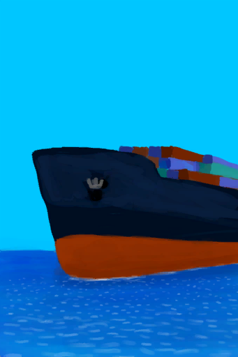

# 过路的船只  
> 一艘经过的船！我得引起它的注意！信号弹亦或是火炬肯定能起作用。  
  
  过路的船只  |   图片   
 ----  |  ----:   
 ** 效果: ** [不适](Discomfort.md)+500  |     
  
## 获取来源  
来源  |  操作  
----  |  ----  
[(事件)一艘路过的船！](Event_Raft_PassingShip.md)  |  继续  
## 动作  
动作  |  耗时  |  条件  |  变化  |  状态  
----  |  ----  |  ----  |  ----  |  ----  
挥舞双手并呼救！   |  15分  |    |  进度 + 1  |    
## 可拖入  
使用  |  动作  |  耗时  |  条件  |  变化  |  玩家状态  
----  |  ----  |  ----  |  ----  |  ----  |  ----  
[燃烧的信号弹(开)](FlareHandOn.md)  |  挥舞信号弹！  |  15分  |    |  ** 自身: ** 进度 + 25  |    
[火把(开)](TorchOn.md)  |  挥舞火把！  |  15分  |    |  ** 自身: ** 进度 + 15  |    
[信号镜](SignalingMirror.md)  |  发出信号！  |  15分  |    |  ** 自身: ** 进度 + 10  |    
[蜡烛(开)](CandleOn.md)  |  挥舞蜡烛！  |  15分  |    |  ** 自身: ** 进度 + 5  |    
## 属性   
属性  |  值  |  耗时  |  变化  
----  |  ----  |  ----  |  ----  
剩余时间  |  初始：6 最大：6  |  每15分钟-1 最多需要：1小时30分  |  ** 到达0时： ** [(事件)错过了船只](Event_ShipMissed.md)+1   
进度  |  初始：0 最大：100  |  -  |  ** 到达上限时： ** [(事件)船舶救援](Event_ShipRescue.md)+1   
