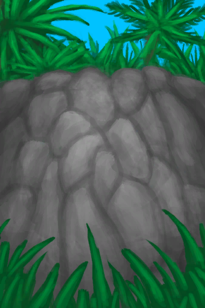

# 丛林高地  
> 爬上悬崖，可以前往丛林高地。  <b>（只有手牌可以带走）</b>  
  
<table class="table table-bordered" data-toggle="table"  data-show-header="false"><thead style="display:none"><tr ><th  style="width:50%;text-align:left;vertical-align:top;"  >title</th><th  style="width:50%;text-align:left;vertical-align:top;"  ></th></tr></thead><tr ><td  style="width:50%;text-align:left;vertical-align:top;"  >** 区域唯一 **  **环境：**[沙滩(环境)](Env_Cove.md)</td><td  style="width:50%;text-align:left;vertical-align:top;"  >

<a href="Path_CoveToJungleHighlands.md" style="color:black">丛林高地</a>

丛林高地位于岛屿深处。该地区拥有众多洞穴，以及数量最多的猕猴。 这里还可以找到许多独特而有用的植物，包括<b>咖啡树、芒果树和金鸡纳树</b>。 </td></tr></tbody></table>  
  
## 获取来源  

探索

[隐秘港湾(沙滩)](Cove.md)

爬上去

[前往丛林高地(沙滩)](Path_CoveToJungleHighlands.md)

爬下去

[前往隐秘港湾(丛林高地)](Path_JungleHighlandsToCove.md)

  
  
## 动作  

<table><tr><td rowspan="2" style="width:200px;text-align:center;font-size:1.3em;font-weight:bold">

爬上去

15分

</td><td>[“攀爬动作(组)”](ClimbAction.md)</td></tr><tr><td></td></tr><tr><td colspan="2"><b>需求：</b>[

[光亮](Light.md)](Light.md): <b>10-100</b>, [

[耐力](Stamina.md)](Stamina.md): <b>11-32</b>, [攀爬动作受限](ModifierClimb.md): <b>0-2</b></td></tr><tr><td colspan="2"><b>状态变化：</b>[

[足部损伤](FootDamage.md)](FootDamage.md)<b>+10</b>, [

[手掌损伤](HandDamage.md)](HandDamage.md)<b>+20</b>, [

[耐力](Stamina.md)](Stamina.md)<b>-20</b>, [

[污垢](Filth.md)](Filth.md)<b>+6</b>, [

[攀爬(技能)](Skill_Climbing.md)](Skill_Climbing.md)<b>+1</b>, [

[压力](Stress.md)](Stress.md)<b>-10</b>, [

[猎手接近](HuntersProximity.md)](HuntersProximity.md)<b>-48</b></td></tr><tr><td colspan="2">

<table style="margin-bottom:3px;"><tr><td rowspan=2 style="text-align:center" width="80px">
基础权重

10
</td><td style="font-size:0.6em;line-height:0.6em;font-weight:bold">Fall - Fracture</td></tr><tr><td>[

[坠落！(事件)](Event_FallFracture.md)](Event_FallFracture.md)(<b>+1</b>)</td></tr><tr><td colspan=2><li>[

[攀爬(技能)](Skill_Climbing.md)](Skill_Climbing.md)为<b>100～150</b>时权重<b>-10</b></li></td></tr></table>

<table style="margin-bottom:3px;"><tr><td rowspan=2 style="text-align:center" width="80px">
基础权重

-20
</td><td style="font-size:0.6em;line-height:0.6em;font-weight:bold">Fall - Sprain</td></tr><tr><td>[

[坠落！(事件)](Event_FallSprains.md)](Event_FallSprains.md)(<b>+1</b>)</td></tr><tr><td colspan=2><li>[

[攀爬(技能)](Skill_Climbing.md)](Skill_Climbing.md)为<b>100～150</b>时权重<b>-10</b></li></td></tr></table>

<table style="margin-bottom:3px;"><tr><td rowspan=2 style="text-align:center" width="80px">
基础权重

30
</td><td style="font-size:0.6em;line-height:0.6em;font-weight:bold">Fall - Abrasion</td></tr><tr><td>[

[坠落！(事件)](Event_FallAbrasion.md)](Event_FallAbrasion.md)(<b>+1</b>)</td></tr></table>

<table style="margin-bottom:3px;"><tr><td rowspan=2 style="text-align:center" width="80px">
基础权重

60
</td><td style="font-size:0.6em;line-height:0.6em;font-weight:bold">Fall - Bruises</td></tr><tr><td>[

[坠落！(事件)](Event_FallBruise.md)](Event_FallBruise.md)(<b>+1</b>)</td></tr></table>

<table style="margin-bottom:3px;"><tr><td rowspan=2 style="text-align:center" width="80px">
基础权重

5
</td><td style="font-size:0.6em;line-height:0.6em;font-weight:bold">Success</td></tr><tr><td>[

[丛林高地(环境)](Env_JungleHighlands.md)](Env_JungleHighlands.md)(<b>+1</b>), [

[前往丛林高地(沙滩)](Path_CoveToJungleHighlands.md)](Path_CoveToJungleHighlands.md)(<b>+1</b>)[

[猎手接近](HuntersProximity.md)](HuntersProximity.md)<b>-24</b></td></tr><tr><td colspan=2><li>[

[攀爬(技能)](Skill_Climbing.md)](Skill_Climbing.md)为<b>0～150</b>时权重限定为<b>+0～+150</b></li><li>[

[降水值](RainValue.md)](RainValue.md)为<b>1～5</b>时权重<b>-40～-250</b></li></td></tr></table>
<button class="btn btn-secondary btn-sm" style="" data-toggle="modal" onclick="setCollectionDataBase64('eyJ0aXRsZSI6IuamgueOh+aooeaLnzog54is5LiK5Y67ICjkuJvmnpfpq5jlnLApIiwiY29sbGVjdGlvbnMiOlt7ImRyb3AiOiI8ZGl2IHN0eWxlPVwid2lkdGg6MjVweDtkaXNwbGF5OmlubGluZS1ibG9jazt0ZXh0LWFsaWduOmNlbnRlclwiPjxpbWcgZGVjb2Rpbmc9XCJhc3luY1wiIHNyYz1cIi4uL3dpa2kvU3ByaXRlL1dlYXRoZXJQYXJ0aWFsbHlDbG91ZHlfRnVsbC5wbmdcIiBocmVmPVwiYS5tZFwiIHN0eWxlPVwibWF4LXdpZHRoOjI1cHg7bWF4LWhlaWdodDoyNXB4O1wiPjwvZGl2PuWdoOiQve+8gSjkuovku7YpIiwiYmFzZSI6MTAsImNvbmRpdGlvbiI6W3sia2V5IjoiU2tpbGxfQ2xpbWJpbmciLCJ0aXRsZSI6IuaUgOeIrCjmioDog70pIiwidHlwZSI6InJhbmdlIiwibWF4IjpbMCwxNTBdLCJyYW5nZSI6WzEwMCwxNTBdLCJ3ZWlnaHQiOlstMTAsLTEwXSwiZGVmYXVsdFZhbHVlIjowLCJ3aGVuT3V0T2ZSYW5nZSI6MH1dfSx7ImRyb3AiOiI8ZGl2IHN0eWxlPVwid2lkdGg6MjVweDtkaXNwbGF5OmlubGluZS1ibG9jazt0ZXh0LWFsaWduOmNlbnRlclwiPjxpbWcgZGVjb2Rpbmc9XCJhc3luY1wiIHNyYz1cIi4uL3dpa2kvU3ByaXRlL1dlYXRoZXJQYXJ0aWFsbHlDbG91ZHlfRnVsbC5wbmdcIiBocmVmPVwiYS5tZFwiIHN0eWxlPVwibWF4LXdpZHRoOjI1cHg7bWF4LWhlaWdodDoyNXB4O1wiPjwvZGl2PuWdoOiQve+8gSjkuovku7YpIiwiYmFzZSI6LTIwLCJjb25kaXRpb24iOlt7ImtleSI6IlNraWxsX0NsaW1iaW5nIiwidGl0bGUiOiLmlIDniKwo5oqA6IO9KSIsInR5cGUiOiJyYW5nZSIsIm1heCI6WzAsMTUwXSwicmFuZ2UiOlsxMDAsMTUwXSwid2VpZ2h0IjpbLTEwLC0xMF0sImRlZmF1bHRWYWx1ZSI6MCwid2hlbk91dE9mUmFuZ2UiOjB9XX0seyJkcm9wIjoiPGRpdiBzdHlsZT1cIndpZHRoOjI1cHg7ZGlzcGxheTppbmxpbmUtYmxvY2s7dGV4dC1hbGlnbjpjZW50ZXJcIj48aW1nIGRlY29kaW5nPVwiYXN5bmNcIiBzcmM9XCIuLi93aWtpL1Nwcml0ZS9XZWF0aGVyUGFydGlhbGx5Q2xvdWR5X0Z1bGwucG5nXCIgaHJlZj1cImEubWRcIiBzdHlsZT1cIm1heC13aWR0aDoyNXB4O21heC1oZWlnaHQ6MjVweDtcIj48L2Rpdj7lnaDokL3vvIEo5LqL5Lu2KSIsImJhc2UiOjMwLCJjb25kaXRpb24iOltdfSx7ImRyb3AiOiI8ZGl2IHN0eWxlPVwid2lkdGg6MjVweDtkaXNwbGF5OmlubGluZS1ibG9jazt0ZXh0LWFsaWduOmNlbnRlclwiPjxpbWcgZGVjb2Rpbmc9XCJhc3luY1wiIHNyYz1cIi4uL3dpa2kvU3ByaXRlL1dlYXRoZXJQYXJ0aWFsbHlDbG91ZHlfRnVsbC5wbmdcIiBocmVmPVwiYS5tZFwiIHN0eWxlPVwibWF4LXdpZHRoOjI1cHg7bWF4LWhlaWdodDoyNXB4O1wiPjwvZGl2PuWdoOiQve+8gSjkuovku7YpIiwiYmFzZSI6NjAsImNvbmRpdGlvbiI6W119LHsiZHJvcCI6IjxkaXYgc3R5bGU9XCJ3aWR0aDoyNXB4O2Rpc3BsYXk6aW5saW5lLWJsb2NrO3RleHQtYWxpZ246Y2VudGVyXCI+PGltZyBkZWNvZGluZz1cImFzeW5jXCIgc3JjPVwiLi4vd2lraS9TcHJpdGUvSnVuZ2xlLnBuZ1wiIGhyZWY9XCJhLm1kXCIgc3R5bGU9XCJtYXgtd2lkdGg6MjVweDttYXgtaGVpZ2h0OjI1cHg7XCI+PC9kaXY+5Lib5p6X6auY5ZywKOeOr+Wigyk8ZGl2IHN0eWxlPVwid2lkdGg6MjVweDtkaXNwbGF5OmlubGluZS1ibG9jazt0ZXh0LWFsaWduOmNlbnRlclwiPjxpbWcgZGVjb2Rpbmc9XCJhc3luY1wiIHNyYz1cIi4uL3dpa2kvU3ByaXRlL0NsaWZmc1VwLnBuZ1wiIGhyZWY9XCJhLm1kXCIgc3R5bGU9XCJtYXgtd2lkdGg6MjVweDttYXgtaGVpZ2h0OjI1cHg7XCI+PC9kaXY+5YmN5b6A5Lib5p6X6auY5ZywKOaymea7qSkiLCJiYXNlIjo1LCJjb25kaXRpb24iOlt7ImtleSI6IlNraWxsX0NsaW1iaW5nIiwidGl0bGUiOiLmlIDniKwo5oqA6IO9KSIsInR5cGUiOiJyYW5nZSIsIm1heCI6WzAsMTUwXSwicmFuZ2UiOlswLDE1MF0sIndlaWdodCI6WzAsMTUwXSwiZGVmYXVsdFZhbHVlIjowLCJ3aGVuT3V0T2ZSYW5nZSI6MX0seyJrZXkiOiJSYWluVmFsdWUiLCJ0aXRsZSI6IumZjeawtOWAvCIsInR5cGUiOiJyYW5nZSIsIm1heCI6WzAsNV0sInJhbmdlIjpbMSw1XSwid2VpZ2h0IjpbLTQwLC0yNTBdLCJkZWZhdWx0VmFsdWUiOjAsIndoZW5PdXRPZlJhbmdlIjowfV19XX0=')" data-target="#modelCollectionSimulator">概率模拟</button>
</td></tr></table>
  

<table><tr><td rowspan="2" style="width:200px;text-align:center;font-size:1.3em;font-weight:bold">

练习攀爬

30分

</td><td>[“攀爬动作(组)”](ClimbAction.md)</td></tr><tr><td></td></tr><tr><td colspan="2"><b>需求：</b>[

[光亮](Light.md)](Light.md): <b>10-100</b>, [

[耐力](Stamina.md)](Stamina.md): <b>11-32</b>, [攀爬动作受限](ModifierClimb.md): <b>0-2</b></td></tr><tr><td colspan="2"><b>状态变化：</b>[

[耐力](Stamina.md)](Stamina.md)<b>-6</b>, [

[足部损伤](FootDamage.md)](FootDamage.md)<b>+8</b>, [

[污垢](Filth.md)](Filth.md)<b>+6</b>, [

[攀爬(技能)](Skill_Climbing.md)](Skill_Climbing.md)<b>+1</b></td></tr><tr><td colspan="2">

<table style="margin-bottom:3px;"><tr><td rowspan=2 style="text-align:center" width="80px">
基础权重

1
</td><td style="font-size:0.6em;line-height:0.6em;font-weight:bold">Fall - Abrasion</td></tr><tr><td>[

[坠落！(事件)](Event_FallAbrasion.md)](Event_FallAbrasion.md)(<b>+1</b>)</td></tr></table>

<table style="margin-bottom:3px;"><tr><td rowspan=2 style="text-align:center" width="80px">
基础权重

1
</td><td style="font-size:0.6em;line-height:0.6em;font-weight:bold">Fall - Bruises</td></tr><tr><td>[

[坠落！(事件)](Event_FallBruise.md)](Event_FallBruise.md)(<b>+1</b>)</td></tr></table>

<table style="margin-bottom:3px;"><tr><td rowspan=2 style="text-align:center" width="80px">
基础权重

8
</td><td style="font-size:0.6em;line-height:0.6em;font-weight:bold">Success</td></tr><tr><td></td></tr><tr><td colspan=2><li>[

[攀爬(技能)](Skill_Climbing.md)](Skill_Climbing.md)为<b>0～150</b>时权重<b>+0～+150</b></li><li>[

[降水值](RainValue.md)](RainValue.md)为<b>1～5</b>时权重<b>-4～-25</b></li><li>[

[绳子](Rope.md)](Rope.md)存在于*手中*，权重<b>+6</b>,</li></td></tr></table>
<button class="btn btn-secondary btn-sm" style="" data-toggle="modal" onclick="setCollectionDataBase64('eyJ0aXRsZSI6IuamgueOh+aooeaLnzog57uD5Lmg5pSA54isICjkuJvmnpfpq5jlnLApIiwiY29sbGVjdGlvbnMiOlt7ImRyb3AiOiI8ZGl2IHN0eWxlPVwid2lkdGg6MjVweDtkaXNwbGF5OmlubGluZS1ibG9jazt0ZXh0LWFsaWduOmNlbnRlclwiPjxpbWcgZGVjb2Rpbmc9XCJhc3luY1wiIHNyYz1cIi4uL3dpa2kvU3ByaXRlL1dlYXRoZXJQYXJ0aWFsbHlDbG91ZHlfRnVsbC5wbmdcIiBocmVmPVwiYS5tZFwiIHN0eWxlPVwibWF4LXdpZHRoOjI1cHg7bWF4LWhlaWdodDoyNXB4O1wiPjwvZGl2PuWdoOiQve+8gSjkuovku7YpIiwiYmFzZSI6MSwiY29uZGl0aW9uIjpbXX0seyJkcm9wIjoiPGRpdiBzdHlsZT1cIndpZHRoOjI1cHg7ZGlzcGxheTppbmxpbmUtYmxvY2s7dGV4dC1hbGlnbjpjZW50ZXJcIj48aW1nIGRlY29kaW5nPVwiYXN5bmNcIiBzcmM9XCIuLi93aWtpL1Nwcml0ZS9XZWF0aGVyUGFydGlhbGx5Q2xvdWR5X0Z1bGwucG5nXCIgaHJlZj1cImEubWRcIiBzdHlsZT1cIm1heC13aWR0aDoyNXB4O21heC1oZWlnaHQ6MjVweDtcIj48L2Rpdj7lnaDokL3vvIEo5LqL5Lu2KSIsImJhc2UiOjEsImNvbmRpdGlvbiI6W119LHsiZHJvcCI6IuaXoCIsImJhc2UiOjgsImNvbmRpdGlvbiI6W3sia2V5IjoiU2tpbGxfQ2xpbWJpbmciLCJ0aXRsZSI6IuaUgOeIrCjmioDog70pIiwidHlwZSI6InJhbmdlIiwibWF4IjpbMCwxNTBdLCJyYW5nZSI6WzAsMTUwXSwid2VpZ2h0IjpbMCwxNTBdLCJkZWZhdWx0VmFsdWUiOjAsIndoZW5PdXRPZlJhbmdlIjowfSx7ImtleSI6IlJhaW5WYWx1ZSIsInRpdGxlIjoi6ZmN5rC05YC8IiwidHlwZSI6InJhbmdlIiwibWF4IjpbMCw1XSwicmFuZ2UiOlsxLDVdLCJ3ZWlnaHQiOlstNCwtMjVdLCJkZWZhdWx0VmFsdWUiOjAsIndoZW5PdXRPZlJhbmdlIjowfSx7ImtleSI6IlJvcGUiLCJ0aXRsZSI6IjxkaXYgc3R5bGU9XCJ3aWR0aDoyMHB4O2Rpc3BsYXk6aW5saW5lLWJsb2NrO3RleHQtYWxpZ246Y2VudGVyXCI+PGltZyBkZWNvZGluZz1cImFzeW5jXCIgc3JjPVwiLi4vd2lraS9TcHJpdGUvUm9wZS5wbmdcIiBocmVmPVwiYS5tZFwiIHN0eWxlPVwibWF4LXdpZHRoOjIwcHg7bWF4LWhlaWdodDoyMHB4O1wiPjwvZGl2Pue7s+WtkOWtmOWcqOS6jirmiYvkuK0q77yMIiwidHlwZSI6InRvZ2dsZSIsInJhbmdlIjpbMCwxXSwibWF4IjpbMCwxXSwid2VpZ2h0IjpbMCw2XSwiZGVmYXVsdFZhbHVlIjowLCJ3aGVuT3V0T2ZSYW5nZSI6MCwibWF4U3RhY2tHcm91cCI6IiJ9XX1dfQ==')" data-target="#modelCollectionSimulator">概率模拟</button>
</td></tr></table>
  
  
  

