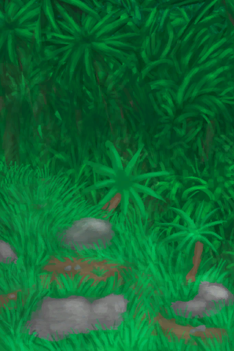

# 丛林高地  
> 前往丛林高地。  <b>（只有手牌可以带走）</b>  
   
> 丛林高地位于岛屿深处。该地区拥有众多洞穴，以及数量最多的猕猴。 这里还可以找到许多独特而有用的植物，包括<b>咖啡树、芒果树和金鸡纳树</b>。   
  
  丛林高地  |   图片   
 ----  |  ----:   
 ** 区域唯一 **  **环境：**[西部高地(环境)](Env_HighlandsWestern.md)  |     
  
## 获取来源  
来源  |  操作  
----  |  ----  
[前往西部高地(丛林高地)](Path_JungleHighlandsToHighlandsW.md)  |  前往  
## 动作  
动作  |  耗时  |  条件  |  变化  |  状态  
----  |  ----  |  ----  |  ----  |  ----  
前往 [腿部动作](LegAction.md) [旅行动作](TravelAction.md)  |  15分  |  [光亮](Light.md): 10-100 [耐力](Stamina.md): 11-32  |  ** 获得： ** ** [Path] **   [丛林高地(环境)](Env_JungleHighlands.md)(+1)   [前往西部高地(丛林高地)](Path_JungleHighlandsToHighlandsW.md)(+1) 基础权重：1   |  [足部损伤](FootDamage.md)+20 [耐力](Stamina.md)-4 [压力](Stress.md)-10 [猎手接近](HuntersProximity.md)-6  
