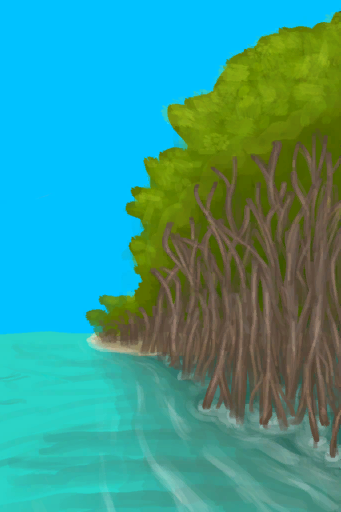

# 海湾  
> 它将引我前往海湾。  <b>（只有手牌可以带走）</b>  
  
<table class="table table-bordered" data-toggle="table" ><tbody><tr ><td  style="width:80%;text-align:left;vertical-align:top;"  >** 区域唯一 **</td><td  style="width:20%;text-align:left;vertical-align:top;"  >

</td></tr></tbody></tbody></table>  
  
## 获取来源  
<table class="table table-bordered" data-toggle="table" ><thead><tr ><th  style="text-align:left;vertical-align:top;"  >来源</th><th  style="text-align:left;vertical-align:top;"  >操作</th></tr></thead><tr ><td  style="text-align:left;vertical-align:top;"  >[

[沙滩(事件)](Event_BeachFoundFromMangroves.md)](Event_BeachFoundFromMangroves.md)</td><td  style="text-align:left;vertical-align:top;"  >继续</td></tr><tr ><td  style="text-align:left;vertical-align:top;"  >[

[前往红树林](Path_BayToMangroves.md)](Path_BayToMangroves.md)</td><td  style="text-align:left;vertical-align:top;"  >前往</td></tr></tbody></table>  
  
## 动作  
<table class="table table-bordered" data-toggle="table" ><thead><tr ><th  style="text-align:left;vertical-align:top;"  >动作</th><th  style="text-align:left;vertical-align:top;"  >耗时</th><th  style="text-align:left;vertical-align:top;"  data-sortable="true"  >条件</th><th  style="text-align:left;vertical-align:top;"  >变化</th><th  style="text-align:left;vertical-align:top;"  >状态</th></tr></thead><tr ><td  style="text-align:left;vertical-align:top;"  >前往 [“腿部动作(组)”](LegAction.md) [“探索动作(组)”](SlipperyAction.md) [“旅行动作(组)”](TravelAction.md)</td><td  style="text-align:left;vertical-align:top;"  >2TP</td><td  style="text-align:left;vertical-align:top;"  ></td><td  style="text-align:left;vertical-align:top;"  >** 获得： ** ** [Path]  **   [

[海湾(环境)](Env_Bay.md)](Env_Bay.md)(+1)   [

[前往红树林](Path_BayToMangroves.md)](Path_BayToMangroves.md)(+1) 基础权重：1</td><td  style="text-align:left;vertical-align:top;"  >[

[足部损伤](FootDamage.md)](FootDamage.md)+20 [

[耐力](Stamina.md)](Stamina.md)-4 [

[压力](Stress.md)](Stress.md)-10 [

[猎手接近](HuntersProximity.md)](HuntersProximity.md)-12</td></tr></tbody></table>  
  

