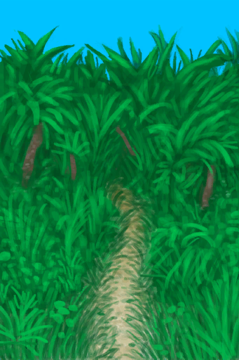

# 丛林小径  
> 它将引我深入丛林。  <b>（只有手牌可以带走）</b>  
   
> 丛林位于岛屿中心。它连接着岛屿的西部和南部海岸，同时连接东部的草原。 丛林植被茂盛，在这里你可以找到多种有用的植物，例如<b>大叶仙茅、卡瓦胡椒、香蕉、参薯还有马勃菌</b>  如果你考虑在此长期逗留并且怕被虫咬，请做好蚊虫防护。  
  
<table class="table table-bordered"><tbody><tr ><td  style="width:80%;text-align:left;vertical-align:top;" >** 区域唯一 **</td><td  style="width:20%;text-align:left;vertical-align:top;" >

</td></tr></tbody></tbody></table>  
  
## 获取来源  
<table class="table table-bordered"><thead><tr ><th  style="text-align:left;vertical-align:top;" >来源</th><th  style="text-align:left;vertical-align:top;" >操作</th></tr></thead><tr ><td  style="text-align:left;vertical-align:top;" >[

[前往丛林边缘(丛林)](Path_JungleToOutskirts.md)](Path_JungleToOutskirts.md)</td><td  style="text-align:left;vertical-align:top;" >前往</td></tr></tbody></table>  
  
## 动作  
<table class="table table-bordered"><thead><tr ><th  style="text-align:left;vertical-align:top;" >动作</th><th  style="text-align:left;vertical-align:top;" >耗时</th><th  style="text-align:left;vertical-align:top;" >条件</th><th  style="text-align:left;vertical-align:top;" >变化</th><th  style="text-align:left;vertical-align:top;" >状态</th></tr></thead><tr ><td  style="text-align:left;vertical-align:top;" >前往 [腿部动作(组)](LegAction.md) [探索动作(组)](SlipperyAction.md) [旅行动作(组)](TravelAction.md)</td><td  style="text-align:left;vertical-align:top;" >30分</td><td  style="text-align:left;vertical-align:top;" >[

[光亮](Light.md)](Light.md): 10-100 [

[耐力](Stamina.md)](Stamina.md): 11-32</td><td  style="text-align:left;vertical-align:top;" >** 获得： ** ** [Shore Path]  **   [

[丛林(环境)](Env_Jungle.md)](Env_Jungle.md)(+1)   [

[前往丛林边缘(丛林)](Path_JungleToOutskirts.md)](Path_JungleToOutskirts.md)(+1) 基础权重：1</td><td  style="text-align:left;vertical-align:top;" >[

[足部损伤](FootDamage.md)](FootDamage.md)+20 [

[耐力](Stamina.md)](Stamina.md)-4 [

[压力](Stress.md)](Stress.md)-10 [

[猎手接近](HuntersProximity.md)](HuntersProximity.md)-12</td></tr></tbody></table>  
  

