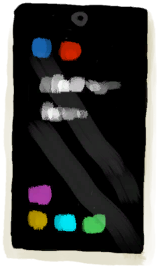
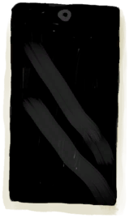
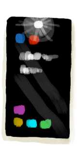

# 手机  
> 只要还有电，就能提供照明和娱乐。 可惜没信号。  
  
<table class="table table-bordered" data-toggle="table"  data-show-header="false"><thead style="display:none"><tr ><th  style="width:50%;text-align:left;vertical-align:top;"  >title</th><th  style="width:50%;text-align:left;vertical-align:top;"  ></th></tr></thead><tr ><td  style="width:50%;text-align:left;vertical-align:top;"  >**重量：**25</td><td  style="width:50%;text-align:left;vertical-align:top;"  >

<a href="PhoneOn.md" style="color:black">手机</a>

</td></tr></tbody></table>  
  
## 获取来源  

开机

[手机(关)](PhoneOff.md)

关闭手电筒

[手机](PhoneOnLight.md)

  
  
## 动作  

<table><tr><td rowspan="2" style="width:200px;text-align:center;font-size:1.3em;font-weight:bold">

关机

</td><td></td></tr><tr><td><b>自身：</b>→ [

[手机(关)](PhoneOff.md)](PhoneOff.md)</td></tr></table>
  

<table><tr><td rowspan="2" style="width:200px;text-align:center;font-size:1.3em;font-weight:bold">

玩游戏

30分

</td><td></td></tr><tr><td><b>自身：</b>燃料  <b>-2(-0.69%)</b></td></tr><tr><td colspan="2"><b>状态变化：</b>[

[情绪](Morale.md)](Morale.md)<b>+5</b>, [

[压力](Stress.md)](Stress.md)<b>-25～+5</b>, [

[娱乐](Entertainment.md)](Entertainment.md)<b>+30</b></td></tr></table>
  

<table><tr><td rowspan="2" style="width:200px;text-align:center;font-size:1.3em;font-weight:bold">

看照片

15分

</td><td></td></tr><tr><td><b>自身：</b>燃料  <b>-1(-0.35%)</b></td></tr><tr><td colspan="2"><b>状态变化：</b>[

[孤独感](Loneliness.md)](Loneliness.md)<b>-50</b>, [

[压力](Stress.md)](Stress.md)<b>-10</b></td></tr></table>
  

<table><tr><td rowspan="2" style="width:200px;text-align:center;font-size:1.3em;font-weight:bold">

打开手电筒

</td><td></td></tr><tr><td><b>自身：</b>→ [

[手机](PhoneOnLight.md)](PhoneOnLight.md), 燃料  <b>-1(-0.35%)</b></td></tr></table>
  
  
  
## 属性   

<table style="margin-bottom:0px;"><tr><td style="width:30%;text-align:left; background-color:#FEFEFE;font-size:1.3em;font-weight:bold;">燃料</td><td style="font-size:1em;background-color:#FEFEFE">初始：288 , 最大：288 每15分钟-1 , 最多需要：3天</td></tr><tr style="background-color:#FFFFFF"><td colspan=2>** 到达0时：电量耗尽 ** 自身: → [

[手机(关)](PhoneOff.md)](PhoneOff.md)</td></tr></table>
  

