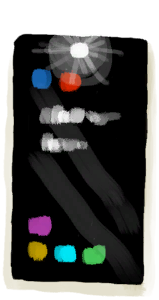
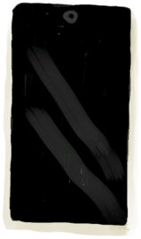

# 手机  
> 只要还有电，就能提供照明和娱乐。 可惜没信号。  
  
<table class="table table-bordered" data-toggle="table" ><tbody><tr ><td  style="width:80%;text-align:left;vertical-align:top;"  >**重量：**25  ** 效果: ** [

[光亮](Light.md)](Light.md)+25</td><td  style="width:20%;text-align:left;vertical-align:top;"  >

</td></tr></tbody></tbody></table>  
  
## 获取来源  
<table class="table table-bordered" data-toggle="table" ><thead><tr ><th  style="text-align:left;vertical-align:top;"  >来源</th><th  style="text-align:left;vertical-align:top;"  >操作</th></tr></thead><tr ><td  style="text-align:left;vertical-align:top;"  >[

[手机(开)](PhoneOn.md)](PhoneOn.md)</td><td  style="text-align:left;vertical-align:top;"  >打开手电筒</td></tr></tbody></table>  
  
## 动作  
<table class="table table-bordered" data-toggle="table" ><thead><tr ><th  style="text-align:left;vertical-align:top;"  >动作</th><th  style="text-align:left;vertical-align:top;"  >耗时</th><th  style="text-align:left;vertical-align:top;"  data-sortable="true"  >条件</th><th  style="text-align:left;vertical-align:top;"  >变化</th><th  style="text-align:left;vertical-align:top;"  >状态</th></tr></thead><tr ><td  style="text-align:left;vertical-align:top;"  >关机 </td><td  style="text-align:left;vertical-align:top;"  >-</td><td  style="text-align:left;vertical-align:top;"  ></td><td  style="text-align:left;vertical-align:top;"  >** 自身：** → [

[手机(关)](PhoneOff.md)](PhoneOff.md)</td><td  style="text-align:left;vertical-align:top;"  ></td></tr><tr ><td  style="text-align:left;vertical-align:top;"  >玩游戏 </td><td  style="text-align:left;vertical-align:top;"  >2TP</td><td  style="text-align:left;vertical-align:top;"  ></td><td  style="text-align:left;vertical-align:top;"  >** 自身：** 燃料  -2(-0.69%)</td><td  style="text-align:left;vertical-align:top;"  >[

[情绪](Morale.md)](Morale.md)+5 [

[压力](Stress.md)](Stress.md)-25～+5</td></tr><tr ><td  style="text-align:left;vertical-align:top;"  >看照片 </td><td  style="text-align:left;vertical-align:top;"  >1TP</td><td  style="text-align:left;vertical-align:top;"  ></td><td  style="text-align:left;vertical-align:top;"  >** 自身：** 燃料  -1(-0.35%)</td><td  style="text-align:left;vertical-align:top;"  >[

[孤独感](Loneliness.md)](Loneliness.md)-50 [

[压力](Stress.md)](Stress.md)-10</td></tr><tr ><td  style="text-align:left;vertical-align:top;"  >关闭手电筒 </td><td  style="text-align:left;vertical-align:top;"  >-</td><td  style="text-align:left;vertical-align:top;"  ></td><td  style="text-align:left;vertical-align:top;"  >** 自身：** → [

[手机(开)](PhoneOn.md)](PhoneOn.md) 燃料  -1(-0.35%)</td><td  style="text-align:left;vertical-align:top;"  ></td></tr></tbody></table>  
  
## 属性   
<table class="table table-bordered" data-toggle="table" ><thead><tr ><th  style="text-align:left;vertical-align:top;"  >属性</th><th  style="text-align:left;vertical-align:top;"  >值</th><th  style="text-align:left;vertical-align:top;"  >耗时</th><th  style="text-align:left;vertical-align:top;"  >变化</th></tr></thead><tr ><td  style="text-align:left;vertical-align:top;"  >燃料</td><td  style="text-align:left;vertical-align:top;"  >初始：288 最大：288</td><td  style="text-align:left;vertical-align:top;"  >每15分钟-3 最多需要：96TP</td><td  style="text-align:left;vertical-align:top;"  >** 到达0时：电量耗尽 **  ** 自身 ** → [

[手机(关)](PhoneOff.md)](PhoneOff.md)</td></tr></tbody></table>  
  

