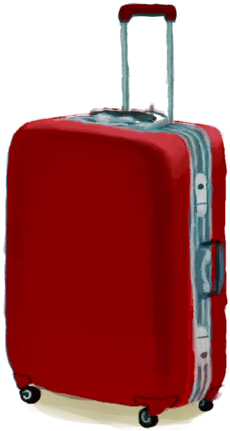

# 坠机  
> 在湿地中坠毁的飞机开始。  
  
<table class="table table-bordered table5414" data-toggle="table"  data-show-header="false"><thead style="display:none"><tr ><th  style="width:15%;"  >名称</th><th  style=""  >值</th></tr></thead><tr ><td  style="width:15%;"  >解锁条件</td><td  style=""  >3🌙</td></tr><tr ><td  style="width:15%;"  >难度分</td><td  style=""  >500</td></tr><tr ><td  style="width:15%;"  >初始装备</td><td  style=""  >无</td></tr><tr ><td  style="width:15%;"  >额外卡牌</td><td  style=""  >[

[收纳箱](Trunk.md)](Trunk.md)&nbsp;&nbsp;&nbsp;&nbsp;[

[座椅](SeatAttached.md)](SeatAttached.md)(6)&nbsp;&nbsp;&nbsp;&nbsp;[

[行李箱(A)](LuggageA.md)](LuggageA.md)&nbsp;&nbsp;&nbsp;&nbsp;[

[行李箱(C)](LuggageC.md)](LuggageC.md)&nbsp;&nbsp;&nbsp;&nbsp;[

[装有燃料的油桶](JerrycanFuel.md)](JerrycanFuel.md)&nbsp;&nbsp;&nbsp;&nbsp;[

[安全刀](SafetyKnife.md)](SafetyKnife.md)&nbsp;&nbsp;&nbsp;&nbsp;[

[急救包(飞机)](FirstAidKitPlane.md)](FirstAidKitPlane.md)&nbsp;&nbsp;&nbsp;&nbsp;[

[止‍疼薬](Painkillers.md)](Painkillers.md)&nbsp;&nbsp;&nbsp;&nbsp;[

[抗生素](Antibiotics.md)](Antibiotics.md)&nbsp;&nbsp;&nbsp;&nbsp;[

[伤口敷料](WoundDressing.md)](WoundDressing.md)(2)&nbsp;&nbsp;&nbsp;&nbsp;[

[袜子](Socks.md)](Socks.md)(4)&nbsp;&nbsp;&nbsp;&nbsp;[

[内裤](Underwear.md)](Underwear.md)&nbsp;&nbsp;&nbsp;&nbsp;[

[短裤](Shorts.md)](Shorts.md)&nbsp;&nbsp;&nbsp;&nbsp;[

[T恤](T-Shirt.md)](T-Shirt.md)(2)&nbsp;&nbsp;&nbsp;&nbsp;[

[运动鞋](Sneakers.md)](Sneakers.md)&nbsp;&nbsp;&nbsp;&nbsp;[

[纸](Papers.md)](Papers.md)(6)&nbsp;&nbsp;&nbsp;&nbsp;[

[眼镜](Glasses.md)](Glasses.md)&nbsp;&nbsp;&nbsp;&nbsp;[

[巧克力](Chocolate.md)](Chocolate.md)(3)</td></tr><tr ><td  style="width:15%;"  >初始状态</td><td  style=""  >[

[污垢](Filth.md)](Filth.md)<b>-225</b></td></tr><tr ><td  style="width:15%;"  >被动状态</td><td  style=""  >无</td></tr><tr ><td  style="width:15%;"  >初始环境</td><td  style=""  >[

[坠毁的飞机(环境)](Env_CrashedPlane.md)](Env_CrashedPlane.md)</td></tr></tbody></table>  
  

