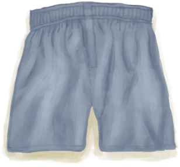
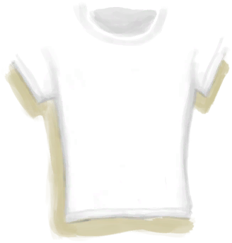

# 坠机  
> 在湿地中坠毁的飞机开始。  
  
<table class="table table-bordered" data-toggle="table" ><tbody><tr ><td  style="width:15%;text-align:left;vertical-align:top;"  >解锁价格</td><td  style="text-align:left;vertical-align:top;"  >3🌙</td></tr></tbody><tr ><td  style="width:15%;text-align:left;vertical-align:top;"  >难度分</td><td  style="text-align:left;vertical-align:top;"  >500</td></tr><tr ><td  style="width:15%;text-align:left;vertical-align:top;"  >初始装备</td><td  style="text-align:left;vertical-align:top;"  >无</td></tr><tr ><td  style="width:15%;text-align:left;vertical-align:top;"  >额外卡牌</td><td  style="text-align:left;vertical-align:top;"  >[

[收纳箱](Trunk.md)](Trunk.md) , [

[座椅](SeatAttached.md)](SeatAttached.md)(6) , [

[行李箱(A)](LuggageA.md)](LuggageA.md) , [

[行李箱(C)](LuggageC.md)](LuggageC.md) , [

[装有燃料的油桶](JerrycanFuel.md)](JerrycanFuel.md) , [

[安全刀](SafetyKnife.md)](SafetyKnife.md) , [

[急救包(飞机)](FirstAidKitPlane.md)](FirstAidKitPlane.md) , [

[止痛药](Painkillers.md)](Painkillers.md) , [

[抗生素](Antibiotics.md)](Antibiotics.md) , [

[伤口敷料](WoundDressing.md)](WoundDressing.md)(2) , [

[袜子](Socks.md)](Socks.md)(4) , [

[内裤](Underwear.md)](Underwear.md) , [

[短裤](Shorts.md)](Shorts.md) , [

[T恤](T-Shirt.md)](T-Shirt.md)(2) , [

[运动鞋](Sneakers.md)](Sneakers.md) , [

[纸](Papers.md)](Papers.md)(6) , [

[眼镜](Glasses.md)](Glasses.md) , [

[巧克力](Chocolate.md)](Chocolate.md)(3)</td></tr><tr ><td  style="width:15%;text-align:left;vertical-align:top;"  >初始状态</td><td  style="text-align:left;vertical-align:top;"  >[

[污垢](Filth.md)](Filth.md)-225</td></tr><tr ><td  style="width:15%;text-align:left;vertical-align:top;"  >被动状态</td><td  style="text-align:left;vertical-align:top;"  >无</td></tr><tr ><td  style="width:15%;text-align:left;vertical-align:top;"  >效果</td><td  style="text-align:left;vertical-align:top;"  ></td></tr></tbody></table>  
  

