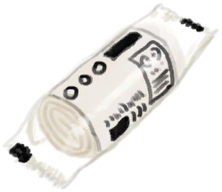

# 坠机  
> 在湿地中坠毁的飞机开始。  
  
<table class="table table-bordered" data-toggle="table"  data-show-header="false"><thead style="display:none"><tr ><th  style="width:15%;text-align:left;vertical-align:top;"  >名称</th><th  style="text-align:left;vertical-align:top;"  >值</th></tr></thead><tr ><td  style="width:15%;text-align:left;vertical-align:top;"  >解锁条件</td><td  style="text-align:left;vertical-align:top;"  >3🌙</td></tr><tr ><td  style="width:15%;text-align:left;vertical-align:top;"  >难度分</td><td  style="text-align:left;vertical-align:top;"  >500</td></tr><tr ><td  style="width:15%;text-align:left;vertical-align:top;"  >初始装备</td><td  style="text-align:left;vertical-align:top;"  >

  
  
</td></tr><tr ><td  style="width:15%;text-align:left;vertical-align:top;"  >额外卡牌</td><td  style="text-align:left;vertical-align:top;"  >

<a href="Trunk.md" style="color:black">收纳箱</a>

<a href="SeatAttached.md" style="color:black">座椅</a>

<a href="SeatAttached.md" style="color:black">座椅</a>

<a href="SeatAttached.md" style="color:black">座椅</a>

<a href="SeatAttached.md" style="color:black">座椅</a>

<a href="SeatAttached.md" style="color:black">座椅</a>

<a href="SeatAttached.md" style="color:black">座椅</a>

<a href="LuggageA.md" style="color:black">行李箱</a>

<a href="LuggageC.md" style="color:black">行李箱</a>

<a href="JerrycanFuel.md" style="color:black">装有燃料的油桶</a>

<a href="SafetyKnife.md" style="color:black">安全刀</a>

<a href="FirstAidKitPlane.md" style="color:black">急救包</a>

<a href="Painkillers.md" style="color:black">止痛药</a>

<a href="Antibiotics.md" style="color:black">抗生素</a>

<a href="WoundDressing.md" style="color:black">伤口敷料</a>

<a href="WoundDressing.md" style="color:black">伤口敷料</a>

<a href="Socks.md" style="color:black">袜子</a>

<a href="Socks.md" style="color:black">袜子</a>

<a href="Underwear.md" style="color:black">内裤</a>

<a href="Shorts.md" style="color:black">短裤</a>

<a href="T-Shirt.md" style="color:black">T恤</a>

<a href="Sneakers.md" style="color:black">运动鞋</a>

<a href="Papers.md" style="color:black">纸</a>

<a href="Papers.md" style="color:black">纸</a>

<a href="Papers.md" style="color:black">纸</a>

<a href="Papers.md" style="color:black">纸</a>

<a href="Papers.md" style="color:black">纸</a>

<a href="Papers.md" style="color:black">纸</a>

<a href="Glasses.md" style="color:black">眼镜</a>

<a href="Chocolate.md" style="color:black">巧克力</a>

<a href="Chocolate.md" style="color:black">巧克力</a>

<a href="Chocolate.md" style="color:black">巧克力</a>

<a href="T-Shirt.md" style="color:black">T恤</a>

<a href="Socks.md" style="color:black">袜子</a>

<a href="Socks.md" style="color:black">袜子</a>

  
  
</td></tr><tr ><td  style="width:15%;text-align:left;vertical-align:top;"  >初始状态</td><td  style="text-align:left;vertical-align:top;"  >[

[污垢](Filth.md)](Filth.md)<b>-225</b></td></tr><tr ><td  style="width:15%;text-align:left;vertical-align:top;"  >被动状态</td><td  style="text-align:left;vertical-align:top;"  >无</td></tr><tr ><td  style="width:15%;text-align:left;vertical-align:top;"  >初始环境</td><td  style="text-align:left;vertical-align:top;"  >[

[坠毁的飞机(环境)](Env_CrashedPlane.md)](Env_CrashedPlane.md)</td></tr></tbody></table>  
  

