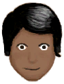

# 岛民  
> 岛屿的原住民。  
  
<table class="table table-bordered" data-toggle="table"  data-show-header="false"><thead style="display:none"><tr ><th  style="width:15%;text-align:left;vertical-align:top;"  >名称</th><th  style="text-align:left;vertical-align:top;"  >值</th></tr></thead><tr ><td  style="width:15%;text-align:left;vertical-align:top;"  >解锁条件</td><td  style="text-align:left;vertical-align:top;"  >5☀️</td></tr><tr ><td  style="width:15%;text-align:left;vertical-align:top;"  >难度分</td><td  style="text-align:left;vertical-align:top;"  >-1000</td></tr><tr ><td  style="width:15%;text-align:left;vertical-align:top;"  >初始装备</td><td  style="text-align:left;vertical-align:top;"  >

<a href="GourdBottle.md" style="color:black">葫芦瓶</a>

<a href="LeafSKirt.md" style="color:black">草裙</a>

<a href="SeashellNecklace.md" style="color:black">贝壳项链</a>

<a href="SatchelHunter.md" style="color:black">挎包</a>

  
  
</td></tr><tr ><td  style="width:15%;text-align:left;vertical-align:top;"  >额外卡牌</td><td  style="text-align:left;vertical-align:top;"  >

<a href="SagoFlour.md" style="color:black">西米粉</a>

<a href="SagoFlour.md" style="color:black">西米粉</a>

<a href="SagoFlour.md" style="color:black">西米粉</a>

<a href="SagoFlour.md" style="color:black">西米粉</a>

  
  
</td></tr><tr ><td  style="width:15%;text-align:left;vertical-align:top;"  >初始状态</td><td  style="text-align:left;vertical-align:top;"  >[

[足茧](CallousesFeet.md)](CallousesFeet.md)<b>+1000</b> [

[手茧](CallousesHands.md)](CallousesHands.md)<b>+500</b> [

[晒黑](Tanning.md)](Tanning.md)<b>+1000</b></td></tr><tr ><td  style="width:15%;text-align:left;vertical-align:top;"  >被动状态</td><td  style="text-align:left;vertical-align:top;"  >无</td></tr></tbody></table>  
  

