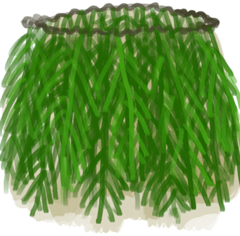

# 岛民  
> 岛屿的原住民。  
  
<table class="table table-bordered"><thead><tr ><th  style="width:10%;text-align:left;vertical-align:top;" >名称</th><th  style="text-align:left;vertical-align:top;" >值</th></tr></thead><tr ><td  style="width:10%;text-align:left;vertical-align:top;" >解锁价格</td><td  style="text-align:left;vertical-align:top;" >5☀️</td></tr><tr ><td  style="width:10%;text-align:left;vertical-align:top;" >分数</td><td  style="text-align:left;vertical-align:top;" >-1000</td></tr><tr ><td  style="width:10%;text-align:left;vertical-align:top;" >初始装备</td><td  style="text-align:left;vertical-align:top;" >[

[葫芦瓶](GourdBottle.md)](GourdBottle.md) , [

[草裙](LeafSKirt.md)](LeafSKirt.md) , [

[贝壳项链](SeashellNecklace.md)](SeashellNecklace.md) , [

[挎包(猎人专有)](SatchelHunter.md)](SatchelHunter.md)</td></tr><tr ><td  style="width:10%;text-align:left;vertical-align:top;" >额外卡牌</td><td  style="text-align:left;vertical-align:top;" >[

[西米粉](SagoFlour.md)](SagoFlour.md)(4) </td></tr><tr ><td  style="width:10%;text-align:left;vertical-align:top;" >初始状态</td><td  style="text-align:left;vertical-align:top;" >[

[足茧](CallousesFeet.md)](CallousesFeet.md)+1000 [

[手茧](CallousesHands.md)](CallousesHands.md)+500 [

[晒黑](Tanning.md)](Tanning.md)+1000</td></tr><tr ><td  style="width:10%;text-align:left;vertical-align:top;" >被动状态</td><td  style="text-align:left;vertical-align:top;" >无</td></tr><tr ><td  style="width:10%;text-align:left;vertical-align:top;" >效果</td><td  style="text-align:left;vertical-align:top;" ></td></tr></tbody></table>  
  

