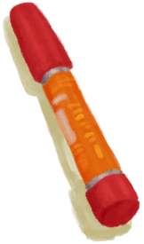

# 超级生存箱 2000  
> 生存有困难？快试试超级生存箱 2000！  
  
<table class="table table-bordered" data-toggle="table"  data-show-header="false"><thead style="display:none"><tr ><th  style="width:15%;text-align:left;vertical-align:top;"  >名称</th><th  style="text-align:left;vertical-align:top;"  >值</th></tr></thead><tr ><td  style="width:15%;text-align:left;vertical-align:top;"  >解锁条件</td><td  style="text-align:left;vertical-align:top;"  >免费</td></tr><tr ><td  style="width:15%;text-align:left;vertical-align:top;"  >难度分</td><td  style="text-align:left;vertical-align:top;"  >-7500</td></tr><tr ><td  style="width:15%;text-align:left;vertical-align:top;"  >初始装备</td><td  style="text-align:left;vertical-align:top;"  >

  
  
</td></tr><tr ><td  style="width:15%;text-align:left;vertical-align:top;"  >额外卡牌</td><td  style="text-align:left;vertical-align:top;"  >

<a href="TrunkPerk.md" style="color:black">超级生存箱 2000</a>

<a href="FirstAidKitTrunk.md" style="color:black">急救包</a>

<a href="Painkillers.md" style="color:black">止痛药</a>

<a href="Painkillers.md" style="color:black">止痛药</a>

<a href="Painkillers.md" style="color:black">止痛药</a>

<a href="Antibiotics.md" style="color:black">抗生素</a>

<a href="Antibiotics.md" style="color:black">抗生素</a>

<a href="Antibiotics.md" style="color:black">抗生素</a>

<a href="AntiDiarrhoeaPills.md" style="color:black">泻立停</a>

<a href="AntiDiarrhoeaPills.md" style="color:black">泻立停</a>

<a href="AntiDiarrhoeaPills.md" style="color:black">泻立停</a>

<a href="WaterPurificationTablets.md" style="color:black">净水片</a>

<a href="WaterPurificationTablets.md" style="color:black">净水片</a>

<a href="WaterPurificationTablets.md" style="color:black">净水片</a>

<a href="WoundDressing.md" style="color:black">伤口敷料</a>

<a href="WoundDressing.md" style="color:black">伤口敷料</a>

<a href="WoundDressing.md" style="color:black">伤口敷料</a>

<a href="WoundDressing.md" style="color:black">伤口敷料</a>

<a href="WoundDressing.md" style="color:black">伤口敷料</a>

<a href="WoundDressing.md" style="color:black">伤口敷料</a>

<a href="FoodRationsPackage.md" style="color:black">压缩干粮包</a>

<a href="FoodRationsPackage.md" style="color:black">压缩干粮包</a>

<a href="WaterRationsPackage.md" style="color:black">应急水袋</a>

<a href="WaterRationsPackage.md" style="color:black">应急水袋</a>

<a href="PlasticBottleFull.md" style="color:black">塑料瓶</a>

<a href="PlasticBottleFull.md" style="color:black">塑料瓶</a>

<a href="PlasticBottleFull.md" style="color:black">塑料瓶</a>

<a href="PlasticBottleFull.md" style="color:black">塑料瓶</a>

<a href="PlasticBottleFull.md" style="color:black">塑料瓶</a>

<a href="PlasticBottleFull.md" style="color:black">塑料瓶</a>

<a href="FishingLine.md" style="color:black">钓鱼线</a>

<a href="FishingLine.md" style="color:black">钓鱼线</a>

<a href="FlareHand.md" style="color:black">信号弹</a>

<a href="FlareHand.md" style="color:black">信号弹</a>

<a href="FlareHand.md" style="color:black">信号弹</a>

<a href="FlareHand.md" style="color:black">信号弹</a>

<a href="PlasticSheet.md" style="color:black">塑料布</a>

<a href="PlasticSheet.md" style="color:black">塑料布</a>

  
  
</td></tr><tr ><td  style="width:15%;text-align:left;vertical-align:top;"  >初始状态</td><td  style="text-align:left;vertical-align:top;"  >无</td></tr><tr ><td  style="width:15%;text-align:left;vertical-align:top;"  >被动状态</td><td  style="text-align:left;vertical-align:top;"  >无</td></tr></tbody></table>  
  

