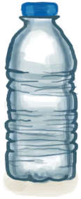
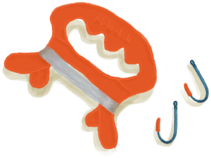

# 超级生存箱 2000  
> 生存有困难？快试试超级生存箱 2000！  
  
<table class="table table-bordered"><thead><tr ><th  style="width:10%;text-align:left;vertical-align:top;" >名称</th><th  style="text-align:left;vertical-align:top;" >值</th></tr></thead><tr ><td  style="width:10%;text-align:left;vertical-align:top;" >解锁价格</td><td  style="text-align:left;vertical-align:top;" >免费</td></tr><tr ><td  style="width:10%;text-align:left;vertical-align:top;" >分数</td><td  style="text-align:left;vertical-align:top;" >-7500</td></tr><tr ><td  style="width:10%;text-align:left;vertical-align:top;" >初始装备</td><td  style="text-align:left;vertical-align:top;" >无</td></tr><tr ><td  style="width:10%;text-align:left;vertical-align:top;" >额外卡牌</td><td  style="text-align:left;vertical-align:top;" > [

[超级生存箱 2000](TrunkPerk.md)](TrunkPerk.md) , [

[急救包](FirstAidKitTrunk.md)](FirstAidKitTrunk.md) , [

[止痛药](Painkillers.md)](Painkillers.md)(3) , [

[抗生素](Antibiotics.md)](Antibiotics.md)(3) , [

[泻立停](AntiDiarrhoeaPills.md)](AntiDiarrhoeaPills.md)(3) , [

[净水片](WaterPurificationTablets.md)](WaterPurificationTablets.md)(3) , [

[伤口敷料](WoundDressing.md)](WoundDressing.md)(6) , [

[压缩干粮包](FoodRationsPackage.md)](FoodRationsPackage.md)(2) , [

[应急水袋](WaterRationsPackage.md)](WaterRationsPackage.md)(2) , [

[塑料瓶(满)](PlasticBottleFull.md)](PlasticBottleFull.md)(6) , [

[钓鱼线](FishingLine.md)](FishingLine.md)(2) , [

[信号弹](FlareHand.md)](FlareHand.md)(4) , [

[塑料布](PlasticSheet.md)](PlasticSheet.md)(2)</td></tr><tr ><td  style="width:10%;text-align:left;vertical-align:top;" >初始状态</td><td  style="text-align:left;vertical-align:top;" >无</td></tr><tr ><td  style="width:10%;text-align:left;vertical-align:top;" >被动状态</td><td  style="text-align:left;vertical-align:top;" >无</td></tr><tr ><td  style="width:10%;text-align:left;vertical-align:top;" >效果</td><td  style="text-align:left;vertical-align:top;" ></td></tr></tbody></table>  
  

