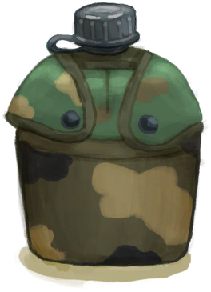

# 生存专家  
> 开始时拥有一套生存装备，包括帐篷和瓦斯炉。  
  
<table class="table table-bordered" data-toggle="table"  data-show-header="false"><thead style="display:none"><tr ><th  style="width:15%;text-align:left;vertical-align:top;"  >名称</th><th  style="text-align:left;vertical-align:top;"  >值</th></tr></thead><tr ><td  style="width:15%;text-align:left;vertical-align:top;"  >解锁条件</td><td  style="text-align:left;vertical-align:top;"  >1🌙</td></tr><tr ><td  style="width:15%;text-align:left;vertical-align:top;"  >难度分</td><td  style="text-align:left;vertical-align:top;"  >-2500</td></tr><tr ><td  style="width:15%;text-align:left;vertical-align:top;"  >初始装备</td><td  style="text-align:left;vertical-align:top;"  >

<a href="HatSurvival.md" style="color:black">求生帽</a>

<a href="BackpackSurvivalist.md" style="color:black">生存者背包</a>

<a href="T-Shirt.md" style="color:black">T恤</a>

<a href="Shorts.md" style="color:black">短裤</a>

<a href="Underwear.md" style="color:black">内裤</a>

<a href="Socks.md" style="color:black">袜子</a>

<a href="MilitaryBoots.md" style="color:black">军靴</a>

  
  
</td></tr><tr ><td  style="width:15%;text-align:left;vertical-align:top;"  >额外卡牌</td><td  style="text-align:left;vertical-align:top;"  >

<a href="Canteen.md" style="color:black">水壶</a>

<a href="KnifeMilitary.md" style="color:black">军刀</a>

<a href="AxeSurvival.md" style="color:black">求生斧</a>

<a href="GasCookerOff.md" style="color:black">瓦斯炉</a>

<a href="TentPacked.md" style="color:black">收起的帐篷</a>

  
  
</td></tr><tr ><td  style="width:15%;text-align:left;vertical-align:top;"  >初始状态</td><td  style="text-align:left;vertical-align:top;"  >无</td></tr><tr ><td  style="width:15%;text-align:left;vertical-align:top;"  >被动状态</td><td  style="text-align:left;vertical-align:top;"  >无</td></tr></tbody></table>  
  

