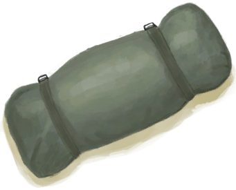

# 生存专家  
> 开始时拥有一套生存装备，包括帐篷和瓦斯炉。  
  
<table class="table table-bordered table1737" data-toggle="table"  data-show-header="false"><thead style="display:none"><tr ><th  style="width:15%;"  >名称</th><th  style=""  >值</th></tr></thead><tr ><td  style="width:15%;"  >解锁条件</td><td  style=""  >1🌙</td></tr><tr ><td  style="width:15%;"  >难度分</td><td  style=""  >-2500</td></tr><tr ><td  style="width:15%;"  >初始装备</td><td  style=""  >[

[求生帽](HatSurvival.md)](HatSurvival.md) , [

[生存者背包](BackpackSurvivalist.md)](BackpackSurvivalist.md) , [

[T恤](T-Shirt.md)](T-Shirt.md) , [

[短裤](Shorts.md)](Shorts.md) , [

[内裤](Underwear.md)](Underwear.md) , [

[袜子](Socks.md)](Socks.md) , [

[军靴](MilitaryBoots.md)](MilitaryBoots.md)</td></tr><tr ><td  style="width:15%;"  >额外卡牌</td><td  style=""  >[

[水壶](Canteen.md)](Canteen.md)&nbsp;&nbsp;&nbsp;&nbsp;[

[军刀](KnifeMilitary.md)](KnifeMilitary.md)&nbsp;&nbsp;&nbsp;&nbsp;[

[求生斧](AxeSurvival.md)](AxeSurvival.md)&nbsp;&nbsp;&nbsp;&nbsp;[

[瓦斯炉(关)](GasCookerOff.md)](GasCookerOff.md)&nbsp;&nbsp;&nbsp;&nbsp;[

[收起的帐篷](TentPacked.md)](TentPacked.md)</td></tr><tr ><td  style="width:15%;"  >初始状态</td><td  style=""  >无</td></tr><tr ><td  style="width:15%;"  >被动状态</td><td  style=""  >无</td></tr></tbody></table>  
  

