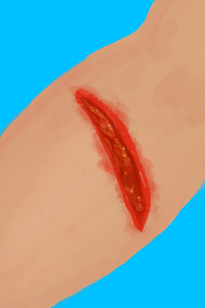

# 正在流血  
> 开始时有一个流血的伤口。  
  
<table class="table table-bordered table8098" data-toggle="table"  data-show-header="false"><thead style="display:none"><tr ><th  style="width:15%;"  >名称</th><th  style=""  >值</th></tr></thead><tr ><td  style="width:15%;"  >解锁条件</td><td  style=""  >10☀️</td></tr><tr ><td  style="width:15%;"  >难度分</td><td  style=""  >2500</td></tr><tr ><td  style="width:15%;"  >初始装备</td><td  style=""  >[

[右臂撕裂伤](W_ArmLacerationR.md)](W_ArmLacerationR.md)</td></tr><tr ><td  style="width:15%;"  >额外卡牌</td><td  style=""  >无</td></tr><tr ><td  style="width:15%;"  >初始状态</td><td  style=""  >无</td></tr><tr ><td  style="width:15%;"  >被动状态</td><td  style=""  >无</td></tr></tbody></table>  
  

