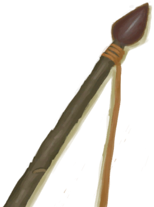
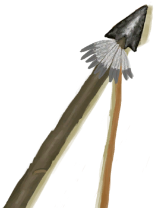

# 石匠  
> 善于制作石制工具。  
  
<table class="table table-bordered" data-toggle="table"  data-show-header="false"><thead style="display:none"><tr ><th  style="width:15%;text-align:left;vertical-align:top;"  >名称</th><th  style="text-align:left;vertical-align:top;"  >值</th></tr></thead><tr ><td  style="width:15%;text-align:left;vertical-align:top;"  >解锁条件</td><td  style="text-align:left;vertical-align:top;"  >10☀️</td></tr><tr ><td  style="width:15%;text-align:left;vertical-align:top;"  >难度分</td><td  style="text-align:left;vertical-align:top;"  >-1000</td></tr><tr ><td  style="width:15%;text-align:left;vertical-align:top;"  >初始装备</td><td  style="text-align:left;vertical-align:top;"  >

  
  
</td></tr><tr ><td  style="width:15%;text-align:left;vertical-align:top;"  >额外卡牌</td><td  style="text-align:left;vertical-align:top;"  >

<a href="Bp_FlintKnife.md" style="color:black">燧石刀</a>

<a href="Bp_FlintSpear.md" style="color:black">燧石长矛</a>

<a href="Bp_FlintAxe.md" style="color:black">燧石斧</a>

<a href="Bp_ObsidianSpear.md" style="color:black">黑曜石长矛</a>

  
  
</td></tr><tr ><td  style="width:15%;text-align:left;vertical-align:top;"  >初始状态</td><td  style="text-align:left;vertical-align:top;"  >[

[石工(技能)](Skill_Knapping.md)](Skill_Knapping.md)<b>+75</b></td></tr><tr ><td  style="width:15%;text-align:left;vertical-align:top;"  >被动状态</td><td  style="text-align:left;vertical-align:top;"  >无</td></tr></tbody></table>  
  

