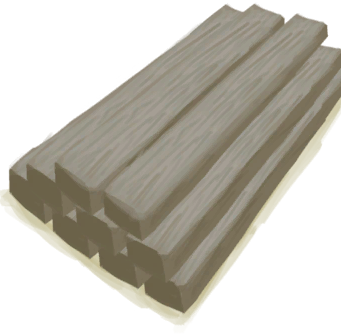

# 木匠  
> 擅长木工。  
  
<table class="table table-bordered"><thead><tr ><th  style="width:10%;text-align:left;vertical-align:top;" >名称</th><th  style="text-align:left;vertical-align:top;" >值</th></tr></thead><tr ><td  style="width:10%;text-align:left;vertical-align:top;" >解锁价格</td><td  style="text-align:left;vertical-align:top;" >10☀️</td></tr><tr ><td  style="width:10%;text-align:left;vertical-align:top;" >分数</td><td  style="text-align:left;vertical-align:top;" >-1000</td></tr><tr ><td  style="width:10%;text-align:left;vertical-align:top;" >初始装备</td><td  style="text-align:left;vertical-align:top;" >无</td></tr><tr ><td  style="width:10%;text-align:left;vertical-align:top;" >额外卡牌</td><td  style="text-align:left;vertical-align:top;" > [

[木屑(蓝图)](Bp_WoodShavings.md)](Bp_WoodShavings.md) , [

[木雕(蓝图)](Bp_WoodCarvings.md)](Bp_WoodCarvings.md) , [

[木板(蓝图)](Bp_Planks.md)](Bp_Planks.md) , [

[木钉(蓝图)](Bp_Treenails.md)](Bp_Treenails.md)</td></tr><tr ><td  style="width:10%;text-align:left;vertical-align:top;" >初始状态</td><td  style="text-align:left;vertical-align:top;" >[

[木工(技能)](Skill_Woodworking.md)](Skill_Woodworking.md)+75</td></tr><tr ><td  style="width:10%;text-align:left;vertical-align:top;" >被动状态</td><td  style="text-align:left;vertical-align:top;" >无</td></tr><tr ><td  style="width:10%;text-align:left;vertical-align:top;" >效果</td><td  style="text-align:left;vertical-align:top;" ></td></tr></tbody></table>  
  

