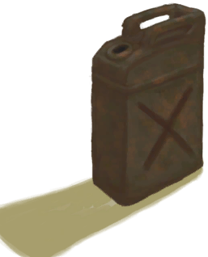

# 储物箱  
> 我可以把物品储存在里面。  
  
<table class="table table-bordered"><tbody><tr ><td  style="width:80%;text-align:left;vertical-align:top;" >**槽位：**7  **初始卡牌：**[

[急救包(救生筏)](FirstAidKitLifeRaft.md)](FirstAidKitLifeRaft.md) , [

[压缩干粮包](FoodRationsPackage.md)](FoodRationsPackage.md) , [

[应急水袋](WaterRationsPackage.md)](WaterRationsPackage.md) , [

[氧气面罩](Oxygen.md)](Oxygen.md) , [

[油桶](Jerrycan.md)](Jerrycan.md)  **过滤器：**~~[“袋子”](tag_Bag.md)~~  **容量：**2000</td><td  style="width:20%;text-align:left;vertical-align:top;" >

</td></tr></tbody></tbody></table>  
  

