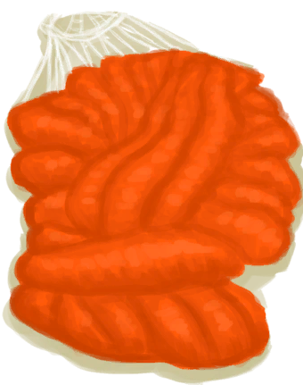

# 塑料布  
> 大块的塑料布，我可以用它搭一个雨水收集器。  
  
<table class="table table-bordered" data-toggle="table"  data-show-header="false"><thead style="display:none"><tr ><th  style="width:50%;text-align:left;vertical-align:top;"  >title</th><th  style="width:50%;text-align:left;vertical-align:top;"  ></th></tr></thead><tr ><td  style="width:50%;text-align:left;vertical-align:top;"  >** 不可删除 **  **重量：**250</td><td  style="width:50%;text-align:left;vertical-align:top;"  >

<a href="PlasticSheet.md" style="color:black">塑料布</a>

</td></tr></tbody></table>  
  
## 获取来源  
<table class="table table-bordered" data-toggle="table"  ><thead style=""><tr ><th  style="text-align:left;vertical-align:top;"  >来源</th><th  style="text-align:left;vertical-align:top;"  >操作</th></tr></thead><tr ><td  style="text-align:left;vertical-align:top;"  >[

[帐篷](TentDeployed.md)](TentDeployed.md)</td><td  style="text-align:left;vertical-align:top;"  >回收塑料 ** 拖入：**[“切割工具”](tag_Cutter.md)</td></tr><tr ><td  style="text-align:left;vertical-align:top;"  >[

[收起的帐篷](TentPacked.md)](TentPacked.md)</td><td  style="text-align:left;vertical-align:top;"  >回收塑料 ** 拖入：**[“切割工具”](tag_Cutter.md)</td></tr><tr ><td  style="text-align:left;vertical-align:top;"  >[

[没气的救生筏](LifeRaftDeflated.md)](LifeRaftDeflated.md)</td><td  style="text-align:left;vertical-align:top;"  >切下塑料布 ** 拖入：**[“切割工具”](tag_Cutter.md)</td></tr><tr ><td  style="text-align:left;vertical-align:top;"  >[

[打开的降落伞](ParachuteDeployed.md)](ParachuteDeployed.md)</td><td  style="text-align:left;vertical-align:top;"  >切下塑料布 ** 拖入：**[“切割工具”](tag_Cutter.md)</td></tr><tr ><td  style="text-align:left;vertical-align:top;"  >[

[烟熏炉(塑料布)(无火)](SmokerNoFirePlastic.md)](SmokerNoFirePlastic.md)</td><td  style="text-align:left;vertical-align:top;"  >移除塑料布</td></tr><tr ><td  style="text-align:left;vertical-align:top;"  >[

[雨衣](Raincoat.md)](Raincoat.md)</td><td  style="text-align:left;vertical-align:top;"  >拆解</td></tr><tr ><td  style="text-align:left;vertical-align:top;"  >[

[雨衣](Raincoat.md)](Raincoat.md)</td><td  style="text-align:left;vertical-align:top;"  >转化</td></tr><tr ><td  style="text-align:left;vertical-align:top;"  >[

[漂浮的残骸](FloatingDebris.md)](FloatingDebris.md)</td><td  style="text-align:left;vertical-align:top;"  >采集</td></tr><tr ><td  style="text-align:left;vertical-align:top;"  >[

[沉船(鸟岩岛)](Shipwreck.md)](Shipwreck.md)</td><td  style="text-align:left;vertical-align:top;"  >探索沉船</td></tr><tr ><td  style="text-align:left;vertical-align:top;"  >[

[雨水收集器](RainCatcher.md)](RainCatcher.md)</td><td  style="text-align:left;vertical-align:top;"  >拆解</td></tr><tr ><td  style="text-align:left;vertical-align:top;"  >[

[太阳能蒸馏器](SolarStill.md)](SolarStill.md)</td><td  style="text-align:left;vertical-align:top;"  >拆解</td></tr></tbody></table>  
  
## 可拖至  

[烟熏炉框架](SmokerFrame.md)

  
  
## 可用于蓝图  

[

[集雨器(蓝图)](Bp_Raincatcher.md)](Bp_Raincatcher.md)

[

[太阳能蒸馏器(蓝图)](Bp_SolarStill.md)](Bp_SolarStill.md)

[

[雨衣(蓝图)](Bp_Raincoat.md)](Bp_Raincoat.md)

  
  
  

