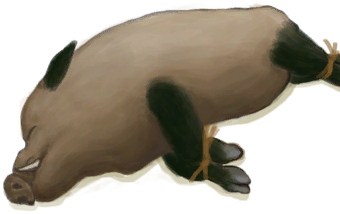

# 野猪种群数量  
  

<b>基础值: </b> 12000 
  

<b>变化范围: </b> 0 ~ 12000 
  

<b>基础变化率: </b> 无 
  
## 阶段  

<table><tr style="height:2em;"><td style="background-color:#F0F0F0;text-align:center;width:180px;font-size:1.4em;font-weight:bold;vertical-align:middle;">
2000 ～ 3000

16% ～ 25%
</td><td colspan=2 style="font-size:1.1em;vertical-align:middle;background-color:#F9F9F9;">
<b>低密度</b>

</td></tr><tr><td colspan=2><b>影响：</b>[野猪种群数量](Pop_Boar.md)加成<b>+0.5</b></td></tr><tr><td colspan=2></td></tr><tr style="height:2em;"><td style="background-color:#F0F0F0;text-align:center;width:180px;font-size:1.4em;font-weight:bold;vertical-align:middle;">
3001 ～ 6000

25% ～ 50%
</td><td colspan=2 style="font-size:1.1em;vertical-align:middle;background-color:#F9F9F9;">
<b>中等密度</b>

</td></tr><tr><td colspan=2><b>影响：</b>[野猪种群数量](Pop_Boar.md)加成<b>+1</b></td></tr><tr><td colspan=2></td></tr><tr style="height:2em;"><td style="background-color:#F0F0F0;text-align:center;width:180px;font-size:1.4em;font-weight:bold;vertical-align:middle;">
6001 ～ 9000

50% ～ 75%
</td><td colspan=2 style="font-size:1.1em;vertical-align:middle;background-color:#F9F9F9;">
<b>高密度</b>

</td></tr><tr><td colspan=2><b>影响：</b>[野猪种群数量](Pop_Boar.md)加成<b>+1.5</b></td></tr><tr><td colspan=2></td></tr><tr style="height:2em;"><td style="background-color:#F0F0F0;text-align:center;width:180px;font-size:1.4em;font-weight:bold;vertical-align:middle;">
9001 ～ 12000

75% ～ 100%
</td><td colspan=2 style="font-size:1.1em;vertical-align:middle;background-color:#F9F9F9;">
<b>超高密度</b>

</td></tr><tr><td colspan=2><b>影响：</b>[野猪种群数量](Pop_Boar.md)加成<b>+2</b></td></tr><tr><td colspan=2></td></tr></table>
  
## 可被以下操作改变  
<table class="table table-bordered table5901" data-toggle="table"  ><thead style=""><tr ><th  style=""  >来源</th><th  style=""  >操作</th><th  style=""  data-sortable="true"  >值</th></tr></thead><tr ><td  style=""  >[

[母猪](BoarEnclosureFemale.md)](BoarEnclosureFemale.md)</td><td  style=""  >放生</td><td  style=""  >1000</td></tr><tr ><td  style=""  >[

[公猪](BoarEnclosureMale.md)](BoarEnclosureMale.md)</td><td  style=""  >放生</td><td  style=""  >1000</td></tr><tr ><td  style=""  >[

[小猪](BoarEnclosurePiglet.md)](BoarEnclosurePiglet.md)</td><td  style=""  >放生</td><td  style=""  >1000</td></tr><tr ><td  style=""  >[

[母猪](BoarTiedFemale.md)](BoarTiedFemale.md)</td><td  style=""  >放生</td><td  style=""  >1000</td></tr><tr ><td  style=""  >[

[公猪](BoarTiedMale.md)](BoarTiedMale.md)</td><td  style=""  >放生</td><td  style=""  >1000</td></tr><tr ><td  style=""  >[

[小猪](BoarTiedPiglet.md)](BoarTiedPiglet.md)</td><td  style=""  >放生</td><td  style=""  >1000</td></tr><tr ><td  style=""  >[

[原木陷阱](LogTrap.md)](LogTrap.md)</td><td  style=""  >捕捉猎物</td><td  style=""  >-1000</td></tr><tr ><td  style=""  >[

[陷坑](TrappingPit.md)](TrappingPit.md)</td><td  style=""  >捕捉猎物</td><td  style=""  >-1000</td></tr><tr ><td  style=""  >[

[我拿下它了，但我受伤了。(事件)](Event_BoarFightMixedSuccess.md)](Event_BoarFightMixedSuccess.md)</td><td  style=""  >继续</td><td  style=""  >-1000</td></tr><tr ><td  style=""  >[

[野猪倒下了！(事件)](Event_BoarFightSuccess.md)](Event_BoarFightSuccess.md)</td><td  style=""  >继续</td><td  style=""  >-1000</td></tr></tbody></table>  
  
## 被以下操作需求  
<table class="table table-bordered table4178" data-toggle="table"  ><thead style=""><tr ><th  style=""  >来源</th><th  style=""  >操作</th><th  style=""  >值</th></tr></thead><tr ><td  style=""  >[原木陷阱](LogTrap.md)</td><td  style=""  >转化需要</td><td  style=""  >1000 ~ 12000</td></tr><tr ><td  style=""  >[陷坑](TrappingPit.md)</td><td  style=""  >转化需要</td><td  style=""  >1000 ~ 12000</td></tr><tr ><td  style=""  >[丛林深处](DeepJungle.md)</td><td  style=""  >影响</td><td  style=""  >1000 ~ 12000</td></tr><tr ><td  style=""  >[丛林](Jungle.md)</td><td  style=""  >影响</td><td  style=""  >1000 ~ 12000</td></tr><tr ><td  style=""  >[丛林高地](JungleHighlands.md)</td><td  style=""  >影响</td><td  style=""  >1000 ~ 12000</td></tr><tr ><td  style=""  >[湿地丛林(湿地)](Wetlands.md)</td><td  style=""  >影响</td><td  style=""  >1000 ~ 12000</td></tr></tbody></table>  
  

