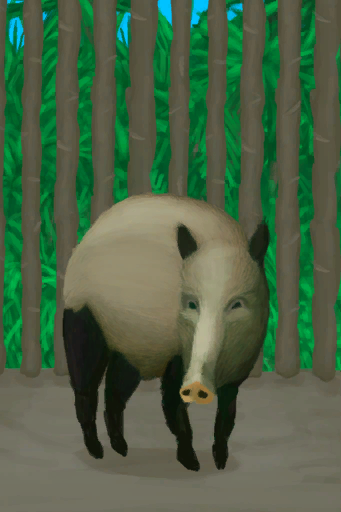

# 野猪种群数量  
#### ** 基础值: ** 12000   
#### ** 变化范围: ** 0 ~ 12000  
#### ** 基础变化率: ** 无   
## 阶段  
<table class="table table-bordered"><thead><tr ><th  style="text-align:left;vertical-align:top;" >范围</th><th  style="text-align:left;vertical-align:top;" >名称</th><th  style="text-align:left;vertical-align:top;" >描述</th><th  style="text-align:left;vertical-align:top;" >影响状态</th><th  style="text-align:left;vertical-align:top;" >影响动作</th></tr></thead><tr ><td  style="text-align:left;vertical-align:top;" >2000 ～ 3000</td><td  style="text-align:left;vertical-align:top;" >低密度</td><td  style="text-align:left;vertical-align:top;" ></td><td  style="text-align:left;vertical-align:top;" >[野猪种群数量](Pop_Boar.md)加成+0.5</td><td  style="text-align:left;vertical-align:top;" ></td></tr><tr ><td  style="text-align:left;vertical-align:top;" >3001 ～ 6000</td><td  style="text-align:left;vertical-align:top;" >中等密度</td><td  style="text-align:left;vertical-align:top;" ></td><td  style="text-align:left;vertical-align:top;" >[野猪种群数量](Pop_Boar.md)加成+1</td><td  style="text-align:left;vertical-align:top;" ></td></tr><tr ><td  style="text-align:left;vertical-align:top;" >6001 ～ 9000</td><td  style="text-align:left;vertical-align:top;" >高密度</td><td  style="text-align:left;vertical-align:top;" ></td><td  style="text-align:left;vertical-align:top;" >[野猪种群数量](Pop_Boar.md)加成+1.5</td><td  style="text-align:left;vertical-align:top;" ></td></tr><tr ><td  style="text-align:left;vertical-align:top;" >9001 ～ 12000</td><td  style="text-align:left;vertical-align:top;" >超高密度</td><td  style="text-align:left;vertical-align:top;" ></td><td  style="text-align:left;vertical-align:top;" >[野猪种群数量](Pop_Boar.md)加成+2</td><td  style="text-align:left;vertical-align:top;" ></td></tr></tbody></table>  
  
## 可被以下操作改变  
<table class="table table-bordered"><thead><tr ><th  style="text-align:left;vertical-align:top;" >来源</th><th  style="text-align:left;vertical-align:top;" >操作</th><th  style="text-align:left;vertical-align:top;" >值</th></tr></thead><tr ><td  style="text-align:left;vertical-align:top;" >[

[母猪](BoarEnclosureFemale.md)](BoarEnclosureFemale.md)</td><td  style="text-align:left;vertical-align:top;" >放生</td><td  style="text-align:left;vertical-align:top;" >1000</td></tr><tr ><td  style="text-align:left;vertical-align:top;" >[

[公猪](BoarEnclosureMale.md)](BoarEnclosureMale.md)</td><td  style="text-align:left;vertical-align:top;" >放生</td><td  style="text-align:left;vertical-align:top;" >1000</td></tr><tr ><td  style="text-align:left;vertical-align:top;" >[

[小猪](BoarEnclosurePiglet.md)](BoarEnclosurePiglet.md)</td><td  style="text-align:left;vertical-align:top;" >放生</td><td  style="text-align:left;vertical-align:top;" >1000</td></tr><tr ><td  style="text-align:left;vertical-align:top;" >[

[母猪](BoarTiedFemale.md)](BoarTiedFemale.md)</td><td  style="text-align:left;vertical-align:top;" >放生</td><td  style="text-align:left;vertical-align:top;" >1000</td></tr><tr ><td  style="text-align:left;vertical-align:top;" >[

[公猪](BoarTiedMale.md)](BoarTiedMale.md)</td><td  style="text-align:left;vertical-align:top;" >放生</td><td  style="text-align:left;vertical-align:top;" >1000</td></tr><tr ><td  style="text-align:left;vertical-align:top;" >[

[小猪](BoarTiedPiglet.md)](BoarTiedPiglet.md)</td><td  style="text-align:left;vertical-align:top;" >放生</td><td  style="text-align:left;vertical-align:top;" >1000</td></tr><tr ><td  style="text-align:left;vertical-align:top;" >[

[原木陷阱](LogTrap.md)](LogTrap.md)</td><td  style="text-align:left;vertical-align:top;" >捕捉猎物</td><td  style="text-align:left;vertical-align:top;" >-1000</td></tr><tr ><td  style="text-align:left;vertical-align:top;" >[

[陷坑](TrappingPit.md)](TrappingPit.md)</td><td  style="text-align:left;vertical-align:top;" >捕捉猎物</td><td  style="text-align:left;vertical-align:top;" >-1000</td></tr><tr ><td  style="text-align:left;vertical-align:top;" >[

[我拿下它了，但我受伤了。(事件)](Event_BoarFightMixedSuccess.md)](Event_BoarFightMixedSuccess.md)</td><td  style="text-align:left;vertical-align:top;" >继续</td><td  style="text-align:left;vertical-align:top;" >-1000</td></tr><tr ><td  style="text-align:left;vertical-align:top;" >[

[野猪倒下了！(事件)](Event_BoarFightSuccess.md)](Event_BoarFightSuccess.md)</td><td  style="text-align:left;vertical-align:top;" >继续</td><td  style="text-align:left;vertical-align:top;" >-1000</td></tr></tbody></table>  
  
## 被以下操作需求  
<table class="table table-bordered"><thead><tr ><th  style="text-align:left;vertical-align:top;" >来源</th><th  style="text-align:left;vertical-align:top;" >操作</th><th  style="text-align:left;vertical-align:top;" >值</th></tr></thead><tr ><td  style="text-align:left;vertical-align:top;" >[原木陷阱](LogTrap.md)</td><td  style="text-align:left;vertical-align:top;" >转化需要</td><td  style="text-align:left;vertical-align:top;" >1000 ~ 12000</td></tr><tr ><td  style="text-align:left;vertical-align:top;" >[陷坑](TrappingPit.md)</td><td  style="text-align:left;vertical-align:top;" >转化需要</td><td  style="text-align:left;vertical-align:top;" >1000 ~ 12000</td></tr><tr ><td  style="text-align:left;vertical-align:top;" >[丛林深处](DeepJungle.md)</td><td  style="text-align:left;vertical-align:top;" >影响</td><td  style="text-align:left;vertical-align:top;" >1000 ~ 12000</td></tr><tr ><td  style="text-align:left;vertical-align:top;" >[丛林](Jungle.md)</td><td  style="text-align:left;vertical-align:top;" >影响</td><td  style="text-align:left;vertical-align:top;" >1000 ~ 12000</td></tr><tr ><td  style="text-align:left;vertical-align:top;" >[丛林高地](JungleHighlands.md)</td><td  style="text-align:left;vertical-align:top;" >影响</td><td  style="text-align:left;vertical-align:top;" >1000 ~ 12000</td></tr><tr ><td  style="text-align:left;vertical-align:top;" >[湿地丛林(湿地)](Wetlands.md)</td><td  style="text-align:left;vertical-align:top;" >影响</td><td  style="text-align:left;vertical-align:top;" >1000 ~ 12000</td></tr></tbody></table>  
  

