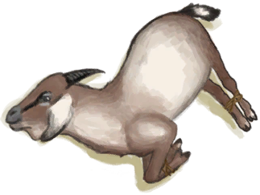

# 山羊种群数量  
#### ** 基础值: ** 15000   
#### ** 变化范围: ** 0 ~ 15000  
#### ** 基础变化率: ** 无   
## 阶段  
<table class="table table-bordered"><thead><tr ><th  style="text-align:left;vertical-align:top;" >范围</th><th  style="text-align:left;vertical-align:top;" >名称</th><th  style="text-align:left;vertical-align:top;" >描述</th><th  style="text-align:left;vertical-align:top;" >影响状态</th><th  style="text-align:left;vertical-align:top;" >影响动作</th></tr></thead><tr ><td  style="text-align:left;vertical-align:top;" >2000 ～ 3000</td><td  style="text-align:left;vertical-align:top;" >低密度</td><td  style="text-align:left;vertical-align:top;" ></td><td  style="text-align:left;vertical-align:top;" >[山羊种群数量](Pop_Goat.md)加成+0.5</td><td  style="text-align:left;vertical-align:top;" ></td></tr><tr ><td  style="text-align:left;vertical-align:top;" >3001 ～ 6000</td><td  style="text-align:left;vertical-align:top;" >中等密度</td><td  style="text-align:left;vertical-align:top;" ></td><td  style="text-align:left;vertical-align:top;" >[山羊种群数量](Pop_Goat.md)加成+1</td><td  style="text-align:left;vertical-align:top;" ></td></tr><tr ><td  style="text-align:left;vertical-align:top;" >6001 ～ 9000</td><td  style="text-align:left;vertical-align:top;" >高密度</td><td  style="text-align:left;vertical-align:top;" ></td><td  style="text-align:left;vertical-align:top;" >[山羊种群数量](Pop_Goat.md)加成+1.5</td><td  style="text-align:left;vertical-align:top;" ></td></tr><tr ><td  style="text-align:left;vertical-align:top;" >10001 ～ 15000</td><td  style="text-align:left;vertical-align:top;" >超高密度</td><td  style="text-align:left;vertical-align:top;" ></td><td  style="text-align:left;vertical-align:top;" >[山羊种群数量](Pop_Goat.md)加成+2</td><td  style="text-align:left;vertical-align:top;" ></td></tr></tbody></table>  
  
## 可被以下操作改变  
<table class="table table-bordered"><thead><tr ><th  style="text-align:left;vertical-align:top;" >来源</th><th  style="text-align:left;vertical-align:top;" >操作</th><th  style="text-align:left;vertical-align:top;" >值</th></tr></thead><tr ><td  style="text-align:left;vertical-align:top;" >[

[母山羊](GoatEnclosureFemale.md)](GoatEnclosureFemale.md)</td><td  style="text-align:left;vertical-align:top;" >放生</td><td  style="text-align:left;vertical-align:top;" >1000</td></tr><tr ><td  style="text-align:left;vertical-align:top;" >[

[小羊](GoatEnclosureKid.md)](GoatEnclosureKid.md)</td><td  style="text-align:left;vertical-align:top;" >放生</td><td  style="text-align:left;vertical-align:top;" >1000</td></tr><tr ><td  style="text-align:left;vertical-align:top;" >[

[哺乳期山羊](GoatEnclosureLactating.md)](GoatEnclosureLactating.md)</td><td  style="text-align:left;vertical-align:top;" >放生</td><td  style="text-align:left;vertical-align:top;" >1000</td></tr><tr ><td  style="text-align:left;vertical-align:top;" >[

[公山羊](GoatEnclosureMale.md)](GoatEnclosureMale.md)</td><td  style="text-align:left;vertical-align:top;" >放生</td><td  style="text-align:left;vertical-align:top;" >1000</td></tr><tr ><td  style="text-align:left;vertical-align:top;" >[

[母山羊](GoatTiedFemale.md)](GoatTiedFemale.md)</td><td  style="text-align:left;vertical-align:top;" >放生</td><td  style="text-align:left;vertical-align:top;" >1000</td></tr><tr ><td  style="text-align:left;vertical-align:top;" >[

[哺乳期山羊](GoatTiedFemaleLactating.md)](GoatTiedFemaleLactating.md)</td><td  style="text-align:left;vertical-align:top;" >放生</td><td  style="text-align:left;vertical-align:top;" >1000</td></tr><tr ><td  style="text-align:left;vertical-align:top;" >[

[小羊](GoatTiedKid.md)](GoatTiedKid.md)</td><td  style="text-align:left;vertical-align:top;" >放生</td><td  style="text-align:left;vertical-align:top;" >1000</td></tr><tr ><td  style="text-align:left;vertical-align:top;" >[

[公山羊](GoatTiedMale.md)](GoatTiedMale.md)</td><td  style="text-align:left;vertical-align:top;" >放生</td><td  style="text-align:left;vertical-align:top;" >1000</td></tr><tr ><td  style="text-align:left;vertical-align:top;" >[

[原木陷阱](LogTrap.md)](LogTrap.md)</td><td  style="text-align:left;vertical-align:top;" >捕捉猎物</td><td  style="text-align:left;vertical-align:top;" >-1000</td></tr><tr ><td  style="text-align:left;vertical-align:top;" >[

[陷坑](TrappingPit.md)](TrappingPit.md)</td><td  style="text-align:left;vertical-align:top;" >捕捉猎物</td><td  style="text-align:left;vertical-align:top;" >-1000</td></tr><tr ><td  style="text-align:left;vertical-align:top;" >[

[拿下了！(事件)](Event_GoatFightSuccess.md)](Event_GoatFightSuccess.md)</td><td  style="text-align:left;vertical-align:top;" >继续</td><td  style="text-align:left;vertical-align:top;" >-1000</td></tr></tbody></table>  
  
## 被以下操作需求  
<table class="table table-bordered"><thead><tr ><th  style="text-align:left;vertical-align:top;" >来源</th><th  style="text-align:left;vertical-align:top;" >操作</th><th  style="text-align:left;vertical-align:top;" >值</th></tr></thead><tr ><td  style="text-align:left;vertical-align:top;" >[原木陷阱](LogTrap.md)</td><td  style="text-align:left;vertical-align:top;" >转化需要</td><td  style="text-align:left;vertical-align:top;" >1000 ~ 15000</td></tr><tr ><td  style="text-align:left;vertical-align:top;" >[陷坑](TrappingPit.md)</td><td  style="text-align:left;vertical-align:top;" >转化需要</td><td  style="text-align:left;vertical-align:top;" >1000 ~ 15000</td></tr><tr ><td  style="text-align:left;vertical-align:top;" >[东部草原](GrasslandsE.md)</td><td  style="text-align:left;vertical-align:top;" >影响</td><td  style="text-align:left;vertical-align:top;" >1000 ~ 15000</td></tr><tr ><td  style="text-align:left;vertical-align:top;" >[西部草原](GrasslandsW.md)</td><td  style="text-align:left;vertical-align:top;" >影响</td><td  style="text-align:left;vertical-align:top;" >1000 ~ 15000</td></tr><tr ><td  style="text-align:left;vertical-align:top;" >[东部高地](HighlandsEastern.md)</td><td  style="text-align:left;vertical-align:top;" >影响</td><td  style="text-align:left;vertical-align:top;" >1000 ~ 15000</td></tr><tr ><td  style="text-align:left;vertical-align:top;" >[西部高地](HighlandsWestern.md)</td><td  style="text-align:left;vertical-align:top;" >影响</td><td  style="text-align:left;vertical-align:top;" >1000 ~ 15000</td></tr></tbody></table>  
  

