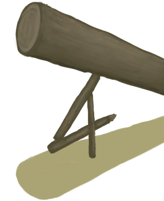

# 猕猴种群数量  
#### ** 基础值: ** 25000   
#### ** 变化范围: ** 0 ~ 25000  
#### ** 基础变化率: ** 无   
## 阶段  
<table class="table table-bordered" data-toggle="table" ><thead><tr ><th  style="text-align:left;vertical-align:top;"  >范围</th><th  style="text-align:left;vertical-align:top;"  >名称</th><th  style="text-align:left;vertical-align:top;"  data-sortable="true"  >描述</th><th  style="text-align:left;vertical-align:top;"  >影响状态</th><th  style="text-align:left;vertical-align:top;"  data-sortable="true"  >影响动作</th></tr></thead><tr ><td  style="text-align:left;vertical-align:top;"  >2000 ～ 7500</td><td  style="text-align:left;vertical-align:top;"  >低密度</td><td  style="text-align:left;vertical-align:top;"  ></td><td  style="text-align:left;vertical-align:top;"  >[猕猴种群数量](Pop_Macaque.md)加成+0.5</td><td  style="text-align:left;vertical-align:top;"  ></td></tr><tr ><td  style="text-align:left;vertical-align:top;"  >7501 ～ 15000</td><td  style="text-align:left;vertical-align:top;"  >中等密度</td><td  style="text-align:left;vertical-align:top;"  ></td><td  style="text-align:left;vertical-align:top;"  >[猕猴种群数量](Pop_Macaque.md)加成+1</td><td  style="text-align:left;vertical-align:top;"  ></td></tr><tr ><td  style="text-align:left;vertical-align:top;"  >15001 ～ 20000</td><td  style="text-align:left;vertical-align:top;"  >高密度</td><td  style="text-align:left;vertical-align:top;"  ></td><td  style="text-align:left;vertical-align:top;"  >[猕猴种群数量](Pop_Macaque.md)加成+1.5</td><td  style="text-align:left;vertical-align:top;"  ></td></tr><tr ><td  style="text-align:left;vertical-align:top;"  >20001 ～ 25000</td><td  style="text-align:left;vertical-align:top;"  >超高密度</td><td  style="text-align:left;vertical-align:top;"  ></td><td  style="text-align:left;vertical-align:top;"  >[猕猴种群数量](Pop_Macaque.md)加成+2</td><td  style="text-align:left;vertical-align:top;"  ></td></tr></tbody></table>  
  
## 可被以下操作改变  
<table class="table table-bordered" data-toggle="table" ><thead><tr ><th  style="text-align:left;vertical-align:top;"  >来源</th><th  style="text-align:left;vertical-align:top;"  >操作</th><th  style="text-align:left;vertical-align:top;"  data-sortable="true"  >值</th></tr></thead><tr ><td  style="text-align:left;vertical-align:top;"  >[

[中陷阱的猕猴](CageTrapMacaque.md)](CageTrapMacaque.md)</td><td  style="text-align:left;vertical-align:top;"  >放生</td><td  style="text-align:left;vertical-align:top;"  >1000</td></tr><tr ><td  style="text-align:left;vertical-align:top;"  >[

[猕猴(事件)](Event_MacaqueRaidRummaging.md)](Event_MacaqueRaidRummaging.md)</td><td  style="text-align:left;vertical-align:top;"  >无能为力地看着……</td><td  style="text-align:left;vertical-align:top;"  >250</td></tr><tr ><td  style="text-align:left;vertical-align:top;"  >[

[诱捕笼](CageTrapPlaced.md)](CageTrapPlaced.md)</td><td  style="text-align:left;vertical-align:top;"  >陷阱触发了！</td><td  style="text-align:left;vertical-align:top;"  >-1000</td></tr><tr ><td  style="text-align:left;vertical-align:top;"  >[

[原木陷阱](LogTrap.md)](LogTrap.md)</td><td  style="text-align:left;vertical-align:top;"  >捕捉猎物</td><td  style="text-align:left;vertical-align:top;"  >-1000</td></tr><tr ><td  style="text-align:left;vertical-align:top;"  >[

[我成功了，但我受伤了。(事件)](Event_MacaqueDenFightMixedSuccess.md)](Event_MacaqueDenFightMixedSuccess.md)</td><td  style="text-align:left;vertical-align:top;"  >继续</td><td  style="text-align:left;vertical-align:top;"  >-1000</td></tr><tr ><td  style="text-align:left;vertical-align:top;"  >[

[我做到啦！(事件)](Event_MacaqueDenFightSuccess.md)](Event_MacaqueDenFightSuccess.md)</td><td  style="text-align:left;vertical-align:top;"  >继续</td><td  style="text-align:left;vertical-align:top;"  >-1000</td></tr><tr ><td  style="text-align:left;vertical-align:top;"  >[

[我拿下它了，但我受伤了。(事件)](Event_MacaqueFightMixedSuccess.md)](Event_MacaqueFightMixedSuccess.md)</td><td  style="text-align:left;vertical-align:top;"  >继续</td><td  style="text-align:left;vertical-align:top;"  >-1000</td></tr><tr ><td  style="text-align:left;vertical-align:top;"  >[

[那只猕猴倒下了！(事件)](Event_MacaqueFightSuccess.md)](Event_MacaqueFightSuccess.md)</td><td  style="text-align:left;vertical-align:top;"  >继续</td><td  style="text-align:left;vertical-align:top;"  >-1000</td></tr><tr ><td  style="text-align:left;vertical-align:top;"  >[

[那只猕猴倒下了！(事件)](Event_MacaqueUndeadFightSuccess.md)](Event_MacaqueUndeadFightSuccess.md)</td><td  style="text-align:left;vertical-align:top;"  >继续</td><td  style="text-align:left;vertical-align:top;"  >-1000</td></tr><tr ><td  style="text-align:left;vertical-align:top;"  >[

[中陷阱的猕猴](CageTrapMacaque.md)](CageTrapMacaque.md)</td><td  style="text-align:left;vertical-align:top;"  >转化</td><td  style="text-align:left;vertical-align:top;"  >-1000</td></tr><tr ><td  style="text-align:left;vertical-align:top;"  >[

[中陷阱的猕猴](CageTrapMacaque.md)](CageTrapMacaque.md)</td><td  style="text-align:left;vertical-align:top;"  >渴死了</td><td  style="text-align:left;vertical-align:top;"  >-1000</td></tr><tr ><td  style="text-align:left;vertical-align:top;"  >[

[受伤的猕猴](MacaqueWounded.md)](MacaqueWounded.md)</td><td  style="text-align:left;vertical-align:top;"  >转化</td><td  style="text-align:left;vertical-align:top;"  >-1000</td></tr><tr ><td  style="text-align:left;vertical-align:top;"  >[

[受伤的猕猴](MacaqueWounded.md)](MacaqueWounded.md)</td><td  style="text-align:left;vertical-align:top;"  >渴死了</td><td  style="text-align:left;vertical-align:top;"  >-1000</td></tr><tr ><td  style="text-align:left;vertical-align:top;"  >[

[猕猴窝(丛林高地)](MacaqueDenEntrance.md)](MacaqueDenEntrance.md)</td><td  style="text-align:left;vertical-align:top;"  >我TM来啦！ ** 拖入：**[炸药(开)](DynamiteOn.md)</td><td  style="text-align:left;vertical-align:top;"  >-20000</td></tr></tbody></table>  
  
## 被以下操作需求  
<table class="table table-bordered" data-toggle="table" ><thead><tr ><th  style="text-align:left;vertical-align:top;"  >来源</th><th  style="text-align:left;vertical-align:top;"  >操作</th><th  style="text-align:left;vertical-align:top;"  >值</th></tr></thead><tr ><td  style="text-align:left;vertical-align:top;"  >[诱捕笼](CageTrapPlaced.md)</td><td  style="text-align:left;vertical-align:top;"  >转化需要</td><td  style="text-align:left;vertical-align:top;"  >1000 ~ 25000</td></tr><tr ><td  style="text-align:left;vertical-align:top;"  >[原木陷阱](LogTrap.md)</td><td  style="text-align:left;vertical-align:top;"  >转化需要</td><td  style="text-align:left;vertical-align:top;"  >1000 ~ 25000</td></tr><tr ><td  style="text-align:left;vertical-align:top;"  >[丛林深处](DeepJungle.md)</td><td  style="text-align:left;vertical-align:top;"  >影响</td><td  style="text-align:left;vertical-align:top;"  >1000 ~ 25000</td></tr><tr ><td  style="text-align:left;vertical-align:top;"  >[丛林](Jungle.md)</td><td  style="text-align:left;vertical-align:top;"  >影响</td><td  style="text-align:left;vertical-align:top;"  >1000 ~ 25000</td></tr><tr ><td  style="text-align:left;vertical-align:top;"  >[丛林高地](JungleHighlands.md)</td><td  style="text-align:left;vertical-align:top;"  >影响</td><td  style="text-align:left;vertical-align:top;"  >1000 ~ 25000</td></tr><tr ><td  style="text-align:left;vertical-align:top;"  >[湿地丛林(湿地)](Wetlands.md)</td><td  style="text-align:left;vertical-align:top;"  >影响</td><td  style="text-align:left;vertical-align:top;"  >1000 ~ 25000</td></tr><tr ><td  style="text-align:left;vertical-align:top;"  >[猕猴窝(丛林高地)](MacaqueDenEntrance.md)</td><td  style="text-align:left;vertical-align:top;"  >猕猴灭绝</td><td  style="text-align:left;vertical-align:top;"  >0 ~ 1999</td></tr></tbody></table>  
  

