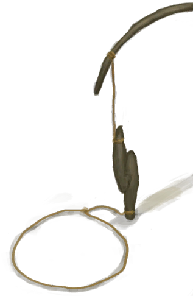

# 老鼠种群数量  
#### ** 基础值: ** 50000   
#### ** 变化范围: ** 0 ~ 100000  
#### ** 基础变化率: ** 无   
## 阶段  
<table class="table table-bordered"><thead><tr ><th  style="text-align:left;vertical-align:top;" >范围</th><th  style="text-align:left;vertical-align:top;" >名称</th><th  style="text-align:left;vertical-align:top;" >描述</th><th  style="text-align:left;vertical-align:top;" >影响状态</th><th  style="text-align:left;vertical-align:top;" >影响动作</th></tr></thead><tr ><td  style="text-align:left;vertical-align:top;" >2000 ～ 25000</td><td  style="text-align:left;vertical-align:top;" >低密度</td><td  style="text-align:left;vertical-align:top;" ></td><td  style="text-align:left;vertical-align:top;" >[老鼠种群数量](Pop_Mouse.md)加成+3</td><td  style="text-align:left;vertical-align:top;" ></td></tr><tr ><td  style="text-align:left;vertical-align:top;" >25001 ～ 50000</td><td  style="text-align:left;vertical-align:top;" >中等密度</td><td  style="text-align:left;vertical-align:top;" ></td><td  style="text-align:left;vertical-align:top;" >[老鼠种群数量](Pop_Mouse.md)加成+4</td><td  style="text-align:left;vertical-align:top;" ></td></tr><tr ><td  style="text-align:left;vertical-align:top;" >50001 ～ 75000</td><td  style="text-align:left;vertical-align:top;" >高密度</td><td  style="text-align:left;vertical-align:top;" ></td><td  style="text-align:left;vertical-align:top;" >[老鼠种群数量](Pop_Mouse.md)加成+5</td><td  style="text-align:left;vertical-align:top;" ></td></tr><tr ><td  style="text-align:left;vertical-align:top;" >75001 ～ 100000</td><td  style="text-align:left;vertical-align:top;" >超高密度</td><td  style="text-align:left;vertical-align:top;" ></td><td  style="text-align:left;vertical-align:top;" >[老鼠种群数量](Pop_Mouse.md)加成+6</td><td  style="text-align:left;vertical-align:top;" ></td></tr></tbody></table>  
  
## 相关卡牌  
[巨蜥种群数量](Pop_Monitor.md)  
## 可被以下操作改变  
<table class="table table-bordered"><thead><tr ><th  style="text-align:left;vertical-align:top;" >来源</th><th  style="text-align:left;vertical-align:top;" >操作</th><th  style="text-align:left;vertical-align:top;" >值</th></tr></thead><tr ><td  style="text-align:left;vertical-align:top;" >[

[鼠害(事件)](Event_MouseDamage.md)](Event_MouseDamage.md)</td><td  style="text-align:left;vertical-align:top;" >评估损失</td><td  style="text-align:left;vertical-align:top;" >250</td></tr><tr ><td  style="text-align:left;vertical-align:top;" >[

[落石陷阱](DeadfallTrap.md)](DeadfallTrap.md)</td><td  style="text-align:left;vertical-align:top;" >捕捉猎物</td><td  style="text-align:left;vertical-align:top;" >-1000</td></tr><tr ><td  style="text-align:left;vertical-align:top;" >[

[套索陷阱](SnareTrap.md)](SnareTrap.md)</td><td  style="text-align:left;vertical-align:top;" >捕捉猎物</td><td  style="text-align:left;vertical-align:top;" >-1000</td></tr><tr ><td  style="text-align:left;vertical-align:top;" >[

[礼物！(事件)](Event_DogFriendGift.md)](Event_DogFriendGift.md)</td><td  style="text-align:left;vertical-align:top;" >看看礼物</td><td  style="text-align:left;vertical-align:top;" >-1000</td></tr><tr ><td  style="text-align:left;vertical-align:top;" >[

[鼠害(事件)](Event_MouseDamage.md)](Event_MouseDamage.md)</td><td  style="text-align:left;vertical-align:top;" >评估损失</td><td  style="text-align:left;vertical-align:top;" >-1000</td></tr><tr ><td  style="text-align:left;vertical-align:top;" >[

[鼠害(事件)](Event_MouseDamage.md)](Event_MouseDamage.md)</td><td  style="text-align:left;vertical-align:top;" >评估损失</td><td  style="text-align:left;vertical-align:top;" >-2500</td></tr></tbody></table>  
  
## 被以下操作需求  
<table class="table table-bordered"><thead><tr ><th  style="text-align:left;vertical-align:top;" >来源</th><th  style="text-align:left;vertical-align:top;" >操作</th><th  style="text-align:left;vertical-align:top;" >值</th></tr></thead><tr ><td  style="text-align:left;vertical-align:top;" >[落石陷阱](DeadfallTrap.md)</td><td  style="text-align:left;vertical-align:top;" >转化需要</td><td  style="text-align:left;vertical-align:top;" >1000 ~ 100000</td></tr><tr ><td  style="text-align:left;vertical-align:top;" >[套索陷阱](SnareTrap.md)</td><td  style="text-align:left;vertical-align:top;" >转化需要</td><td  style="text-align:left;vertical-align:top;" >1000 ~ 100000</td></tr><tr ><td  style="text-align:left;vertical-align:top;" >[鼠害(事件)](Event_MouseDamage.md)</td><td  style="text-align:left;vertical-align:top;" >影响</td><td  style="text-align:left;vertical-align:top;" >1000 ~ 100000</td></tr></tbody></table>  
  

