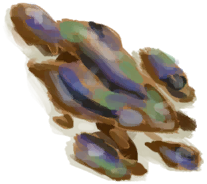

# 虾  
> 可以吃，也可以用作诱饵。  
  
<table class="table table-bordered" data-toggle="table"  data-show-header="false"><thead style="display:none"><tr ><th  style="width:50%;text-align:left;vertical-align:top;"  >title</th><th  style="width:50%;text-align:left;vertical-align:top;"  ></th></tr></thead><tr ><td  style="width:50%;text-align:left;vertical-align:top;"  >**重量：**10  **标签：**	[“饲料”](tag_Feed.md), [“弱效食料”](tag_FeedWeak.md), [“诱饵”](tag_Bait.md), [“可烹饪的”](tag_Cookable.md), [“肉”](tag_Meat.md)</td><td  style="width:50%;text-align:left;vertical-align:top;"  >

<a href="Prawns.md" style="color:black">虾</a>

这些小甲壳类生物在靠近大海的<b>岩石区和潮汐池</b>中大量繁殖，是一种不错的食物来源。  它们可以<b>做成美食</b>，但如果你能忍住不吃它们，它们也可以成为<b>陷阱和钓鱼的良好诱饵</b>。</td></tr></tbody></table>  
  
## 获取来源  

捕捉猎物

[捕鱼陷阱](FishTrapDeployed.md)

拾海

[潮汐池(岩滩)](TidePool.md)

探索

[覆溺洞穴](FloodedChamber.md)

  
  
## 动作  

<table><tr><td rowspan="2" style="width:200px;text-align:center;font-size:1.3em;font-weight:bold">

食用

</td><td>[“食用海鲜动作(组)”](ShellfishAction.md), [“食用肉类动作(组)”](CarnivorousAction.md), [“进食动作(组)”](EatingAction.md)</td></tr><tr><td><b>自身：</b>→消失</td></tr><tr><td colspan="2"><b>状态变化：</b>[

[饱食](Satiation.md)](Satiation.md)<b>+5</b>, [

[胃](Stomach.md)](Stomach.md)<b>+2</b>, [

[水分](Hydration.md)](Hydration.md)<b>+0.25</b>, [

[污垢](Filth.md)](Filth.md)<b>+2</b>, [

[情绪](Morale.md)](Morale.md), [

[细菌性发烧](BacteriaFever.md)](BacteriaFever.md)<b>+15</b>, [

[寄生虫](Parasites.md)](Parasites.md)<b>+0～+50</b>, [

[甲壳类<nobr>厌倦度</nobr>](SaturationCrustaceans.md)](SaturationCrustaceans.md)<b>+10</b></td></tr></table>
  
  
  
## 可拖至  

[猪食槽](BoarFeeder.md)

[猪食槽(空)](BoarFeederEmpty.md)

[堆肥箱](CompostBin.md)

[灰山鹑喂食器](PartridgeFeeder.md)

[灰山鹑喂食器(空)](PartridgeFeederEmpty.md)

[中陷阱的猕猴](CageTrapMacaque.md)

[母猪](BoarEnclosureFemale.md)

[公猪](BoarEnclosureMale.md)

[小猪](BoarEnclosurePiglet.md)

[母猪](BoarTiedFemale.md)

[公猪](BoarTiedMale.md)

[小猪](BoarTiedPiglet.md)

[忠犬朋友](DogFriend.md)

[猕猴朋友](MacaqueFriend.md)

[受伤的猕猴](MacaqueWounded.md)

[小灰山鹑](PartridgeChick.md)

[雌灰山鹑](PartridgeFemaleEnclosure.md)

[雌灰山鹑](PartridgeFemaleLive.md)

[雄灰山鹑](PartridgeMaleEnclosure.md)

[雄灰山鹑](PartridgeMaleLive.md)

[钓鱼线](FishingLine.md)

[钓鱼线](FishingLineRustic.md)

[钓鱼竿](FishingRod.md)

  
  
## 可用于蓝图  

<a href="Bp_FeedBird.md" style="color:black">鸟食</a>

  
  
  
## 可用于转化  
<table class="table table-bordered" data-toggle="table"  ><thead style=""><tr ><th  style="text-align:left;vertical-align:top;"  >转化为</th><th  style="text-align:left;vertical-align:top;"  >容器</th></tr></thead><tr ><td  style="text-align:left;vertical-align:top;"  >[

[烤虾](PrawnsCooked.md)](PrawnsCooked.md)</td><td  style="text-align:left;vertical-align:top;"  >[

[营火](Campfire.md)](Campfire.md)</td></tr><tr ><td  style="text-align:left;vertical-align:top;"  >[

[烤虾](PrawnsCooked.md)](PrawnsCooked.md)</td><td  style="text-align:left;vertical-align:top;"  >[

[粘土火盆](ClayFirePit.md)](ClayFirePit.md)</td></tr><tr ><td  style="text-align:left;vertical-align:top;"  >[

[烤虾](PrawnsCooked.md)](PrawnsCooked.md)</td><td  style="text-align:left;vertical-align:top;"  >[

[火堆](Fire.md)](Fire.md)</td></tr><tr ><td  style="text-align:left;vertical-align:top;"  >[

[烤虾](PrawnsCooked.md)](PrawnsCooked.md)</td><td  style="text-align:left;vertical-align:top;"  >[

[瓦斯炉(开)](GasCookerOn.md)](GasCookerOn.md)</td></tr><tr ><td  style="text-align:left;vertical-align:top;"  >[

[烤虾](PrawnsCooked.md)](PrawnsCooked.md)</td><td  style="text-align:left;vertical-align:top;"  >[

[火炉](Stove.md)](Stove.md)</td></tr></tbody></table>  
  
## 属性   

<table style="margin-bottom:0px;"><tr><td style="width:30%;text-align:left; background-color:#FEFEFE;font-size:1.3em;font-weight:bold;">耐久</td><td style="font-size:1em;background-color:#FEFEFE">初始：278 每15分钟-1 , 最多需要：2天21小时30分</td></tr><tr style="background-color:#FFFFFF"><td colspan=2>** 到达0时： ** 自身: → [

[腐烂物](RottenRemains.md)](RottenRemains.md)</td></tr></table>
  

