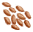

# 蛋白棒  
> 营养丰富！  
  
<table class="table table-bordered" data-toggle="table"  data-show-header="false"><thead style="display:none"><tr ><th  style="width:50%;text-align:left;vertical-align:top;"  >title</th><th  style="width:50%;text-align:left;vertical-align:top;"  ></th></tr></thead><tr ><td  style="width:50%;text-align:left;vertical-align:top;"  >**重量：**25  **标签：**	[“可烹饪的”](tag_Cookable.md), [“饲料”](tag_Feed.md), [“人类食物”](tag_HumanFood.md)</td><td  style="width:50%;text-align:left;vertical-align:top;"  >

<a href="ProteinBar.md" style="color:black">蛋白棒</a>

</td></tr></tbody></table>  
  
## 获取来源  

取出

[烹饪好的蛋白棒](ProteinBarsCooked.md)

  
  
## 动作  

<table><tr><td rowspan="2" style="width:200px;text-align:center;font-size:1.3em;font-weight:bold">

食用

</td><td>[“进食动作(组)”](EatingAction.md)</td></tr><tr><td><b>自身：</b>→消失</td></tr><tr><td colspan="2"><b>状态变化：</b>[

[饱食](Satiation.md)](Satiation.md)+30, [

[胃](Stomach.md)](Stomach.md)+50, [

[水分](Hydration.md)](Hydration.md)+7, [

[椰子<nobr>厌倦度</nobr>](SaturationCoconuts.md)](SaturationCoconuts.md)+25, [

[坚果<nobr>厌倦度</nobr>](SaturationNuts.md)](SaturationNuts.md)+25, [

[肉类<nobr>厌倦度</nobr>](SaturationMeat.md)](SaturationMeat.md)+15, [

[腹泻](Diarrhoea.md)](Diarrhoea.md)+6, [

[污垢](Filth.md)](Filth.md)+5, [

[情绪](Morale.md)](Morale.md)+5, [

[世界观](Structure.md)](Structure.md)+5</td></tr></table>
  
  
  
## 可拖至  

[猪食槽](BoarFeeder.md)

[猪食槽(空)](BoarFeederEmpty.md)

[堆肥箱](CompostBin.md)

[灰山鹑喂食器](PartridgeFeeder.md)

[灰山鹑喂食器(空)](PartridgeFeederEmpty.md)

[中陷阱的猕猴](CageTrapMacaque.md)

[母猪](BoarEnclosureFemale.md)

[公猪](BoarEnclosureMale.md)

[小猪](BoarEnclosurePiglet.md)

[母猪](BoarTiedFemale.md)

[公猪](BoarTiedMale.md)

[小猪](BoarTiedPiglet.md)

[祖父](Grandfather.md)

[祖父(健康)](GrandfatherHealthy.md)

[猕猴朋友](MacaqueFriend.md)

[受伤的猕猴](MacaqueWounded.md)

[小灰山鹑](PartridgeChick.md)

[雌灰山鹑](PartridgeFemaleEnclosure.md)

[雌灰山鹑](PartridgeFemaleLive.md)

[雄灰山鹑](PartridgeMaleEnclosure.md)

[雄灰山鹑](PartridgeMaleLive.md)

  
  
## 属性   

<table style="margin-bottom:0px;"><tr><td style="width:30%;text-align:left; background-color:#FEFEFE;font-size:1.3em;font-weight:bold;">耐久</td><td style="font-size:1em;background-color:#FEFEFE">初始：672 每15分钟-1 , 最多需要：7天</td></tr><tr style="background-color:#FFFFFF"><td colspan=2>** 到达0时： ** 自身: → [

[腐烂物](RottenRemains.md)](RottenRemains.md)</td></tr></table>
  

