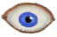

# 蛇床子素  
> 使你的精神状态失常，提高你的情绪。  
  

<b>基础值: </b> 0 
  

<b>变化范围: </b> 0 ~ 16 
  

<b>基础变化率: </b> 无 
  
## 阶段  

<table><tr style="height:2em;"><td style="background-color:#F0F0F0;text-align:center;width:180px;font-size:1.4em;font-weight:bold;vertical-align:middle;">
1 ～ 8

6% ～ 50%
</td><td colspan=2 style="font-size:1.1em;vertical-align:middle;background-color:#F9F9F9;">
<b>

低剂量</b>

</td></tr><tr><td colspan=2><b>影响：</b>[

[疼痛](Pain.md)](Pain.md)<b>-25</b>, [

[恶心](Nausea.md)](Nausea.md)加成<b>+0.5</b>, [

[精神失常](MindState.md)](MindState.md)加成<b>+20</b>, [

[情绪](Morale.md)](Morale.md)加成<b>+2</b>, [

[蛇床子素](Psylocibin.md)](Psylocibin.md)加成<b>-1</b></td></tr><tr><td colspan=2></td></tr><tr style="height:2em;"><td style="background-color:#F0F0F0;text-align:center;width:180px;font-size:1.4em;font-weight:bold;vertical-align:middle;">
9 ～ 16

56% ～ 100%
</td><td colspan=2 style="font-size:1.1em;vertical-align:middle;background-color:#F9F9F9;">
<b>

高剂量</b>

</td></tr><tr><td colspan=2><b>影响：</b>[

[疼痛](Pain.md)](Pain.md)<b>-100</b>, [

[恶心](Nausea.md)](Nausea.md)加成<b>+0.5</b>, [

[精神失常](MindState.md)](MindState.md)加成<b>+50</b>, [

[情绪](Morale.md)](Morale.md)加成<b>+4</b>, [

[蛇床子素](Psylocibin.md)](Psylocibin.md)加成<b>-2</b></td></tr><tr><td colspan=2></td></tr></table>
  
## 可被以下操作改变  
<table class="table table-bordered table7597" data-toggle="table"  ><thead style=""><tr ><th  style=""  >来源</th><th  style=""  >操作</th><th  style=""  data-sortable="true"  >值</th></tr></thead><tr ><td  style=""  >[

[迷幻菇](MagicMushrooms.md)](MagicMushrooms.md)</td><td  style=""  >食用</td><td  style=""  >4</td></tr></tbody></table>  
  

