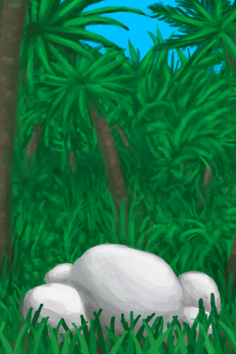

# 马勃菌  
> 一种可食用的蘑菇。  
  
  属性  |   图片   
 ----  |  ----:   
   |     
  
## 获取来源  
来源  |  操作  
----  |  ----  
[丛林深处](DeepJungle.md)  |  探索  
[丛林](Jungle.md)  |  探索  
## 动作  
动作  |  时间  |  条件  |  变化  |  状态  
----  |  ----  |  ----  |  ----  |  ----  
采集   |  15分  |    |  → [柠檬草](LemongrassStalks.md)  [马勃菌](Puffballs.md)(+1～+2)   |  [药草学(技能)](Skill_Herbology.md)+0.5  
