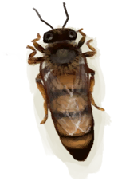

# 蜂后  
> 它可以繁殖出一个新的蜂群！  
   
> 蜂巢可以在岛上的<b>丛林深处</b>找到。巢脾里可以提取蜂蜜和蜡，蜜蜂可以捕来建造你自己的人工蜂箱。  在与蜂巢交互之前，请确保先用火把或熏蜂器熏倒蜜蜂，否则它们会攻击你。  
  
  蜂后  |   图片   
 ----  |  ----:   
 **重量：**10  |     
  
## 获取来源  
来源  |  操作  
----  |  ----  
[繁殖中的蜂群](BeeSkepSwarming.md) , [布袋](Sack.md)  |  捕捉蜜蜂  
[繁殖中的蜂群](BeeSkepSwarming.md) , [布袋](Sack.md)  |  捕捉蜜蜂  
[蜂巢](Beehive.md)  |  采集  
## 可用于蓝图  
- [蜂箱(蓝图)](Bp_BeeSkep.md)  
  
  
## 属性   
属性  |  值  |  耗时  |  变化  
----  |  ----  |  ----  |  ----  
耐久  |  初始：278  |  每15分钟-1 最多需要：2天21小时30分  |  ** 到达0时： ** → [腐烂物](RottenRemains.md)  
