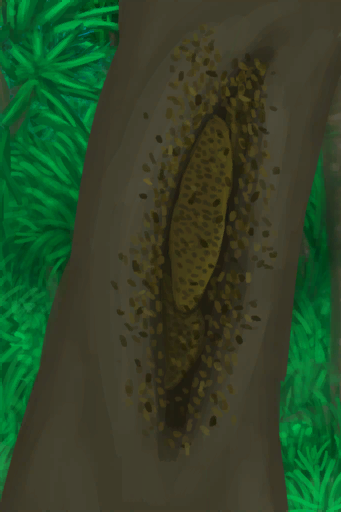

# 蜂后  
> 它可以繁殖出一个新的蜂群！  
  
<table class="table table-bordered" data-toggle="table"  data-show-header="false"><thead style="display:none"><tr ><th  style="width:50%;text-align:left;vertical-align:top;"  >title</th><th  style="width:50%;text-align:left;vertical-align:top;"  ></th></tr></thead><tr ><td  style="width:50%;text-align:left;vertical-align:top;"  >**重量：**10</td><td  style="width:50%;text-align:left;vertical-align:top;"  >

<a href="QueenBee.md" style="color:black">蜂后</a>

蜂巢可以在岛上的<b>丛林深处</b>找到。巢脾里可以提取蜂蜜和蜡，蜜蜂可以捕来建造你自己的人工蜂箱。  在与蜂巢交互之前，请确保先用火把或熏蜂器熏倒蜜蜂，否则它们会攻击你。</td></tr></tbody></table>  
  
## 获取来源  
<table class="table table-bordered" data-toggle="table"  ><thead style=""><tr ><th  style="text-align:left;vertical-align:top;"  >来源</th><th  style="text-align:left;vertical-align:top;"  >操作</th></tr></thead><tr ><td  style="text-align:left;vertical-align:top;"  >[

[繁殖中的蜂群](BeeSkepSwarming.md)](BeeSkepSwarming.md)</td><td  style="text-align:left;vertical-align:top;"  >捕捉蜜蜂 ** 拖入：**[布袋](Sack.md)</td></tr><tr ><td  style="text-align:left;vertical-align:top;"  >[

[蜂巢](Beehive.md)](Beehive.md)</td><td  style="text-align:left;vertical-align:top;"  >采集</td></tr></tbody></table>  
  
## 可用于蓝图  

[

[蜂箱(蓝图)](Bp_BeeSkep.md)](Bp_BeeSkep.md)

  
  
  
## 属性   
<table class="table table-bordered" data-toggle="table"  ><thead style=""><tr ><th  style="text-align:left;vertical-align:top;"  >属性</th><th  style="text-align:left;vertical-align:top;"  >值</th><th  style="text-align:left;vertical-align:top;"  >耗时</th><th  style="text-align:left;vertical-align:top;"  >变化</th></tr></thead><tr ><td  style="text-align:left;vertical-align:top;"  >耐久</td><td  style="text-align:left;vertical-align:top;"  >初始：278</td><td  style="text-align:left;vertical-align:top;"  >每15分钟-1 最多需要：2天21小时30分</td><td  style="text-align:left;vertical-align:top;"  >** 到达0时： **  ** 自身 ** → [

[腐烂物](RottenRemains.md)](RottenRemains.md)</td></tr></tbody></table>  
  

