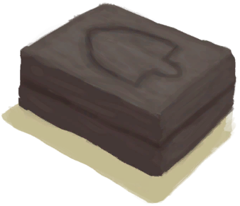

# 生石灰  
> 可以做砂浆或者其他东西。  
  
<table class="table table-bordered" data-toggle="table"  data-show-header="false"><thead style="display:none"><tr ><th  style="width:50%;text-align:left;vertical-align:top;"  >title</th><th  style="width:50%;text-align:left;vertical-align:top;"  ></th></tr></thead><tr ><td  style="width:50%;text-align:left;vertical-align:top;"  >**重量：**50  **标签：**	[“抗裂剂”](tag_Temper.md)</td><td  style="width:50%;text-align:left;vertical-align:top;"  >

<a href="Quicklime.md" style="color:black">生石灰</a>

你可以在将贝壳、石头或大石块放入窑炉中，煅烧完成后将它们磨成生石灰，一种应用性极广的物质。  生石灰可以用于制作<b>砂浆</b>，用来制作更高级的建筑物，或是制作用于农耕的<b>农薬</b>，甚至制作<b>胶水</b>和其他东西。也可以将生石灰浸泡在水中变为<b>熟石灰</b>。</td></tr></tbody></table>  
  
## 获取来源  

制作生石灰

[海螺](Conch.md)

制作生石灰

[海螺](Conch.md)

** 使用**[“锤”](tag_Hammer.md)敲碎

[煅烧后的砂浆](MortarBurnt.md)

** 使用**[“锤”](tag_Hammer.md)敲碎

[煅烧后的石头](StoneBurnt.md)

** 使用**[“锤”](tag_Hammer.md)敲碎

[煅烧后的大石块](StoneHeavyBurnt.md)

  
  
## 可拖入  

<table style="margin-bottom:0px;"><tr><td style="width:40%;text-align:left; background-color:#FEFEFE"><b>拖入：</b>[“灌溉用水”](tag_WaterFresh.md)</td><td style="width:40%;font-size:1em;font-weight:bold;background-color:#FEFEFE">浸泡  </td></tr><tr style="background-color:#FFFFFF"><td style=""><b>使用物：</b>→ [

[熟石灰](LQ_SlakedLime.md)](LQ_SlakedLime.md)</td><td style=""><b>自身：</b>→消失</td></tr></table>
  
  
## 可拖至  

[泥堆](MudPile.md)

[粘土](Clay.md)

  
  
## 可用于蓝图  

<a href="Bp_Cistern.md" style="color:black">水窖</a>

<a href="Bp_MoldAxe.md" style="color:black">斧头模具</a>

<a href="Bp_MoldKnife.md" style="color:black">刀模具</a>

<a href="Bp_MoldShovel.md" style="color:black">铲头模具</a>

<a href="Bp_MoldSpear.md" style="color:black">矛头模具</a>

<a href="Bp_Mortar.md" style="color:black">砂浆</a>

<a href="Bp_PesticideBrimstone.md" style="color:black">硫磺农薬</a>

<a href="Bp_Alembic.md" style="color:black">蒸馏器</a>

<a href="Bp_ClayBowl.md" style="color:black">陶碗</a>

<a href="Bp_ClayFirePit.md" style="color:black">粘土火盆</a>

<a href="Bp_ClayJar.md" style="color:black">小陶罐</a>

<a href="Bp_ClayPotCooler.md" style="color:black">保鲜罐</a>

<a href="Bp_ClayVase.md" style="color:black">陶罐</a>

<a href="Bp_CookingPot.md" style="color:black">烹饪锅</a>

<a href="Bp_GlazedVase.md" style="color:black">釉面陶罐</a>

  
  
  

