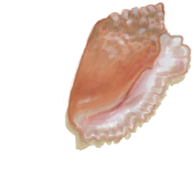
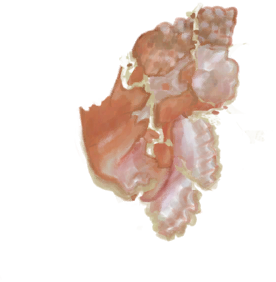

# 生石灰  
> 可以做砂浆或者其他东西。  
  
<table class="table table-bordered" data-toggle="table"  data-show-header="false"><thead style="display:none"><tr ><th  style="width:50%;text-align:left;vertical-align:top;"  >title</th><th  style="width:50%;text-align:left;vertical-align:top;"  ></th></tr></thead><tr ><td  style="width:50%;text-align:left;vertical-align:top;"  >**重量：**50  **标签：**	[“抗裂剂”](tag_Temper.md)</td><td  style="width:50%;text-align:left;vertical-align:top;"  >

<a href="Quicklime.md" style="color:black">生石灰</a>

你可以在将贝壳、石头或大石块放入窑炉中，煅烧完成后将它们磨成生石灰，一种应用性极广的物质。  生石灰可以用于制作<b>砂浆</b>，用来制作更高级的建筑物，或是制作用于农耕的<b>农药</b>，甚至制作<b>胶水</b>和其他东西。也可以将生石灰浸泡在水中变为<b>熟石灰</b>。</td></tr></tbody></table>  
  
## 获取来源  
<table class="table table-bordered" data-toggle="table"  ><thead style=""><tr ><th  style="text-align:left;vertical-align:top;"  >来源</th><th  style="text-align:left;vertical-align:top;"  >操作</th></tr></thead><tr ><td  style="text-align:left;vertical-align:top;"  >[

[海螺](Conch.md)](Conch.md) , [

[碎海螺壳](ConchBroken.md)](ConchBroken.md) , [

[漂亮贝壳](SeashellsPretty.md)](SeashellsPretty.md) , [

[窑炉](Kiln.md)](Kiln.md)</td><td  style="text-align:left;vertical-align:top;"  >制作生石灰</td></tr><tr ><td  style="text-align:left;vertical-align:top;"  >[

[海螺](Conch.md)](Conch.md) , [

[碎海螺壳](ConchBroken.md)](ConchBroken.md) , [

[漂亮贝壳](SeashellsPretty.md)](SeashellsPretty.md) , [

[高级窑炉](KilnAdvanced.md)](KilnAdvanced.md)</td><td  style="text-align:left;vertical-align:top;"  >制作生石灰</td></tr><tr ><td  style="text-align:left;vertical-align:top;"  >[

[煅烧后的砂浆](MortarBurnt.md)](MortarBurnt.md)</td><td  style="text-align:left;vertical-align:top;"  >敲碎 ** 拖入：**[“锤”](tag_Hammer.md)</td></tr><tr ><td  style="text-align:left;vertical-align:top;"  >[

[煅烧后的石头](StoneBurnt.md)](StoneBurnt.md)</td><td  style="text-align:left;vertical-align:top;"  >敲碎 ** 拖入：**[“锤”](tag_Hammer.md)</td></tr><tr ><td  style="text-align:left;vertical-align:top;"  >[

[煅烧后的大石块](StoneHeavyBurnt.md)](StoneHeavyBurnt.md)</td><td  style="text-align:left;vertical-align:top;"  >敲碎 ** 拖入：**[“锤”](tag_Hammer.md)</td></tr></tbody></table>  
  
## 可拖入  
<table class="table table-bordered" data-toggle="table"  ><thead style=""><tr ><th  style="text-align:left;vertical-align:top;"  >使用</th><th  style="text-align:left;vertical-align:top;"  >动作</th><th  style="text-align:left;vertical-align:top;"  data-sortable="true"  >耗时</th><th  style="text-align:left;vertical-align:top;"  data-sortable="true"  >条件</th><th  style="text-align:left;vertical-align:top;"  >变化</th><th  style="text-align:left;vertical-align:top;"  data-sortable="true"  >玩家状态</th></tr></thead><tr ><td  style="text-align:left;vertical-align:top;"  >[“灌溉用水”](tag_WaterFresh.md)</td><td  style="text-align:left;vertical-align:top;"  >浸泡 </td><td  style="text-align:left;vertical-align:top;"  >-</td><td  style="text-align:left;vertical-align:top;"  ></td><td  style="text-align:left;vertical-align:top;"  >** 自身: ** →消失  ** 使用物: ** → [

[熟石灰](LQ_SlakedLime.md)](LQ_SlakedLime.md)</td><td  style="text-align:left;vertical-align:top;"  ></td></tr></tbody></table>  
  
## 可拖至  

[泥堆](MudPile.md)

[粘土](Clay.md)

  
  
## 可用于蓝图  

[

[水窖(蓝图)](Bp_Cistern.md)](Bp_Cistern.md)

[

[斧头模具(蓝图)](Bp_MoldAxe.md)](Bp_MoldAxe.md)

[

[刀模具(蓝图)](Bp_MoldKnife.md)](Bp_MoldKnife.md)

[

[铲头模具(蓝图)](Bp_MoldShovel.md)](Bp_MoldShovel.md)

[

[矛头模具(蓝图)](Bp_MoldSpear.md)](Bp_MoldSpear.md)

[

[砂浆(蓝图)](Bp_Mortar.md)](Bp_Mortar.md)

[

[硫磺农药(蓝图)](Bp_PesticideBrimstone.md)](Bp_PesticideBrimstone.md)

[

[蒸馏器(蓝图)](Bp_Alembic.md)](Bp_Alembic.md)

[

[陶碗(蓝图)](Bp_ClayBowl.md)](Bp_ClayBowl.md)

[

[粘土火盆(蓝图)](Bp_ClayFirePit.md)](Bp_ClayFirePit.md)

[

[小陶罐(蓝图)](Bp_ClayJar.md)](Bp_ClayJar.md)

[

[保鲜罐(蓝图)](Bp_ClayPotCooler.md)](Bp_ClayPotCooler.md)

[

[陶罐(蓝图)](Bp_ClayVase.md)](Bp_ClayVase.md)

[

[烹饪锅(蓝图)](Bp_CookingPot.md)](Bp_CookingPot.md)

[

[釉面陶罐(蓝图)](Bp_GlazedVase.md)](Bp_GlazedVase.md)

  
  
  

