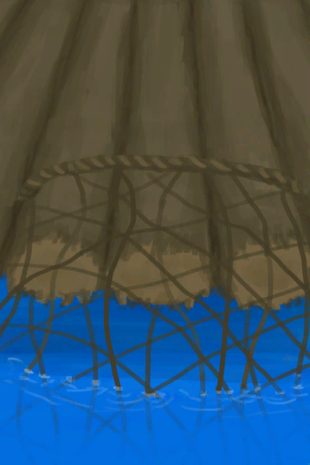
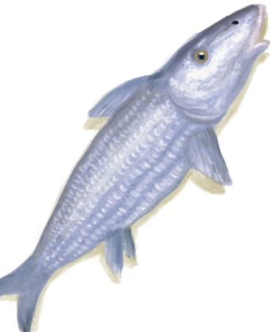
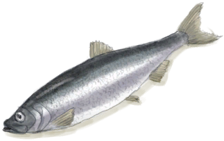

# 捕捞拖网  
> 我应该稍后再来检查是否有鱼。  
  
<table class="table table-bordered" data-toggle="table"  data-show-header="false"><thead style="display:none"><tr ><th  style="width:50%;text-align:left;vertical-align:top;"  >title</th><th  style="width:50%;text-align:left;vertical-align:top;"  ></th></tr></thead><tr ><td  style="width:50%;text-align:left;vertical-align:top;"  >** 不可删除 **  ** 不可堆叠 **  **重量：**250  **槽位：**3  **过滤器：**[“可烹饪的”](tag_Cookable.md)  **可用次数：**480</td><td  style="width:50%;text-align:left;vertical-align:top;"  >

<a href="RaftFishTrap.md" style="color:black">捕捞拖网</a>

</td></tr></tbody></table>  
  
## 获取来源  

蓝图制造

[捕捞拖网(蓝图)](Bp_RaftFishTrap.md)

  
  
## 可拖入  

<table style="margin-bottom:0px;"><tr><td style="width:40%;text-align:left; background-color:#FEFEFE"><b>拖入：</b>[

[细线](CordFiber.md)](CordFiber.md)</td><td style="width:40%;font-size:1em;font-weight:bold;background-color:#FEFEFE">修理 (30分) </td></tr><tr style="background-color:#FFFFFF"><td style=""><b>使用物：</b>→消失</td><td style=""><b>自身：</b>使用次数  +96(20%)</td></tr><tr><td colspan="2"><b>需求：</b>[

[光亮](Light.md)](Light.md): 10-100</td></tr></table>
  
  
## 转化  

<table style="margin-bottom:0px;"><tr><td  colspan=2 style="font-size:1em;font-weight:bold;background-color:#FEFEFE">捕捉猎物</td><td style="text-align:right; background-color:#FEFEFE">[

[陷阱(技能)](Skill_Trapping.md)](Skill_Trapping.md)+0.5</td></tr><tr style="background-color:#FFFFFF"><td style="width:30%;font-size:1em;text-align:right;vertical-align:middle;"></td><td style="text-align:center;width:20%;vertical-align:middle;">
1天1小时 ～ 3天3小时

捕捉猎物
</td><td style="text-align:left;vertical-align:middle;"></td></tr><tr><td colspan="3">

<table style="margin-bottom:3px;"><tr><td rowspan=2 style="text-align:center" width="80px">
基础权重

50
</td><td style="font-size:0.6em;line-height:0.6em;font-weight:bold">Fail</td></tr><tr><td></td></tr><tr><td colspan=2><li>[

[陷阱(技能)](Skill_Trapping.md)](Skill_Trapping.md)为0～150时权重+0～-20</li></td></tr></table>

<table style="margin-bottom:3px;"><tr><td rowspan=2 style="text-align:center" width="80px">
基础权重

10
</td><td style="font-size:0.6em;line-height:0.6em;font-weight:bold">Bonefish</td></tr><tr><td>[

[北梭鱼](Bonefish.md)](Bonefish.md)(+1)</td></tr></table>

<table style="margin-bottom:3px;"><tr><td rowspan=2 style="text-align:center" width="80px">
基础权重

40
</td><td style="font-size:0.6em;line-height:0.6em;font-weight:bold">Herring</td></tr><tr><td>[

[鲱鱼](Herring.md)](Herring.md)(+1)</td></tr></table>

</td></tr></table>
  
## 属性   

<table style="margin-bottom:0px;"><tr><td style="width:30%;text-align:left; background-color:#FEFEFE;font-size:1.3em;font-weight:bold;">使用次数</td><td style="font-size:1em;background-color:#FEFEFE">初始：480 , 最大：480 每15分钟-0.5 , 最多需要：10天</td></tr><tr style="background-color:#FFFFFF"><td colspan=2>** 到达0时： ** 自身: →消失</td></tr></table>
  

