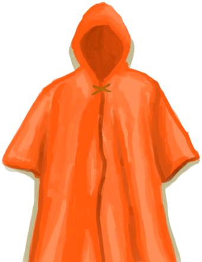

# 雨水防护  
> 了解岛上的天气对生存至关重要。 晴天有较高的<b>气温和日照强度</b>，而阴天则相反。  <b>雨水</b>是饮用水的主要来源，所以每当下雨时都应该尽可能多收集雨水。<b>椰子壳</b>和其他<b>容器</b>都应该装满至最大容量。  岛上有3种<b>季节</b>，每种持续30天左右。第一种是<b>均衡季</b>，有雨天和晴天。第二种是<b>雨季</b>，有持续的降雨和危险的<b>暴风雨</b>，可能对沿海地区造成破坏。第三个是<b>旱季</b>，温度较高且几乎没有降雨。再之后循环往复。  
  
#### ** 基础值: ** 0   
#### ** 变化范围: ** 0 ~ 5  
#### ** 基础变化率: ** 无   
## 阶段  
<table class="table table-bordered" data-toggle="table" ><thead><tr ><th  style="text-align:left;vertical-align:top;"  >范围</th><th  style="text-align:left;vertical-align:top;"  >名称</th><th  style="text-align:left;vertical-align:top;"  data-sortable="true"  >描述</th><th  style="text-align:left;vertical-align:top;"  >影响状态</th><th  style="text-align:left;vertical-align:top;"  data-sortable="true"  >影响动作</th></tr></thead><tr ><td  style="text-align:left;vertical-align:top;"  >1 ～ 1</td><td  style="text-align:left;vertical-align:top;"  >

轻微防护</td><td  style="text-align:left;vertical-align:top;"  ></td><td  style="text-align:left;vertical-align:top;"  >[

[淋雨](RainExposure.md)](RainExposure.md)-1</td><td  style="text-align:left;vertical-align:top;"  ></td></tr><tr ><td  style="text-align:left;vertical-align:top;"  >2 ～ 2</td><td  style="text-align:left;vertical-align:top;"  >

中等防护</td><td  style="text-align:left;vertical-align:top;"  ></td><td  style="text-align:left;vertical-align:top;"  >[

[淋雨](RainExposure.md)](RainExposure.md)-2</td><td  style="text-align:left;vertical-align:top;"  ></td></tr><tr ><td  style="text-align:left;vertical-align:top;"  >3 ～ 3</td><td  style="text-align:left;vertical-align:top;"  >

高级防护</td><td  style="text-align:left;vertical-align:top;"  ></td><td  style="text-align:left;vertical-align:top;"  >[

[淋雨](RainExposure.md)](RainExposure.md)-3</td><td  style="text-align:left;vertical-align:top;"  ></td></tr><tr ><td  style="text-align:left;vertical-align:top;"  >4 ～ 5</td><td  style="text-align:left;vertical-align:top;"  >

顶级防护</td><td  style="text-align:left;vertical-align:top;"  ></td><td  style="text-align:left;vertical-align:top;"  >[

[淋雨](RainExposure.md)](RainExposure.md)-5</td><td  style="text-align:left;vertical-align:top;"  ></td></tr></tbody></table>  
  
## 可被以下操作改变  
<table class="table table-bordered" data-toggle="table" ><thead><tr ><th  style="text-align:left;vertical-align:top;"  >来源</th><th  style="text-align:left;vertical-align:top;"  >操作</th><th  style="text-align:left;vertical-align:top;"  data-sortable="true"  >值</th></tr></thead><tr ><td  style="text-align:left;vertical-align:top;"  >[

[帐篷](TentDeployed.md)](TentDeployed.md)</td><td  style="text-align:left;vertical-align:top;"  >被动</td><td  style="text-align:left;vertical-align:top;"  >5</td></tr><tr ><td  style="text-align:left;vertical-align:top;"  >[

[阴暗洞穴(环境)](Env_DarkChamber.md)](Env_DarkChamber.md)</td><td  style="text-align:left;vertical-align:top;"  >被动</td><td  style="text-align:left;vertical-align:top;"  >5</td></tr><tr ><td  style="text-align:left;vertical-align:top;"  >[

[隧道(环境)](Env_Tunnel.md)](Env_Tunnel.md)</td><td  style="text-align:left;vertical-align:top;"  >被动</td><td  style="text-align:left;vertical-align:top;"  >5</td></tr><tr ><td  style="text-align:left;vertical-align:top;"  >[

[蝙蝠洞(环境)](Env_CaveBats.md)](Env_CaveBats.md)</td><td  style="text-align:left;vertical-align:top;"  >被动</td><td  style="text-align:left;vertical-align:top;"  >5</td></tr><tr ><td  style="text-align:left;vertical-align:top;"  >[

[幽暗洞穴(环境)](Env_CaveDark.md)](Env_CaveDark.md)</td><td  style="text-align:left;vertical-align:top;"  >被动</td><td  style="text-align:left;vertical-align:top;"  >5</td></tr><tr ><td  style="text-align:left;vertical-align:top;"  >[洞穴(环境)](Env_CaveGrasslands.md)</td><td  style="text-align:left;vertical-align:top;"  >被动</td><td  style="text-align:left;vertical-align:top;"  >5</td></tr><tr ><td  style="text-align:left;vertical-align:top;"  >[洞穴(环境)](Env_CaveSea.md)</td><td  style="text-align:left;vertical-align:top;"  >被动</td><td  style="text-align:left;vertical-align:top;"  >5</td></tr><tr ><td  style="text-align:left;vertical-align:top;"  >[潮汐洞(环境)](Env_CaveTidal.md)</td><td  style="text-align:left;vertical-align:top;"  >被动</td><td  style="text-align:left;vertical-align:top;"  >5</td></tr><tr ><td  style="text-align:left;vertical-align:top;"  >[

[地窖(环境)](Env_Cellar.md)](Env_Cellar.md)</td><td  style="text-align:left;vertical-align:top;"  >被动</td><td  style="text-align:left;vertical-align:top;"  >5</td></tr><tr ><td  style="text-align:left;vertical-align:top;"  >[

[坠毁的飞机(环境)](Env_CrashedPlane.md)](Env_CrashedPlane.md)</td><td  style="text-align:left;vertical-align:top;"  >被动</td><td  style="text-align:left;vertical-align:top;"  >5</td></tr><tr ><td  style="text-align:left;vertical-align:top;"  >[

[猕猴窝(环境)](Env_MacaqueDen.md)](Env_MacaqueDen.md)</td><td  style="text-align:left;vertical-align:top;"  >被动</td><td  style="text-align:left;vertical-align:top;"  >5</td></tr><tr ><td  style="text-align:left;vertical-align:top;"  >[

[泥屋(环境)](Env_MudHut.md)](Env_MudHut.md)</td><td  style="text-align:left;vertical-align:top;"  >被动</td><td  style="text-align:left;vertical-align:top;"  >5</td></tr><tr ><td  style="text-align:left;vertical-align:top;"  >[

[泥屋(损坏)(环境)](Env_MudHutRuins.md)](Env_MudHutRuins.md)</td><td  style="text-align:left;vertical-align:top;"  >被动</td><td  style="text-align:left;vertical-align:top;"  >5</td></tr><tr ><td  style="text-align:left;vertical-align:top;"  >[

[棚屋(环境)](Env_Shed.md)](Env_Shed.md)</td><td  style="text-align:left;vertical-align:top;"  >被动</td><td  style="text-align:left;vertical-align:top;"  >5</td></tr><tr ><td  style="text-align:left;vertical-align:top;"  >[

[石屋(环境)](Env_StoneHut.md)](Env_StoneHut.md)</td><td  style="text-align:left;vertical-align:top;"  >被动</td><td  style="text-align:left;vertical-align:top;"  >5</td></tr><tr ><td  style="text-align:left;vertical-align:top;"  >[

[雨衣](Raincoat.md)](Raincoat.md)</td><td  style="text-align:left;vertical-align:top;"  >被动</td><td  style="text-align:left;vertical-align:top;"  >3</td></tr><tr ><td  style="text-align:left;vertical-align:top;"  >[

[蓑衣](StrawCape.md)](StrawCape.md)</td><td  style="text-align:left;vertical-align:top;"  >被动</td><td  style="text-align:left;vertical-align:top;"  >3</td></tr><tr ><td  style="text-align:left;vertical-align:top;"  >[

[窝棚](Shelter.md)](Shelter.md)</td><td  style="text-align:left;vertical-align:top;"  >被动</td><td  style="text-align:left;vertical-align:top;"  >2</td></tr><tr ><td  style="text-align:left;vertical-align:top;"  >[

[有遮蔽的叶床](ShelteredLeafBed.md)](ShelteredLeafBed.md)</td><td  style="text-align:left;vertical-align:top;"  >被动</td><td  style="text-align:left;vertical-align:top;"  >2</td></tr><tr ><td  style="text-align:left;vertical-align:top;"  >[

[丛林深处(环境)](Env_DeepJungle.md)](Env_DeepJungle.md)</td><td  style="text-align:left;vertical-align:top;"  >被动</td><td  style="text-align:left;vertical-align:top;"  >2</td></tr><tr ><td  style="text-align:left;vertical-align:top;"  >[

[西部高地(环境)](Env_HighlandsWestern.md)](Env_HighlandsWestern.md)</td><td  style="text-align:left;vertical-align:top;"  >被动</td><td  style="text-align:left;vertical-align:top;"  >2</td></tr><tr ><td  style="text-align:left;vertical-align:top;"  >[

[丛林(环境)](Env_Jungle.md)](Env_Jungle.md)</td><td  style="text-align:left;vertical-align:top;"  >被动</td><td  style="text-align:left;vertical-align:top;"  >2</td></tr><tr ><td  style="text-align:left;vertical-align:top;"  >[

[丛林高地(环境)](Env_JungleHighlands.md)](Env_JungleHighlands.md)</td><td  style="text-align:left;vertical-align:top;"  >被动</td><td  style="text-align:left;vertical-align:top;"  >2</td></tr><tr ><td  style="text-align:left;vertical-align:top;"  >[

[红树林(环境)](Env_Mangroves.md)](Env_Mangroves.md)</td><td  style="text-align:left;vertical-align:top;"  >被动</td><td  style="text-align:left;vertical-align:top;"  >2</td></tr><tr ><td  style="text-align:left;vertical-align:top;"  >[

[丛林边缘(环境)](Env_Outskirts.md)](Env_Outskirts.md)</td><td  style="text-align:left;vertical-align:top;"  >被动</td><td  style="text-align:left;vertical-align:top;"  >2</td></tr><tr ><td  style="text-align:left;vertical-align:top;"  >[

[湿地(环境)](Env_Wetlands.md)](Env_Wetlands.md)</td><td  style="text-align:left;vertical-align:top;"  >被动</td><td  style="text-align:left;vertical-align:top;"  >2</td></tr><tr ><td  style="text-align:left;vertical-align:top;"  >[

[木筏庇护所](RaftShelter.md)](RaftShelter.md)</td><td  style="text-align:left;vertical-align:top;"  >被动</td><td  style="text-align:left;vertical-align:top;"  >2</td></tr><tr ><td  style="text-align:left;vertical-align:top;"  >[

[求生帽](HatSurvival.md)](HatSurvival.md)</td><td  style="text-align:left;vertical-align:top;"  >被动</td><td  style="text-align:left;vertical-align:top;"  >0.5</td></tr><tr ><td  style="text-align:left;vertical-align:top;"  >[

[棕榈编织帽](HatWoven.md)](HatWoven.md)</td><td  style="text-align:left;vertical-align:top;"  >被动</td><td  style="text-align:left;vertical-align:top;"  >0.5</td></tr><tr ><td  style="text-align:left;vertical-align:top;"  >[

[坍塌的屋顶(泥屋)](Dmg_RoofCollapsed.md)](Dmg_RoofCollapsed.md)</td><td  style="text-align:left;vertical-align:top;"  >被动</td><td  style="text-align:left;vertical-align:top;"  >-5</td></tr></tbody></table>  
  

