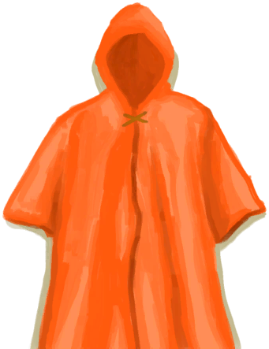

# 雨衣  
> 一件塑料雨衣，可以帮我挡雨。<b>必须装备在装备栏才能生效</b>  
   
>   
  
  雨衣  |   图片   
 ----  |  ----:   
 **重量：**350  **装备时减重：**-300  **标签：**	[“躯干（外层）”](tag_OuterTorso.md), [“腿部（内层）”](tag_Clothing.md)  **装备：**[“大衣”](eTag_Coat.md)  **可使用次数：**2400  ** 效果: ** [体感温度](TemperaturePerceived.md)+3 [阳光防护](SunProtection.md)+2 [蚊虫防护](BugProtection.md)+1 [雨水防护](RainProtection.md)+3  |     
  
## 获取来源  
来源  |  操作  
----  |  ----  
[雨衣(蓝图)](Bp_Raincoat.md)  |  蓝图制造  
## 动作  
动作  |  耗时  |  条件  |  变化  |  状态  
----  |  ----  |  ----  |  ----  |  ----  
拆解 [手部动作](HandAction.md)  |  -  |    |  ** 自身：** →消失  ** 获得： ** ** [Plastic] **   [塑料布](PlasticSheet.md)(+1)   [细线](CordFiber.md)(+2～+4) 基础权重：1  |    
## 可拖入  
使用  |  动作  |  耗时  |  条件  |  变化  |  玩家状态  
----  |  ----  |  ----  |  ----  |  ----  |  ----  
[“针线”](tag_ThreadedNeedle.md)  |  修复 [手部动作](HandAction.md) [制造动作](CraftAction.md)  |  30分  |    |  ** 自身: ** 使用次数  +800(33%)  ** 使用物: ** 可用次数  -1   -1  |    
## 属性   
属性  |  值  |  耗时  |  变化  
----  |  ----  |  ----  |  ----  
使用次数  |  初始：2400 最大：2400  |  -  |  ** 到达0时： ** ** [Cloth] **   [塑料布](PlasticSheet.md)(+1)   [细线](CordFiber.md)(+4) 基础权重：1 自身→消失  

