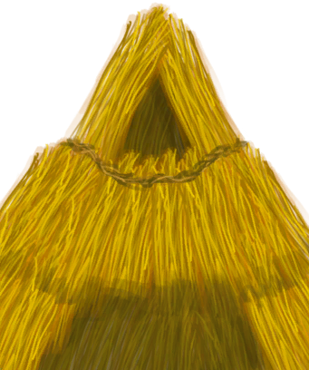

# 稻杆  
> 可用作燃料或者食料。  
  
<table class="table table-bordered" data-toggle="table"  data-show-header="false"><thead style="display:none"><tr ><th  style="width:50%;text-align:left;vertical-align:top;"  >title</th><th  style="width:50%;text-align:left;vertical-align:top;"  ></th></tr></thead><tr ><td  style="width:50%;text-align:left;vertical-align:top;"  >**重量：**100  **标签：**	[“树叶”](tag_Leaves.md), [“燃料”](tag_Fuel.md), [“喂食（草食动物）”](tag_FeedHerb.md), [“抗裂剂”](tag_Temper.md), [“中纤维”](tag_FibersMedium.md)</td><td  style="width:50%;text-align:left;vertical-align:top;"  >

<a href="RiceStraw.md" style="color:black">稻杆</a>

这种水培植物可以在岛屿中心的<b>神秘谷</b>中找到。种植水稻是稳定的碳水来源，同时还能提供喂养<b>山羊</b>的饲料。  水稻首先需要用<b>切割工具</b>收割。谷物和秸秆可以<b>打谷</b>分离。稻米需要在水中<b>煮熟</b>才能食用。  煮米饭后留下的<b>米汤</b>对肠胃很好。</td></tr></tbody></table>  
  
## 获取来源  

拆解

[蓑衣](StrawCape.md)

转化

[蓑衣](StrawCape.md)

打谷

[稻秆](RiceStalks.md)

转化

[稻秆](RiceStalks.md)

  
  
## 可拖至  

[叶床](LeafBed.md)

[有遮蔽的叶床](ShelteredLeafBed.md)

[堆肥箱](CompostBin.md)

[蒸馏器(关)](AlembicOff.md)

[蒸馏器(开)](AlembicOn.md)

[营火](Campfire.md)

[营火(熄灭)](CampfireExtinguished.md)

[粘土火盆](ClayFirePit.md)

[粘土火盆(熄灭)](ClayFirePitExtinguished.md)

[火堆](Fire.md)

[火堆(熄灭)](FireExtinguished.md)

[熔炉](Forge.md)

[熔炉(熄灭)](ForgeExtinguished.md)

[窑炉](Kiln.md)

[高级窑炉](KilnAdvanced.md)

[高级窑炉(熄灭)](KilnAdvancedExtinguished.md)

[窑炉(熄灭)](KilnExtinguished.md)

[火炉](Stove.md)

[火炉(熄灭)](StoveExtinguished.md)

[羊食槽](GoatFeeder.md)

[羊食槽(空)](GoatFeederEmpty.md)

[泥堆](MudPile.md)

[粘土](Clay.md)

[母山羊](GoatEnclosureFemale.md)

[小羊](GoatEnclosureKid.md)

[泌乳期山羊](GoatEnclosureLactating.md)

[公山羊](GoatEnclosureMale.md)

[母山羊](GoatTiedFemale.md)

[泌乳期山羊](GoatTiedFemaleLactating.md)

[小羊](GoatTiedKid.md)

[公山羊](GoatTiedMale.md)

  
  
## 可用于蓝图  

<a href="Bp_FeedGoat.md" style="color:black">山羊饲料</a>

<a href="Bp_Leafbed.md" style="color:black">叶床</a>

<a href="Bp_MoldAxe.md" style="color:black">斧头模具</a>

<a href="Bp_MoldKnife.md" style="color:black">刀模具</a>

<a href="Bp_MoldShovel.md" style="color:black">铲头模具</a>

<a href="Bp_MoldSpear.md" style="color:black">矛头模具</a>

<a href="Bp_MushroomBed.md" style="color:black">菌床</a>

<a href="Bp_Alembic.md" style="color:black">蒸馏器</a>

<a href="Bp_ClayBowl.md" style="color:black">陶碗</a>

<a href="Bp_ClayFirePit.md" style="color:black">粘土火盆</a>

<a href="Bp_ClayJar.md" style="color:black">小陶罐</a>

<a href="Bp_ClayPotCooler.md" style="color:black">保鲜罐</a>

<a href="Bp_ClayVase.md" style="color:black">陶罐</a>

<a href="Bp_CookingPot.md" style="color:black">烹饪锅</a>

<a href="Bp_GlazedVase.md" style="color:black">釉面陶罐</a>

<a href="Bp_StrawCape.md" style="color:black">蓑衣</a>

  
  
  

